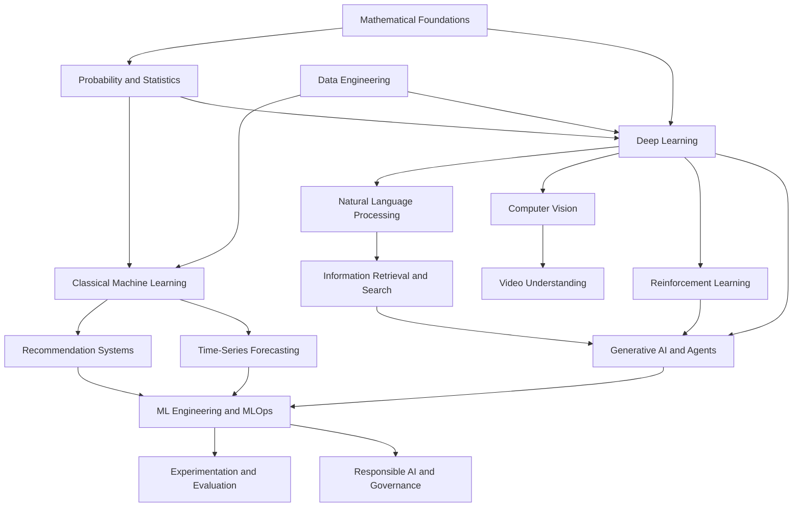

# Knowledge Map

## Summary

The knowledge map shows how the wiki's major areas depend on each other. It is a conceptual route through prerequisites, not just a list of folders: it answers "what should I understand before this topic makes sense?" rather than "where is this file?" Use [learning paths](learning-paths.md) when you want an ordered study sequence, and [navigation](navigation.md) when you know the destination and just need the shortest route.

## The dependency graph

Arrows point from a prerequisite to what it enables. Read top to bottom: mathematics and probability sit at the root, core modeling families branch into modality-specific systems, retrieval and generative AI compose several of those, and production and governance sit downstream of everything applied.

## The layers

**Foundations.** [Mathematical foundations](../01-mathematical-foundations/index.md) — linear algebra, calculus, and optimization — and [probability and statistics](../02-probability-and-statistics/index.md) are the shared vocabulary for every model that follows. Gradients, distributions, expectation, and matrix decompositions reappear under different names across the whole tree.

**Core modeling.** [Classical machine learning](../03-classical-machine-learning/index.md) and [deep learning](../06-deep-learning/index.md) are the two trunks. Classical ML dominates tabular and small-data problems; deep learning dominates perception, language, and generation. Most applied areas specialize one of these.

**Modality-specific systems.** [Recommendation systems](../04-recommendation-systems/index.md), [time-series forecasting](../05-time-series-and-forecasting/index.md), [natural language processing](../08-natural-language-processing/index.md), [computer vision](../09-computer-vision/index.md), [video understanding](../10-video-understanding/index.md), and [reinforcement learning](../07-reinforcement-learning/index.md) adapt the core trunks to a data shape and a decision. They share methods but differ in their evaluation and failure modes.

**Retrieval and generative AI.** [Information retrieval](../12-information-retrieval-and-search/index.md) and [generative AI](../11-generative-ai/index.md) are compositional: a retrieval-augmented or agentic system reuses embeddings, ranking, language models, and sometimes preference-based reinforcement learning at once.

**Production and governance.** [ML engineering and MLOps](../14-ml-engineering-and-mlops/index.md), [experimentation and evaluation](../17-experimentation-and-evaluation/index.md), and [responsible AI](../18-responsible-ai-safety-and-governance/index.md) sit downstream of every applied area, because a model only becomes a system once it is deployed, measured, and governed.

## Cross-cutting concerns

Some areas are not a single layer; they cut across the whole map:

- [Data engineering](../13-data-engineering/index.md) feeds every model, so data quality and pipeline correctness bound the accuracy of everything downstream.
- [Cloud and distributed systems](../15-cloud-and-distributed-systems/index.md) and [software engineering](../16-software-engineering/index.md) determine whether a method survives contact with real scale and real teams.
- [Experimentation and evaluation](../17-experimentation-and-evaluation/index.md) and [responsible AI](../18-responsible-ai-safety-and-governance/index.md) apply to every applied area, not just the ones that happen to mention them.

## Worked example: what a RAG system depends on

A retrieval-augmented generation system looks like one topic but is a composition of many. Reading up the dependency chain, it relies on [embeddings](../08-natural-language-processing/embeddings.md) and [chunking](../11-generative-ai/chunking.md), [dense retrieval](../12-information-retrieval-and-search/dense-retrieval.md) and [hybrid search](../12-information-retrieval-and-search/hybrid-search.md), [retrieval pipelines](../11-generative-ai/retrieval-pipelines.md), [RAG evaluation](../11-generative-ai/rag-evaluation.md), [PII protection](../11-generative-ai/pii-protection.md), [model serving](../11-generative-ai/model-serving.md), and [cost and latency optimization](../11-generative-ai/cost-and-latency-optimization.md). The map exists so a reader treats RAG as this dependency set rather than one isolated box.

## Practical use

Use this page when you know a destination topic but not its prerequisites: trace the arrows backward until you reach something you already understand, then study forward. Use [learning paths](learning-paths.md) when you want that trace pre-packaged as an ordered sequence, and [technical answer patterns](technical-answer-patterns.md) when the goal is to explain a concept concisely rather than to learn it.
