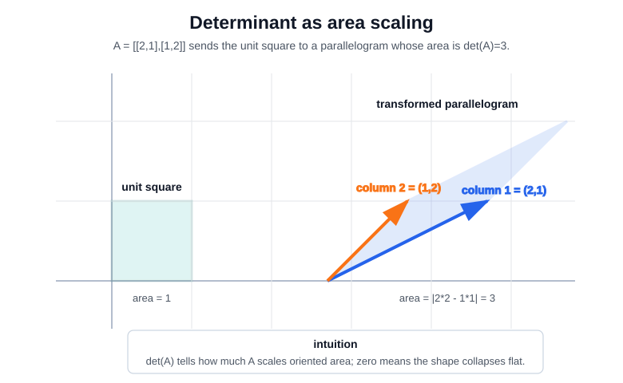

# Determinants

A determinant is a scalar attached to a square matrix. Geometrically, it is the signed volume-scaling factor of the linear map. In two dimensions it scales oriented area; in three dimensions it scales oriented volume; in $n$ dimensions it scales $n$-dimensional volume.

The sign tracks orientation. A positive determinant preserves orientation, a negative determinant flips orientation, and a zero determinant means the map collapses space into a lower-dimensional set. That collapse is why determinants connect directly to [rank](rank.md), invertibility, and [eigenvalues](eigenvalues-and-eigenvectors.md).

## Defining math

For a $2\times2$ matrix,

$$
A=\begin{bmatrix}a&b\\c&d\end{bmatrix},
\qquad
\det(A)=ad-bc.
$$

The columns of $A$ are where the basis vectors land. The determinant is the signed area of the parallelogram spanned by those two columns.

For a general $n\times n$ matrix, the determinant can be defined by expanding along any fixed row $i$:

$$
\det(A)=\sum_{j=1}^n (-1)^{i+j}a_{ij}\det(A_{\hat{i},\hat{j}}).
$$

Here $A_{\hat{i},\hat{j}}$ is the smaller matrix formed by deleting row $i$ and column $j$ from $A$. The factor $(-1)^{i+j}$ gives the checkerboard sign pattern

$$
\begin{bmatrix}
+&-&+&\cdots\\
-&+&-&\cdots\\
+&-&+&\cdots\\
\vdots&\vdots&\vdots&\ddots
\end{bmatrix}.
$$

The term $\det(A_{\hat{i},\hat{j}})$ is called a minor, and $(-1)^{i+j}\det(A_{\hat{i},\hat{j}})$ is the corresponding cofactor. Intuitively, choosing $a_{ij}$ fixes how the selected row contributes; the minor measures the remaining volume scaling after that row and column have been removed. The alternating signs correct for orientation, just as the minus sign in the $2\times2$ formula $ad-bc$ subtracts the oppositely oriented contribution.

The same definition can also be written in one compact permutation formula:

$$
\det(A)=\sum_{\sigma\in S_n}\operatorname{sgn}(\sigma)\prod_{i=1}^n A_{i,\sigma(i)}.
$$

Here $S_n$ is the set of all permutations of $\{1,\dots,n\}$. A permutation $\sigma$ chooses exactly one column $\sigma(i)$ for each row $i$, so each product uses one entry from every row and every column. The sign $\operatorname{sgn}(\sigma)$ is $+1$ for an even permutation and $-1$ for an odd permutation. Equivalently, it records whether the column order chosen by $\sigma$ preserves or flips orientation.

These formulas are rarely the best way to compute large determinants directly, but they make the structure explicit: a determinant is a signed sum of full row-column matchings, and the signs enforce oriented volume.

Important consequences are:

$$
\det(AB)=\det(A)\det(B),
\qquad
\det(A)=0 \Longleftrightarrow A\ \text{is singular}.
$$

The second statement means that a square matrix is invertible exactly when its determinant is nonzero.

## Worked example

Take

$$
B=\begin{bmatrix}2&1\\1&2\end{bmatrix}.
$$

Its determinant is

$$
\det(B)=2\cdot2-1\cdot1=3.
$$

So $B$ multiplies every oriented area by $3$. The first column $(2,1)$ is where $e_1$ lands, and the second column $(1,2)$ is where $e_2$ lands. The unit square becomes the parallelogram spanned by those two column vectors.

This is the same matrix used on [Eigenvalues and Eigenvectors](eigenvalues-and-eigenvectors.md#worked-example). There, the eigenvalues are $3$ and $1$; their product is also the determinant:

$$
\det(B)=3\cdot1=3.
$$

For diagonalizable matrices, the determinant is the product of eigenvalues because each eigenvalue is a stretch factor along an eigenvector direction.

## Intuition

The determinant answers: "How much does this square matrix scale full-dimensional volume?"

- $\det(A)=2$ doubles oriented volume.
- $\det(A)=-2$ doubles volume and flips orientation.
- $\det(A)=1$ preserves volume, though it may shear or rotate.
- $\det(A)=0$ collapses volume to zero, so some independent direction is lost.

That last case is the key connection to [rank](rank.md). If a matrix collapses a square into a line, or a cube into a plane, its columns are dependent and it cannot be inverted.

## Caveats

Determinants are conceptually important but numerically blunt. In higher dimensions, determinants can become extremely large or small, and a nonzero determinant does not by itself say whether a matrix is well-conditioned. For numerical stability, singular values and condition numbers are usually more informative than determinant magnitude.

## References

- [MIT OpenCourseWare: 18.06 Linear Algebra](https://ocw.mit.edu/courses/18-06-linear-algebra-spring-2010/)

> [!nav]
> **Section** — [Mathematical Foundations](index.md)
>
> [← Matrix Multiplication](matrix-multiplication.md) [Rank →](rank.md)
