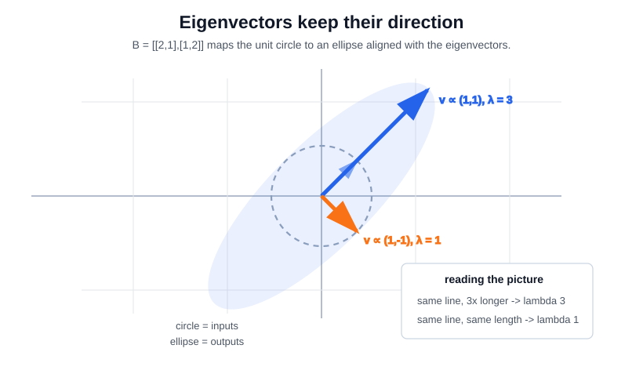

# Eigenvalues and Eigenvectors

An eigenvector is a direction that a square matrix stretches or shrinks without rotating away from itself. The eigenvalue is that stretch factor. They expose natural axes of transformations, covariance matrices, [graph Laplacians](graph-laplacian.md), and stability dynamics.

## Defining math

For $A\in\mathbb R^{n\times n}$, a nonzero vector $v$ is an eigenvector when

$$
Av=\lambda v.
$$

Here $A$ is a square matrix, $v$ is a nonzero direction vector, and $\lambda$ is the scalar factor applied along that direction. The equation says that applying $A$ changes the length and possibly sign of $v$, but not its direction.

The scalar $\lambda$ is an eigenvalue, found by solving the [determinant](determinants.md) equation

$$
\det(A-\lambda I)=0.
$$

This equation is just the eigenvalue equation rewritten into a homogeneous linear system:

$$
Av=\lambda v
\quad\Longleftrightarrow\quad
Av-\lambda Iv=0
\quad\Longleftrightarrow\quad
(A-\lambda I)v=0.
$$

The vector $v$ is required to be nonzero. Therefore $A-\lambda I$ must have a nonzero vector in its null space: it sends at least one direction to zero. A square matrix has a nonzero null-space vector exactly when it is singular, and a square matrix is singular exactly when its determinant is zero. That gives the equivalence:

$$
\lambda\ \text{is an eigenvalue}
\quad\Longleftrightarrow\quad
\exists v\ne0:\ (A-\lambda I)v=0
\quad\Longleftrightarrow\quad
\det(A-\lambda I)=0.
$$

Geometrically, subtracting $\lambda I$ means "remove a uniform stretch by $\lambda$ from every direction." If $\lambda$ matches a real stretch factor of $A$, then along the matching eigenvector direction the residual map $A-\lambda I$ collapses that direction to zero. The determinant detects exactly that collapse.

If $A$ is symmetric, its eigenvectors can be chosen [orthogonal](orthogonality.md), giving $A=Q\Lambda Q^\top$. This special structure is why covariance eigendecomposition and [PCA](../03-classical-machine-learning/pca.md) are stable for symmetric matrices. [SVD](singular-value-decomposition.md) extends related geometry to rectangular or non-normal matrices by using eigenvectors of $A^\top A$.

## Worked example

For $B=\begin{bmatrix}2&1\\1&2\end{bmatrix}$, solve $\det(B-\lambda I)=0$:

$$
\det\begin{bmatrix}2-\lambda&1\\1&2-\lambda\end{bmatrix}
=(2-\lambda)^2-1=\lambda^2-4\lambda+3=(\lambda-3)(\lambda-1)=0,
$$

so the eigenvalues are $\lambda=3$ and $\lambda=1$. Substituting each back into $(B-\lambda I)v=0$:

$$
\lambda=3:\ \begin{bmatrix}-1&1\\1&-1\end{bmatrix}v=0\Rightarrow v\propto(1,1);
\qquad
\lambda=1:\ \begin{bmatrix}1&1\\1&1\end{bmatrix}v=0\Rightarrow v\propto(1,-1).
$$

Both satisfy $Bv=\lambda v$ exactly. The larger eigenvalue $3$ corresponds to the direction $(1,1)$ where the matrix amplifies most strongly; along $(1,-1)$ it only scales by $1$.

The plot shows the same result geometrically. A linear map sends the unit circle to an ellipse. Eigenvectors are exactly the directions where the input arrow and output arrow stay on the same line; the eigenvalue is the output length divided by the input length.

## Caveats

Eigenvectors are scale-ambiguous: $v$ and $-v$ represent the same direction. Non-symmetric matrices may have complex eigenvalues or too few independent eigenvectors, so do not use eigendecomposition where [matrix decompositions](matrix-decompositions.md) such as SVD are the safer tool.

## References

- [MIT OpenCourseWare: 18.06 Linear Algebra](https://ocw.mit.edu/courses/18-06-linear-algebra-spring-2010/)

> [!nav]
> **Section** — [Mathematical Foundations](index.md)
>
> [← Norms and Distances](norms-and-distances.md) [Laplacians and Graph Laplacians →](graph-laplacian.md)
