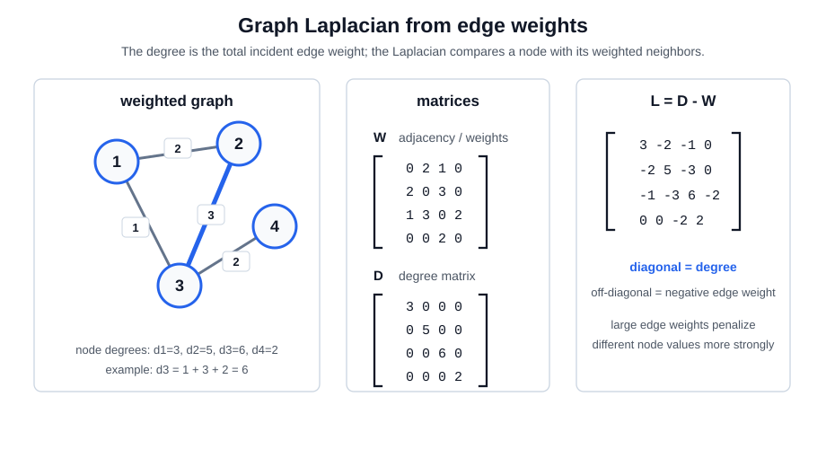
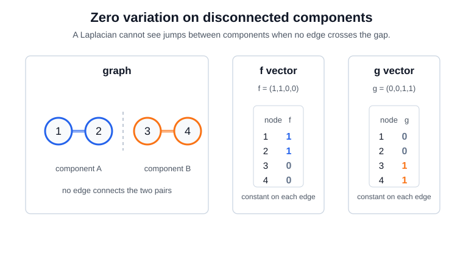

# Laplacians and Graph Laplacians

A Laplacian measures how different a value is from its local neighborhood. In calculus, the Laplacian of a function measures local curvature or diffusion. A graph Laplacian is the discrete version on nodes and edges: it compares each node's value with the values of its weighted neighbors. In machine learning, graph Laplacians sit behind [spectral clustering](../03-classical-machine-learning/clustering.md#spectral-clustering), graph semi-supervised learning, and many graph signal methods.

## Continuous intuition

For a smooth function $u(x,y)$, the two-dimensional Laplacian is

$$
\Delta u = \frac{\partial^2 u}{\partial x^2}+\frac{\partial^2 u}{\partial y^2}.
$$

It is positive near a local bowl, negative near a local hill, and near zero when the value agrees with the average of nearby values. That "compare with the neighborhood" intuition is the bridge to graphs. A graph has no derivatives, but it does have neighbors and edge weights.

## Defining math

For an undirected weighted graph with similarity or adjacency matrix $W$, the entry $W_{ij}$ is the edge weight between nodes $i$ and $j$. The degree of node $i$ is the total edge weight touching it:

$$
d_i=\sum_j W_{ij}.
$$

The degree matrix $D$ is diagonal:

$$
D_{ii}=d_i,\qquad D_{ij}=0\ \text{for}\ i\ne j.
$$

The unnormalized graph Laplacian is

$$
L = D-W.
$$

Common normalized versions are

$$
L_{\text{sym}}=I-D^{-1/2}WD^{-1/2},
\qquad
L_{\text{rw}}=I-D^{-1}W.
$$

The matrix $L$ measures how different a vector is across connected nodes. For a node-value vector $f$,

$$
f^\top L f=\frac12\sum_{i,j}W_{ij}(f_i-f_j)^2.
$$

This quantity is small when strongly connected nodes have similar values. Spectral clustering uses this property by finding eigenvectors that vary slowly inside dense graph regions but change across weak graph cuts.

## Worked example

Suppose four nodes form two disconnected pairs: nodes 1 and 2 are connected, and nodes 3 and 4 are connected. This example uses unit edge weights, so every node has degree 1.

$$
W=
\begin{bmatrix}
0&1&0&0\\
1&0&0&0\\
0&0&0&1\\
0&0&1&0
\end{bmatrix},
\qquad
D=
\begin{bmatrix}
1&0&0&0\\
0&1&0&0\\
0&0&1&0\\
0&0&0&1
\end{bmatrix}.
$$

Then

$$
L=D-W=
\begin{bmatrix}
1&-1&0&0\\
-1&1&0&0\\
0&0&1&-1\\
0&0&-1&1
\end{bmatrix}.
$$

Here $f$ and $g$ are node-value vectors: they assign one number to each graph node, in node order. For example, the first coordinate belongs to node 1, the second to node 2, and so on:

$$
f=(1,1,0,0),\qquad g=(0,0,1,1).
$$

That means:

| Vector | Node 1 | Node 2 | Node 3 | Node 4 |
| ------ | ------ | ------ | ------ | ------ |
| $f$    | 1      | 1      | 0      | 0      |
| $g$    | 0      | 0      | 1      | 1      |

The vector $f$ is constant on every existing edge. The edge $1\text{--}2$ connects two nodes with value 1, so there is no difference across that edge. The edge $3\text{--}4$ connects two nodes with value 0, so there is no difference there either. Since this toy graph has no edge between the first pair and the second pair, the jump from 1 to 0 is invisible to the graph. The Laplacian therefore reports no graph-local variation: $Lf=0$.

The vector $g$ says the same thing with the roles reversed: value 0 on the first pair and value 1 on the second pair. It is also constant on every existing edge, so $Lg=0$.

Those two independent zero-eigenvalue directions indicate two connected components. In real spectral clustering the graph is usually not perfectly disconnected, so the small nonzero eigenvectors approximate this component structure.

## What the matrix does

For the unnormalized Laplacian, the $i$th entry of $Lf$ is

$$
(Lf)_i=d_i f_i-\sum_j W_{ij}f_j
=\sum_j W_{ij}(f_i-f_j).
$$

This says: compare node $i$'s value to its neighbors, weighted by edge strength. If node $i$ has a value similar to strongly connected neighbors, $(Lf)_i$ is small. If it differs sharply from strongly connected neighbors, $(Lf)_i$ is large. That is the graph analogue of a continuous Laplacian detecting local variation.

## Caveats

The graph Laplacian is only as meaningful as the graph construction. A poor similarity function, too few neighbors, too many neighbors, or unscaled features can create a graph whose eigenvectors reflect preprocessing artifacts rather than useful structure. Normalized graph Laplacians are often preferred when node degrees vary strongly because high-degree nodes can otherwise dominate the unnormalized operator. The continuous Laplacian and graph Laplacian share the same neighborhood-comparison intuition, but they operate on different objects: smooth functions over space versus values on graph nodes.

## References

- [scikit-learn User Guide: Spectral clustering](https://scikit-learn.org/stable/modules/clustering.html#spectral-clustering)
- [MIT OpenCourseWare: 18.06 Linear Algebra](https://ocw.mit.edu/courses/18-06-linear-algebra-spring-2010/)

> [!nav]
> **Section** — [Mathematical Foundations](index.md)
>
> [← Eigenvalues and Eigenvectors](eigenvalues-and-eigenvectors.md) [Matrix Decompositions →](matrix-decompositions.md)
