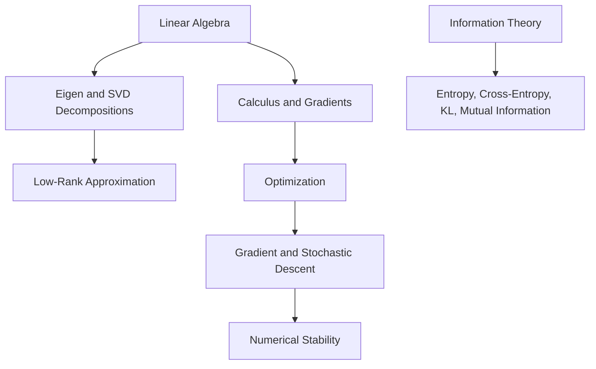

# Mathematical Foundations

Mathematical foundations supplies the notation and mechanisms used throughout the wiki. Linear algebra explains data as vectors, matrices, projections, ranks, and decompositions. Calculus and optimization explain how models are trained. Information theory explains losses, uncertainty, and distribution mismatch.

The goal is not abstract proof for its own sake. Each page answers a modeling question: what does this operation preserve, what can go wrong numerically, and how does it appear in machine learning systems?

## Knowledge map

The section has three trunks — linear algebra, calculus/optimization, and information theory — that recur across every later area. Arrows point from a prerequisite to what it enables.

## Reading path

Read linear algebra first, then calculus and optimization, then information theory.

1. [Linear Algebra](linear-algebra.md): the overview of vectors, matrices, and the operations that follow.
2. [Vectors and Matrices](vectors-and-matrices.md): the basic objects and how shapes compose.
3. [Matrix Multiplication](matrix-multiplication.md): the core operation behind linear maps and layers.
4. [Rank](rank.md): how many independent directions a matrix actually spans.
5. [Orthogonality](orthogonality.md): perpendicular directions, projections, and orthonormal bases.
6. [Norms and Distances](norms-and-distances.md): measuring size and similarity of vectors.
7. [Eigenvalues and Eigenvectors](eigenvalues-and-eigenvectors.md): directions a matrix only stretches.
8. [Matrix Decompositions](matrix-decompositions.md): factorizations that expose structure.
9. [Singular Value Decomposition](singular-value-decomposition.md): the decomposition behind embeddings and compression.
10. [Low-Rank Approximation](low-rank-approximation.md): keeping the dominant structure and discarding noise.
11. [Calculus](calculus.md): derivatives as the language of change.
12. [Gradients](gradients.md): multivariate derivatives that point training in a direction.
13. [Jacobians and Hessians](jacobians-and-hessians.md): first- and second-order derivative matrices.
14. [Optimization](optimization.md): finding parameters that minimize a loss.
15. [Convex Optimization](convex-optimization.md): the well-behaved case with a single global optimum.
16. [Constrained Optimization](constrained-optimization.md): optimizing subject to equalities and inequalities.
17. [Gradient Descent](gradient-descent.md): the workhorse iterative optimizer.
18. [Stochastic Gradient Descent](stochastic-gradient-descent.md): mini-batch updates that scale to large data.
19. [Numerical Stability](numerical-stability.md): avoiding overflow, underflow, and catastrophic cancellation.
20. [Information Theory](information-theory.md): quantifying uncertainty and information.
21. [Entropy](entropy.md): the average surprise of a distribution.
22. [Cross Entropy](cross-entropy.md): the standard classification training loss.
23. [KL Divergence](kl-divergence.md): a directed measure of distribution mismatch.
24. [Mutual Information](mutual-information.md): shared information between variables.

## Connections

- [Probability and Statistics](../02-probability-and-statistics/index.md) builds estimation and inference on this notation.
- [Classical Machine Learning](../03-classical-machine-learning/index.md) and [Deep Learning](../06-deep-learning/index.md) turn these operations into models and training loops.

> [!nav]
> **Learning path** — [Foundations](../00-home-and-navigation/learning-paths.md#foundations)
>
> [Probability and Statistics →](../02-probability-and-statistics/index.md)
