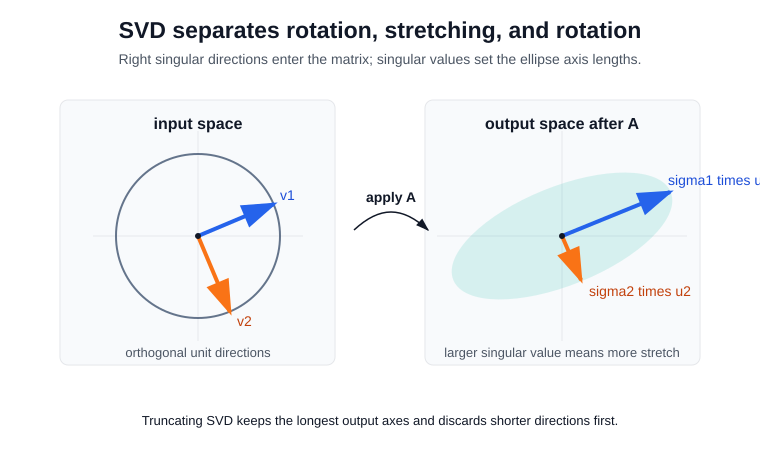

# Singular Value Decomposition

Singular value decomposition writes any real matrix as orthogonal input directions, nonnegative gains, and orthogonal output directions. Unlike [eigenvalues and eigenvectors](eigenvalues-and-eigenvectors.md), it applies to rectangular matrices and does not require the matrix to preserve a single space.

## Defining math

For $A\in\mathbb R^{m\times n}$, the compact SVD is

$$
A=U_r\Sigma_rV_r^\top
=\sum_{i=1}^r \sigma_i u_i v_i^\top,
$$

where $r=\operatorname{rank}(A)$, $U_r^\top U_r=I$, $V_r^\top V_r=I$, and $\sigma_1\ge \cdots \ge \sigma_r>0$. The right singular vectors $v_i$ are [orthogonal](orthogonality.md) input directions; $A v_i=\sigma_i u_i$ sends them to orthogonal output directions. The nonzero $\sigma_i^2$ are eigenvalues of $A^\top A$, which is why SVD connects directly to [matrix decompositions](matrix-decompositions.md) and [PCA](../03-classical-machine-learning/pca.md).

The truncated SVD

$$
A_k=\sum_{i=1}^k \sigma_i u_i v_i^\top
$$

is the best [low-rank approximation](low-rank-approximation.md) in Frobenius norm:

$$
\lVert A-A_k\rVert_F=\sqrt{\sum_{i=k+1}^r\sigma_i^2}.
$$

This Eckart-Young result is the reason SVD is a clean mathematical baseline for compression, denoising, latent semantic analysis, [PCA](../03-classical-machine-learning/pca.md), [classical SVD recommenders](../04-recommendation-systems/classical-svd.md), and [truncated SVD](../04-recommendation-systems/truncated-svd.md). It is also the baseline for understanding why sparse recommender pages distinguish [ordinary SVD on sparse utility matrices](../04-recommendation-systems/sparse-utility-matrices-and-svd.md) from learned [matrix factorization](../04-recommendation-systems/matrix-factorization.md).



Geometrically, $V^\top$ chooses orthogonal input coordinates, $\Sigma$ stretches them by singular values, and $U$ rotates the stretched axes into the output space. Truncating the SVD keeps the longest axes first, which is why the discarded singular values determine the low-rank approximation error.

## Executed demo

This snippet decomposes a matrix with SVD, verifies exact reconstruction, and compares the rank-1 error with the discarded singular-value tail.

```python
import numpy as np

A = np.array([[3., 1., 1.], [-1., 3., 1.], [0., 2., 4.], [2., 0., 2.]])
U, s, Vt = np.linalg.svd(A, full_matrices=False)
Ahat1 = (U[:, :1] * s[:1]) @ Vt[:1]
print("singular_values", np.round(s, 4))
print("reconstruction_error", round(np.linalg.norm(A - (U*s)@Vt), 12))
print("rank1_fro_error", round(np.linalg.norm(A - Ahat1, "fro"), 4))
print("tail_singular_fro", round(np.sqrt(np.sum(s[1:]**2)), 4))
```

Observed output:

```text
singular_values [5.6569 3.7417 2.    ]
reconstruction_error 0.0
rank1_fro_error 4.2426
tail_singular_fro 4.2426
```

The exact reconstruction error is numerically zero, and the rank-1 truncation error equals the Frobenius norm of the discarded singular values. Numerically tiny singular values should be interpreted relative to scale, as in [rank](rank.md), not by exact equality to zero.

## Connections

| Page                                                                                               | How it uses SVD                                                                                                                      |
| -------------------------------------------------------------------------------------------------- | ------------------------------------------------------------------------------------------------------------------------------------ |
| [PCA](../03-classical-machine-learning/pca.md)                                                     | Applies SVD to centered data; right singular vectors become principal axes and squared singular values determine explained variance. |
| [Low-rank approximation](low-rank-approximation.md)                                                | Uses the Eckart-Young theorem to quantify the best rank-$k$ reconstruction error.                                                    |
| [Classical SVD](../04-recommendation-systems/classical-svd.md)                                     | Applies SVD to a complete dense matrix in recommender examples.                                                                      |
| [Truncated SVD](../04-recommendation-systems/truncated-svd.md)                                     | Computes only leading singular components for compact representations.                                                               |
| [SVD versus matrix factorization](../04-recommendation-systems/svd-versus-matrix-factorization.md) | Contrasts decomposing a complete matrix with learning factors from sparse observed entries.                                          |

## References

- [NumPy documentation: `numpy.linalg.svd`](https://numpy.org/doc/stable/reference/generated/numpy.linalg.svd.html)
- [MIT OpenCourseWare: 18.06 Linear Algebra](https://ocw.mit.edu/courses/18-06-linear-algebra-spring-2010/)
