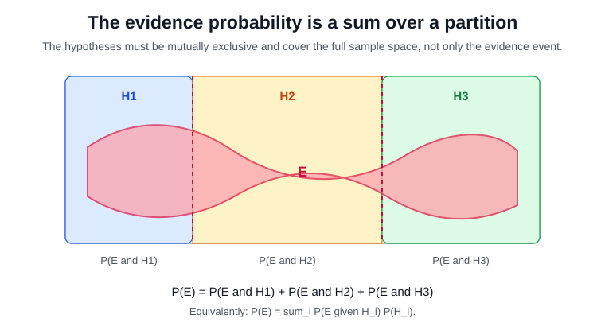
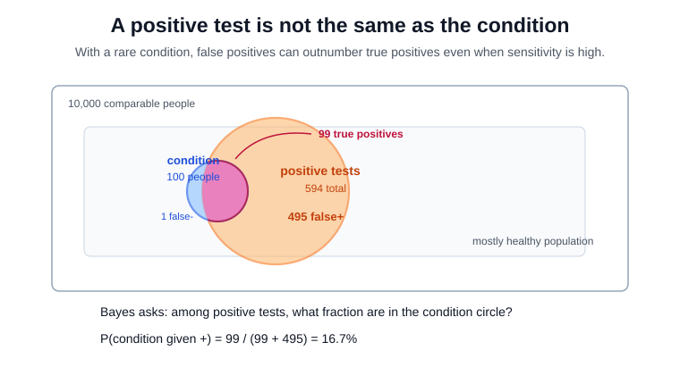

# Bayes Theorem

Bayes' theorem is conditional probability rearranged so evidence can update belief. For events $H$ and $E$ with $P(E)>0$,

$$
P(H\mid E)=\frac{P(E\mid H)P(H)}{P(E)}.
$$

Here $H$ is the hypothesis or event being updated, and $E$ is the observed evidence. The prior $P(H)$ is multiplied by the likelihood $P(E\mid H)$, then divided by the evidence probability $P(E)$ so the posterior $P(H\mid E)$ is properly normalized.

For a partition $\{H_i\}$, the denominator expands to

$$
P(E)=\sum_i P(E\mid H_i)P(H_i).
$$

The events $H_i$ are mutually exclusive possibilities that cover the sample space. The denominator is the total probability of seeing the evidence under all possible hypotheses, weighted by their priors.

The denominator works because the $H_i$ partition the full [probability space](probability-spaces.md). It is not necessary to restrict the sample space to $H\cup E$; rather, every outcome belongs to exactly one $H_i$, so the evidence event can be decomposed into disjoint slices $E\cap H_i$:

$$
P(E)=\sum_i P(E\cap H_i)=\sum_i P(E\mid H_i)P(H_i).
$$

That normalization is what prevents a high likelihood from overwhelming a low base rate. The theorem is the algebra behind [Bayesian statistics](bayesian-statistics.md), [MAP estimation](maximum-a-posteriori-estimation.md), and many diagnostic calculations built from [conditional probability](conditional-probability.md).

## Worked scenario

Suppose 1 percent of a screening population has a disease. The test is highly sensitive, $P(+\mid disease)=0.99$, but it also has a 5 percent false-positive rate, $P(+\mid healthy)=0.05$. Among 10,000 comparable people, about 100 are diseased and 9,900 are healthy. A positive result is expected for about $99$ diseased people and about $495$ healthy people, so

$$
P(disease\mid +)=\frac{99}{99+495}\approx 0.1667.
$$

A positive test therefore moves the disease probability from 1 percent to about 16.7 percent, not 99 percent. The false-positive term is applied to the much larger healthy majority, which is what keeps the posterior low; for a sampling simulation of the same base-rate effect, see [conditional probability](conditional-probability.md).

In the diagram, the positive-test circle is larger than the condition circle because positives include both true positives and false positives. The overlap contains the 99 diseased people who test positive; the positive-only region contains the 495 healthy people who test positive. Bayes' denominator counts both regions before asking what fraction of positives came from the condition circle.

## Caveats

Bayes' theorem is exact only relative to its model: the prior, sensitivity, specificity, and partition must describe the population being analyzed. Dependent pieces of evidence cannot be multiplied as if they were independent.

## References

- [Bayes' theorem](https://en.wikipedia.org/wiki/Bayes%27_theorem)
- [ProbabilityCourse: Conditional Probability](https://www.probabilitycourse.com/chapter1/1_4_0_conditional_probability.php)

> **Section — [Probability and Statistics](index.md):** ← [Conditional Probability](conditional-probability.md) · [Covariance and Correlation](covariance-and-correlation.md) →
