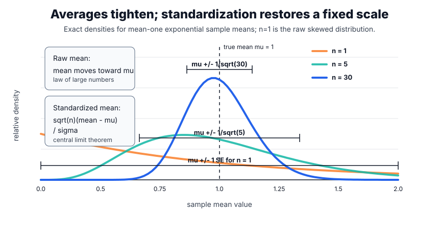
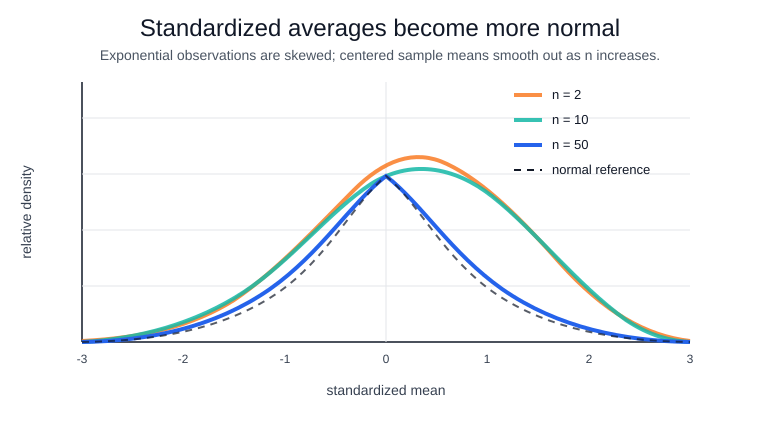

# Central Limit Theorem

The central limit theorem explains why averages, totals, and many estimated effects often have nearly [normal](common-distributions.md#normal-and-gaussian-distributions) sampling distributions even when the individual observations are not normal. It is the reason a click-rate lift, average latency difference, survey mean, model-score delta, or revenue-per-user estimate can often be paired with a standard error and a normal or [t](common-distributions.md#student-t-distribution) reference distribution.

The theorem is not saying that raw data become normal. User spending can remain skewed, failures can remain rare, and waiting times can remain positive and long-tailed. The theorem says that after many independent finite-variance observations are averaged, the remaining estimation error has a universal shape:

$$
\frac{\sqrt n(\bar X_n-\mu)}{\sigma}
\Rightarrow \mathcal N(0,1).
$$

The [law of large numbers](law-of-large-numbers.md) says the sample mean $\bar X_n$ moves toward the true mean $\mu$. The central limit theorem says what the remaining fluctuation around $\mu$ looks like. That second statement is what powers many [confidence intervals](confidence-intervals.md), z-statistics in [hypothesis testing](hypothesis-testing.md), and large-sample analyses of randomized experiments.

## The problem it solves

Suppose a metric is noisy. One user clicks or does not click, one request is fast or slow, one annotated answer receives a high or low score. A single observation is a poor guide to the population mean. Averaging helps, but a decision still needs to know how much random error remains.

The central limit theorem gives that scale and shape. If each observation has standard deviation $\sigma$, then the sample mean has standard error:

$$
\operatorname{SE}(\bar X_n)=\frac{\sigma}{\sqrt n}.
$$

That formula explains the square-root economics of sampling: multiplying traffic or examples by 100 reduces the standard error by 10, not by 100. The normal limit explains why the standardized error,

$$
Z_n=\frac{\bar X_n-\mu}{\sigma/\sqrt n},
$$

can be compared with standard normal cutoffs such as $\pm 1.96$.



The first visual separates two ideas that are often mixed together. The sampling distribution of $\bar X_n$ tightens around $\mu$ because averaging reduces variance. For the exponential example, the $n=1$ curve is just the raw exponential density: it is highest at 0 even though its mean is 1. Standardization then zooms back in by multiplying the error by $\sqrt n/\sigma$, producing a stable scale where normal reference values can be reused.

## Statement with named symbols

Let $X_1,X_2,\ldots$ be independent and identically distributed copies of a [random variable](random-variables.md) $X$. Assume:

1. The mean exists and is finite:

$$
\mu=\mathbb E[X].
$$

2. The variance exists, is finite, and is positive:

$$
\sigma^2=\operatorname{Var}(X)>0.
$$

3. The sample mean is:

$$
\bar X_n=\frac{1}{n}\sum_{i=1}^{n}X_i.
$$

Then:

$$
\frac{\bar X_n-\mu}{\sigma/\sqrt n}
\Rightarrow \mathcal N(0,1).
$$

Equivalently, for any real numbers $a<b$,

$$
P\left(a\le \frac{\bar X_n-\mu}{\sigma/\sqrt n}\le b\right)
\to
\int_a^b \frac{1}{\sqrt{2\pi}}e^{-x^2/2}\,dx.
$$

| Symbol            | Meaning                                                                                    |
| ----------------- | ------------------------------------------------------------------------------------------ |
| $X_i$             | Observation $i$ before averaging.                                                          |
| $\mu$             | Population mean of one observation.                                                        |
| $\sigma^2$        | Population variance of one observation.                                                    |
| $\bar X_n$        | Average of $n$ observations.                                                               |
| $\sigma/\sqrt n$  | Standard deviation of the sample mean, also called its standard error.                     |
| $\Rightarrow$     | Convergence in distribution: CDF probabilities converge at continuity points of the limit. |
| $\mathcal N(0,1)$ | Standard normal distribution.                                                              |

## Why centering and scaling are necessary

Without centering, $\bar X_n$ just converges to $\mu$. The limiting distribution would collapse to a point, which is useful for consistency but not useful for uncertainty. Centering removes the deterministic target:

$$
\bar X_n-\mu.
$$

Without scaling, that centered error shrinks to zero. Multiplying by $\sqrt n$ keeps the random fluctuation visible:

$$
\sqrt n(\bar X_n-\mu).
$$

Dividing by $\sigma$ makes the scale unitless:

$$
\frac{\sqrt n(\bar X_n-\mu)}{\sigma}.
$$

The theorem says this unitless residual error has a universal limiting law. That is why different domains can reuse the same z table: the individual data-generating processes differ, but the standardized average behaves similarly when the assumptions are good enough.

## How averaging changes shape

A skewed observation can have a long right tail, but an average is a sum of many independent small contributions. Centering removes the deterministic mean, and scaling by $\sqrt n$ keeps the random fluctuation from collapsing to zero. Convolution smooths the shape, so the sampling distribution of the mean can be close to normal even when the original distribution is not.



The plot uses [exponential](common-distributions.md#exponential-distribution) observations, which are right-skewed and strictly nonnegative. After centering and scaling the sample mean, the $n=2$ curve is still visibly skewed, $n=10$ is closer, and $n=50$ is close to the dashed standard normal reference. The $n=2$ curve starts abruptly because $\sqrt n(\bar X_n-\mu)/\sigma$ cannot be smaller than $-\sqrt n$ when the original observations are nonnegative; its peak is left of zero because the finite-sample Gamma shape is still skewed. The approximation improves in shape, not only in mean and variance.

## Proof from characteristic functions

The following proof handles the classical iid finite-variance theorem. It uses characteristic functions because they turn sums of independent random variables into products. That is exactly the algebraic structure needed for averages.

### Step 1: Standardize one observation

Define:

$$
Y_i=\frac{X_i-\mu}{\sigma}.
$$

Then each $Y_i$ has mean 0 and variance 1:

$$
\mathbb E[Y_i]=0.
$$

$$
\operatorname{Var}(Y_i)=1.
$$

The CLT for $X_i$ is equivalent to proving:

$$
\frac{Y_1+\cdots+Y_n}{\sqrt n}
\Rightarrow \mathcal N(0,1).
$$

This removes unnecessary symbols. The only remaining assumptions are independence, identical distribution, mean 0, and variance 1.

### Step 2: Use a function that encodes the distribution

The characteristic function of $Y_1$ is:

$$
\phi(t)=\mathbb E[e^{itY_1}].
$$

It is a distribution fingerprint: under standard uniqueness results, knowing $\phi(t)$ for every real $t$ determines the distribution of $Y_1$. Characteristic functions are useful here because independence makes the characteristic function of a sum factor:

$$
\mathbb E[e^{it(A+B)}]
=
\mathbb E[e^{itA}]\mathbb E[e^{itB}]
$$

when $A$ and $B$ are independent.

### Step 3: Approximate the one-observation characteristic function near zero

For small $u$, the exponential has a Taylor expansion:

$$
e^{iuY_1}
=1+iuY_1-\frac{u^2Y_1^2}{2}+\text{smaller terms}.
$$

Taking expectations and using $\mathbb E[Y_1]=0$ and $\mathbb E[Y_1^2]=1$ gives:

$$
\phi(u)=1-\frac{u^2}{2}+o(u^2).
$$

The notation $o(u^2)$ means a remainder that is small compared with $u^2$ as $u\to0$. This is the whole reason the assumptions "mean 0" and "variance 1" matter: they force the first-order term to vanish and the second-order term to be exactly $-u^2/2$.

### Step 4: Apply the product rule to the standardized sum

Let:

$$
S_n=\frac{Y_1+\cdots+Y_n}{\sqrt n}.
$$

The characteristic function of $S_n$ is:

$$
\phi_{S_n}(t)
=
\mathbb E[e^{itS_n}].
$$

Substitute the definition of $S_n$:

$$
\phi_{S_n}(t)
=
\mathbb E\left[e^{it(Y_1+\cdots+Y_n)/\sqrt n}\right].
$$

Independence turns this into a product:

$$
\phi_{S_n}(t)
=
\left(\phi\left(\frac{t}{\sqrt n}\right)\right)^n.
$$

### Step 5: Insert the near-zero approximation

Because $t/\sqrt n\to0$, the expansion from step 3 applies:

$$
\phi\left(\frac{t}{\sqrt n}\right)
=
1-\frac{t^2}{2n}+o\left(\frac{1}{n}\right).
$$

Therefore:

$$
\phi_{S_n}(t)
=
\left(1-\frac{t^2}{2n}+o\left(\frac{1}{n}\right)\right)^n.
$$

The elementary limit

$$
\left(1+\frac{a}{n}\right)^n\to e^a
$$

now gives:

$$
\phi_{S_n}(t)\to e^{-t^2/2}.
$$

### Step 6: Identify the limiting distribution

The function

$$
e^{-t^2/2}
$$

is the characteristic function of the standard normal distribution $\mathcal N(0,1)$. Levy's continuity theorem says that pointwise convergence of characteristic functions to a valid limiting characteristic function implies convergence in distribution. Hence:

$$
S_n
\Rightarrow
\mathcal N(0,1).
$$

Returning to the original variables:

$$
S_n
=
\frac{Y_1+\cdots+Y_n}{\sqrt n}
=
\frac{\sqrt n(\bar X_n-\mu)}{\sigma}
=
\frac{\bar X_n-\mu}{\sigma/\sqrt n}.
$$

That proves the theorem.

## Worked simulation

This simulation draws sample means from an [exponential distribution](common-distributions.md#exponential-distribution) at increasing sample sizes and reports how their standardized skew and quantiles move toward a normal distribution.

```python
import numpy as np
from scipy import stats

rng = np.random.default_rng(20260711)
for n in [2, 10, 50]:
    means = rng.exponential(scale=1.0, size=(20000, n)).mean(axis=1)
    z = np.sqrt(n) * (means - 1.0)
    print(f"n={n} mean={z.mean():.4f} std={z.std(ddof=1):.4f} "
          f"skew={stats.skew(z):.4f} q025={np.quantile(z,.025):.4f} "
          f"q975={np.quantile(z,.975):.4f}")
print("normal_q025_q975", np.round(stats.norm.ppf([.025,.975]), 4))
```

Observed output:

```text
n=2 mean=-0.0081 std=0.9885 skew=1.3804 q025=-1.2480 q975=2.5171
n=10 mean=-0.0044 std=1.0055 skew=0.6182 q025=-1.6479 q975=2.2662
n=50 mean=0.0039 std=0.9915 skew=0.2877 q025=-1.7956 q975=2.0871
normal_q025_q975 [-1.96  1.96]
```

The standardized means from an exponential distribution keep mean near 0 and standard deviation near 1 for all three sample sizes. The skewness shrinks from `1.3804` at $n=2$ to `0.2877` at $n=50$, which is the numerical sign that the sampling distribution is becoming more normal.

The 2.5 percent and 97.5 percent quantiles also move toward the normal reference `[-1.96, 1.96]`. They do not match perfectly at $n=50$ because the exponential distribution is skewed; the theorem is asymptotic, so finite-sample error remains.

| Sample size | What changes                                                                              |
| ----------- | ----------------------------------------------------------------------------------------- |
| $n=2$       | The standardized average still inherits much of the original right skew.                  |
| $n=10$      | The center is close to 0 and the spread is close to 1, but the right tail is still heavy. |
| $n=50$      | The curve is much closer to normal, though skewness has not vanished completely.          |

## How it is used in data science

The CLT is usually not used by itself. It is the approximation layer inside workflows:

1. Estimate an effect, such as a mean latency difference or conversion-rate lift.
2. Estimate or model the standard error of that effect.
3. Standardize the effect by dividing by the standard error.
4. Use a normal or t reference distribution to build an interval or p-value.

For a large independent [A-B test](../17-experimentation-and-evaluation/a-b-testing.md) with a binary metric, the two arms have [binomial](common-distributions.md#binomial-distribution) success counts. The difference in observed proportions is not exactly normal, but the CLT makes it approximately normal when the arms are large and the rates are not too close to 0 or 1. That is why the z-statistic on [hypothesis testing](hypothesis-testing.md) has the form:

$$
z=\frac{\text{observed effect}-\text{null effect}}{\text{standard error}}.
$$

The same logic appears in model evaluation. If a metric is averaged over many independent or paired examples, the average metric difference may be approximately normal even when each example-level score is discrete, bounded, or skewed. The approximation is only as good as the sampling design and standard error model.

## Caveats

The theorem is asymptotic, not a guarantee that $n=30$ is enough. Skewed or heavy-tailed observations can need much larger samples than symmetric light-tailed observations.

The classical version assumes independence and identical distribution. Time series, repeated measurements per user, clustered traffic, duplicate examples, and network effects can reduce the effective sample size. The sample mean may still have a normal limit under more advanced dependent-data CLTs, but the standard error must match the dependence structure.

Finite variance matters. If the observation distribution has infinite variance, the $\sqrt n$ scaling and normal limit can fail. Stable-law limits or robust estimators may be more appropriate.

The CLT describes the sampling distribution of an average, not whether the average is the right estimand. For highly skewed business metrics, a mean can be mathematically valid but operationally incomplete; quantiles, trimmed means, or segment-level analyses may be needed.

## History and adoption

The earliest central-limit result was the de Moivre-Laplace approximation for binomial counts, developed for repeated Bernoulli trials. Laplace extended normal approximations and helped make the normal law central to probability. Later work by Lyapunov, Lindeberg, Levy, Feller, and others clarified when sums of many small contributions converge to the normal law.

In modern data science, the theorem is a practical bridge between probability models and decision procedures. It justifies standard errors for large-sample estimates, supports normal approximations for many [common distributions](common-distributions.md), and explains why normal reference values appear throughout experimentation, monitoring, and statistical modelling.

## References

- [OpenStax Introductory Statistics 2e, Chapter 7 introduction](https://openstax.org/books/introductory-statistics-2e/pages/7-introduction)
- [de Moivre, The Doctrine of Chances, Cambridge edition](https://doi.org/10.1017/CBO9781139833783)
- [Lindeberg, 1922, Eine neue Herleitung des Exponentialgesetzes in der Wahrscheinlichkeitsrechnung](https://doi.org/10.1007/BF01494395)
- [Encyclopedia of Mathematics: characteristic function](https://encyclopediaofmath.org/wiki/Characteristic_function)

> [!nav]
> **Section** — [Probability and Statistics](index.md)
>
> [← Law of Large Numbers](law-of-large-numbers.md) [Markov Chains →](markov-chains.md)
