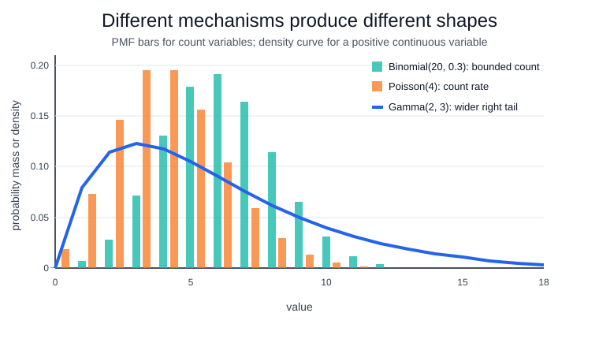

# Common Distributions

A probability distribution assigns mass or density to the values of a [random variable](random-variables.md). The useful part is not the name; it is the data-generating mechanism. Bernoulli and binomial laws describe independent yes/no trials, Poisson laws describe counts under a constant rate, normal laws describe symmetric additive noise, and gamma or exponential laws describe positive waiting-time-like quantities.

Key examples:

$$
X\sim\operatorname{Binomial}(n,p), \quad
P(X=k)=\binom nkp^k(1-p)^{n-k}.
$$

$$
X\sim\operatorname{Poisson}(\lambda), \quad
P(X=k)=e^{-\lambda}\frac{\lambda^k}{k!}.
$$

For a positive continuous quantity, the shape-scale Gamma density is

$$
X\sim\operatorname{Gamma}(\alpha,\theta), \quad
f(x)=\frac{x^{\alpha-1}e^{-x/\theta}}{\Gamma(\alpha)\theta^\alpha},\quad x>0.
$$

The Gamma function generalizes factorials to positive real inputs:

$$
\Gamma(\alpha)=\int_0^\infty t^{\alpha-1}e^{-t}\,dt,\quad \alpha>0,
$$

so for integer $m$, $\Gamma(m)=(m-1)!$.

Its distribution function is the accumulated density,

$$
F(x)=P(X\le x)=\int_0^x \frac{t^{\alpha-1}e^{-t/\theta}}{\Gamma(\alpha)\theta^\alpha}\,dt.
$$

Distribution choice directly affects [maximum likelihood](maximum-likelihood.md), [expectation and variance](expectation-and-variance.md), and whether a [central limit theorem](central-limit-theorem.md) approximation is reasonable.

## Worked visual comparison

The distribution should match the mechanism and the support. Use a binomial model when there is a fixed number of independent opportunities, such as 20 users each either clicking or not clicking. Use a Poisson model when counting events over a fixed exposure window, such as support tickets arriving in one hour under a roughly constant rate. Use a gamma model for positive continuous amounts or waiting-time-like quantities, such as time until a multi-step repair completes.

| distribution                          | what it models                                    |           mean |         variance | support               |
| ------------------------------------- | ------------------------------------------------- | -------------: | ---------------: | --------------------- |
| $\operatorname{Binomial}(n,p)$        | successes in $n$ independent yes/no trials        |           $np$ |        $np(1-p)$ | integers $0,\ldots,n$ |
| $\operatorname{Poisson}(\lambda)$     | event count in a fixed interval at rate $\lambda$ |      $\lambda$ |        $\lambda$ | integers $0,1,\ldots$ |
| $\operatorname{Gamma}(\alpha,\theta)$ | positive waiting-time-like quantity               | $\alpha\theta$ | $\alpha\theta^2$ | real values $x>0$     |

The plot instantiates the generic rows with $\operatorname{Binomial}(20,0.3)$, $\operatorname{Poisson}(4)$, and $\operatorname{Gamma}(2,3)$. The binomial and gamma examples both have mean 6, but the gamma variance is $18$ instead of $4.2$, so its right tail is much wider. The Poisson example is centered lower, near 4, and its variance equals its mean; that equality is a modeling assumption, not a universal law for count data.

## Caveats

Independence, constant rate, support, and tail assumptions are part of the model. Zero inflation, truncation, seasonality, and dependence can make a convenient distribution wrong.

## References

- [SciPy statistics reference](https://docs.scipy.org/doc/scipy/reference/stats.html)
- [OpenStax Introductory Statistics 2e, Chapter 4 introduction](https://openstax.org/books/introductory-statistics-2e/pages/4-introduction)
