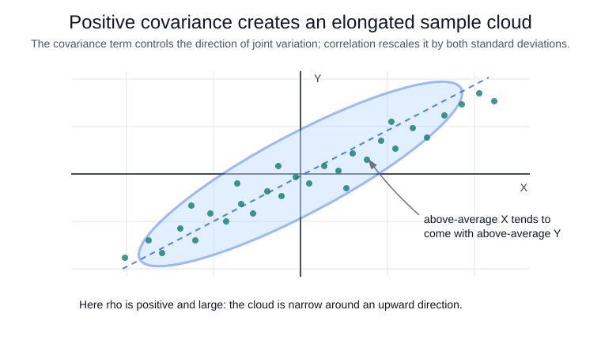

# Covariance and Correlation

Covariance measures whether two [random variables](random-variables.md) tend to be above or below their means together:

$$
\operatorname{Cov}(X,Y)=\mathbb E[(X-\mathbb E[X])(Y-\mathbb E[Y])].
$$

Correlation standardizes covariance by the two standard deviations:

$$
\rho_{X,Y}=\frac{\operatorname{Cov}(X,Y)}{\sigma_X\sigma_Y}.
$$

Covariance keeps the product of the units; correlation is unitless and lies in $[-1,1]$ when variances are positive. Covariance matrices are central in [statistical modelling](statistical-modelling.md) and [PCA](../03-classical-machine-learning/pca.md).

## Executed sample check

The code below draws 5000 observations from a bivariate normal distribution with mean vector $(0,0)$ and covariance matrix

$$
\Sigma =
\begin{bmatrix}
4 & 1.8\\
1.8 & 1
\end{bmatrix}.
$$

The diagonal entries say that $\sigma_X=\sqrt{4}=2$ and $\sigma_Y=\sqrt{1}=1$. The off-diagonal covariance is $1.8$, so the population correlation should be

$$
\rho_{X,Y}=\frac{1.8}{\sqrt{4}\sqrt{1}}=0.9.
$$

This snippet draws a bivariate normal sample with known covariance and compares the sample covariance and correlation with the theoretical correlation.

```python
import numpy as np

rng = np.random.default_rng(20260711)
xy = rng.multivariate_normal([0, 0], [[4, 1.8], [1.8, 1]], size=5000)
print("sample_cov")
print(np.round(np.cov(xy, rowvar=False), 3))
print("sample_corr", round(np.corrcoef(xy, rowvar=False)[0, 1], 3),
      "theoretical_corr", round(1.8 / (2 * 1), 3))
```

Observed output:

```text
sample_cov
[[3.891 1.751]
 [1.751 0.979]]
sample_corr 0.897 theoretical_corr 0.9
```

`np.cov(xy, rowvar=False)` treats the two columns as the variables and estimates the covariance matrix from the drawn sample. The sample covariance matrix is close to $\Sigma$: its variances, `3.891` and `0.979`, are near the generating values `4` and `1`, while its off-diagonal entry `1.751` is near the generating covariance `1.8`.

`np.corrcoef(xy, rowvar=False)[0, 1]` standardizes that cross-covariance by the sample standard deviations. The sample correlation `0.897` is near the theoretical `0.9`; it is not exactly equal because 5000 draws still contain sampling noise.



## Caveats

Correlation measures linear association, not causality. Nonlinear dependence can have near-zero correlation, and outliers or shared trends can dominate the estimate.

## References

- [SciPy statistics reference](https://docs.scipy.org/doc/scipy/reference/stats.html)
- [OpenStax Introductory Statistics 2e, Chapter 4 introduction](https://openstax.org/books/introductory-statistics-2e/pages/4-introduction)
