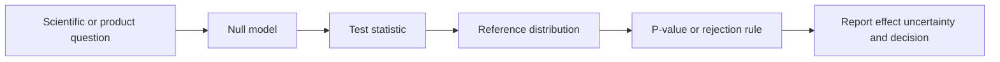

# Hypothesis Testing

Hypothesis testing compares observed data with a null model. It asks whether a pre-specified statistic would look unusually large, small, or extreme if the null hypothesis were true. This is the statistical mechanism behind [statistical significance](../17-experimentation-and-evaluation/statistical-significance.md), [A-B tests](../17-experimentation-and-evaluation/a-b-testing.md), and many checks that decide whether an observed difference is larger than ordinary sampling noise.

The central idea is modest but easy to misuse: a test does not prove that a hypothesis is true or false. It calculates how surprising the observed statistic would be under a model. [Confidence intervals](confidence-intervals.md) often use the same standard errors and reference distributions, while [experimental design](experimental-design.md) determines whether the comparison answers the intended causal question.

## Null model, statistic, and reference distribution

A hypothesis test has four named parts:

1. **Null hypothesis.** $H_0$ is the default model used to compute reference probabilities, such as "the two conversion rates are equal."
2. **Alternative hypothesis.** $H_1$ names the departure the test is designed to detect, such as "the treatment conversion rate differs from control."
3. **Test statistic.** $T(X)$ is a function of the random data $X$ that gets larger, smaller, or more extreme when the data disagree with $H_0$.
4. **Reference distribution.** The distribution of $T(X)$ under $H_0$ tells how unusual the observed value is.

For a one-sided upper-tail test, the p-value is:

$$
p=P_{H_0}\left(T(X)\ge T(x_{\mathrm{obs}})\right)
$$

Here $X$ denotes the random data that could have been observed under the null model, $x_{\mathrm{obs}}$ is the actual observed dataset, $T(x_{\mathrm{obs}})$ is the observed statistic, and $P_{H_0}$ means probability computed assuming $H_0$. A two-sided p-value counts statistics at least as extreme in either direction, using a rule specified before seeing the data.



The statistic is deliberately a compression: it reduces the data to the feature relevant to the test. That compression is useful only when it matches the question. A mean-difference test, a two-proportion z-test, a sign test, and a chi-square test all answer different questions.

## Z-statistics and standard errors

The z-statistic appears early because it is the simplest version of a pattern used throughout data science: compare an observed effect with its standard error. In an [A-B test](../14-ml-engineering-and-mlops/a-b-testing.md), the observed effect might be a treatment conversion rate minus a control conversion rate. A raw lift such as 0.7 percentage points is not enough by itself; the question is whether that lift is large relative to the noise expected from random assignment. The z-statistic turns that question into "how many standard errors away from zero is the observed lift?"

A z-statistic is a standardized statistic whose null distribution is approximately [standard normal](common-distributions.md#normal-and-gaussian-distributions), $\mathcal N(0,1)$. The usual form is:

$$
z=\frac{\hat\theta-\theta_0}{\operatorname{SE}(\hat\theta)}
$$

Here $\hat\theta$ is an estimator computed from the sample, $\theta_0$ is the null value of the estimand, and $\operatorname{SE}(\hat\theta)$ is the standard error: the sampling standard deviation of $\hat\theta$ under the model or a large-sample approximation. The z-statistic says how many standard errors the estimate sits above or below the null value.

For a two-sided test, the large-sample normal p-value is:

$$
p=2\left(1-\Phi(|z|)\right)
$$

where $\Phi$ is the cumulative distribution function of the standard normal distribution. The [central limit theorem](central-limit-theorem.md) explains why many averages, proportions, and smooth estimators become approximately normal after centering and scaling. The approximation is strongest when the sample is large, observations are independent enough for the standard error formula, and the estimator is not near a boundary.

In a two-proportion test, used often in online experiments, the observed rates are:

$$
\hat p_A=\frac{x_A}{n_A}
$$

$$
\hat p_B=\frac{x_B}{n_B}
$$

where $x_A$ and $x_B$ are success counts and $n_A$ and $n_B$ are exposed sample sizes in arms $A$ and $B$. Under the null hypothesis that both arms share one success probability, the pooled estimate is:

$$
X_A\sim\operatorname{Binomial}(n_A,p_A)
$$

$$
X_B\sim\operatorname{Binomial}(n_B,p_B)
$$

Here $X_A$ and $X_B$ are random success counts, while $p_A$ and $p_B$ are the true success probabilities. The [binomial distribution](common-distributions.md#binomial-distribution) is the observation model because each arm is treated as a fixed number of independent binary trials. The null model is $H_0:p_A=p_B$. For large samples, the [central limit theorem](central-limit-theorem.md) makes the difference in sample proportions approximately normal.

$$
\hat p=\frac{x_A+x_B}{n_A+n_B}
$$

The null standard error for the difference is:

$$
SE_0=\sqrt{\hat p(1-\hat p)\left(\frac{1}{n_A}+\frac{1}{n_B}\right)}
$$

The z-statistic is:

$$
z=\frac{\hat p_B-\hat p_A}{SE_0}
$$

This is the same statistic used in the MLOps [A-B testing](../14-ml-engineering-and-mlops/a-b-testing.md) release example. The numerator is the observed lift; the denominator is the amount of lift expected from sampling variation alone if the null were true.

**Example scenario.** A team tests a new recommender on 40,000 randomized users. The primary metric is binary: did the user click any recommended item? A two-proportion z-test is appropriate because the estimand is a difference in two independent conversion probabilities and both arms are large enough for a normal approximation.

## Tests and confidence intervals

Hypothesis tests and [confidence intervals](confidence-intervals.md) are two views of the same sampling distribution. A two-sided test at significance level $\alpha=0.05$ often rejects a null value exactly when the corresponding 95 percent confidence interval excludes that null value. For a large-sample normal estimator, the interval has the form:

$$
\hat\theta \pm z_{1-\alpha/2}\operatorname{SE}(\hat\theta)
$$

Here $z_{1-\alpha/2}$ is the standard-normal critical value with cumulative probability $1-\alpha/2$. For a 95 percent interval, $z_{0.975}\approx1.96$. The test reports compatibility with a specific null value; the interval shows a range of values compatible with the data under the same approximation.

## Common test families in data science

Most data-science tests differ in three choices: what kind of outcome is measured, what distributional model is assumed under the null, and what statistic compresses the evidence. The table is a routing guide for the subsections below: every test family named in the table is either explained in the z-statistic section above or in one of the named subsections that follow. The named probability laws are catalogued in [common distributions](common-distributions.md).

| Situation                                | Typical test family                    | Observation model                                                                                                      | Explained in                                |
| ---------------------------------------- | -------------------------------------- | ---------------------------------------------------------------------------------------------------------------------- | ------------------------------------------- |
| Two large binary rates                   | Two-proportion z-test                  | Independent [binomial](common-distributions.md#binomial-distribution) counts                                           | Z-statistics and standard errors            |
| Two continuous independent groups        | Welch or Student t-test                | Independent continuous samples with finite variance                                                                    | Mean and paired-difference tests            |
| Same unit measured twice                 | Paired t-test or signed-rank test      | One sample of paired differences                                                                                       | Mean and paired-difference tests            |
| Two or more continuous groups            | ANOVA or Welch ANOVA                   | Additive group-effect model plus residual noise                                                                        | More than two means: ANOVA                  |
| Small 2-by-2 categorical table           | Fisher exact test                      | [Hypergeometric](common-distributions.md#hypergeometric-distribution) table conditional on margins                     | Counts, proportions, and contingency tables |
| Larger categorical table                 | Chi-square independence test           | [Multinomial](common-distributions.md#multinomial-and-product-multinomial-distributions) or product-multinomial counts | Counts, proportions, and contingency tables |
| Distribution or drift check              | Kolmogorov-Smirnov or Anderson-Darling | [Empirical CDF](common-distributions.md#empirical-distributions) versus specified or reference CDF                     | Distribution and drift tests                |
| Ordinal, skewed, or outlier-heavy values | Mann-Whitney or Wilcoxon rank test     | Rank/order model or symmetric paired differences                                                                       | Rank and permutation tests                  |
| Custom metric or small benchmark         | Permutation test                       | Exchangeable labels under the null                                                                                     | Rank and permutation tests                  |

### Mean and paired-difference tests

Use a t-test when the estimand is a mean or mean difference and the standard error must be estimated from the sample. For two independent groups, Welch's t-test is usually the safer default because it does not assume equal variances. With sample means $\bar X_A$ and $\bar X_B$, sample variances $s_A^2$ and $s_B^2$, group sizes $n_A$ and $n_B$, and null difference $\Delta_0$, the statistic is:

$$
t=\frac{\bar X_B-\bar X_A-\Delta_0}{\sqrt{s_A^2/n_A+s_B^2/n_B}}
$$

The reference distribution is approximately a [Student t distribution](common-distributions.md#student-t-distribution) with Welch-Satterthwaite degrees of freedom. The model is "independent observations inside each group, with finite variance and a mean difference as the target." In data science, this appears in latency comparisons, average revenue per user, average rating, and offline metric deltas across independent examples.

The usual generative model is:

$$
X_{Ai}\sim F_A
$$

$$
X_{Bj}\sim F_B
$$

where observations are independent within and across groups, $F_A$ and $F_B$ are continuous distributions with means $\mu_A$ and $\mu_B$, and the null is $H_0:\mu_B-\mu_A=\Delta_0$. Student's t-test adds the stronger model $F_A$ and $F_B$ are [normal](common-distributions.md#normal-and-gaussian-distributions) with equal variance. Welch's t-test relaxes the equal-variance assumption and relies on an approximate t reference distribution for the estimated standard error. For very small, heavy-tailed, or dependent samples, a permutation, paired, or robust method is often a better model than forcing a t reference distribution.

**Example scenario.** A search team compares mean response latency for two independently sampled backend versions. Version $B$ has different variance because it calls an extra cache, so Welch's t-test is a better default than the equal-variance Student t-test.

For paired data, reduce the problem to one sample of differences. Let $D_i=Y_i^{B}-Y_i^{A}$ be the within-unit difference for unit $i$, $\bar D$ the average difference, $s_D$ the sample standard deviation of differences, $n$ the number of pairs, and $d_0$ the null mean difference:

$$
t=\frac{\bar D-d_0}{s_D/\sqrt n}
$$

This is the right structure when each query, user, patient, document, or benchmark item receives both treatments. Pairing removes unit-level noise and is often more sensitive than an unpaired test; [paired evaluation](../17-experimentation-and-evaluation/paired-evaluation.md) applies the same idea to model comparisons.

The paired t-test models the differences $D_i$ as independent draws from a distribution with mean $\mu_D$, and tests $H_0:\mu_D=d_0$ using a t reference distribution. It does not require the original $Y_i^A$ and $Y_i^B$ values to be independent; the dependence is exactly why pairing helps. The Wilcoxon signed-rank version replaces a mean model with an assumption that paired differences are symmetrically distributed around the null center. Its null reference distribution comes from the possible signed rank sums, so it is less tied to normal numeric errors and more tied to a symmetry assumption about paired differences.

**Example scenario.** A summarization benchmark scores the old and new model on the same 300 documents. Testing the 300 within-document score differences is better than treating the two score lists as independent, because hard documents affect both models.

### More than two means: ANOVA

Use one-way ANOVA when one categorical factor has $k$ levels and the question is whether any group mean differs. A simple model is:

$$
Y_{ij}=\mu+\tau_j+\varepsilon_{ij}
$$

Here $Y_{ij}$ is observation $i$ in group $j$, $\mu$ is a shared baseline mean, $\tau_j$ is the effect of group $j$, and $\varepsilon_{ij}$ is residual noise. Classical one-way ANOVA assumes the residuals are independent, approximately normal, and share one variance:

$$
\varepsilon_{ij}\sim\mathcal N(0,\sigma^2)
$$

The null hypothesis is that all group effects are zero:

$$
H_0:\tau_1=\tau_2=\cdots=\tau_k=0
$$

ANOVA compares variation explained by group membership with residual variation:

$$
F=\frac{MS_{\text{between}}}{MS_{\text{within}}}
$$

If the null model is true, both mean squares estimate the same noise scale and the statistic has an [F reference distribution](common-distributions.md#f-distribution). $F$ should be near 1; large values mean group labels explain more variation than expected from residual noise. In data science, ANOVA appears in multi-arm product tests, comparing several preprocessing pipelines, or checking whether a continuous metric differs across segments. It tells that some mean differs; follow-up contrasts or intervals are needed to say which ones.

Welch ANOVA keeps the additive group-mean target but relaxes the equal-variance assumption, which is useful when groups have different noise levels or sample sizes. Either way, ANOVA is a model for continuous outcomes with group-structured means, not a general test for arbitrary categorical outcomes.

**Example scenario.** A feature engineering team compares validation RMSE across four imputation strategies. One-way ANOVA tests whether strategy labels explain more variation in RMSE than residual run-to-run noise; follow-up contrasts then identify which strategy differs.

### Counts, proportions, and contingency tables

For a binary outcome in two large independent arms, the two-proportion z-test above compares rates. For small 2-by-2 tables, Fisher's exact test is often safer because it computes probabilities under fixed table margins instead of relying on a large-sample normal or chi-square approximation. The null model for a 2-by-2 Fisher test is an odds ratio of one, conditional on the observed row and column totals.

For Fisher's exact test, a 2-by-2 table can be written:

$$
\begin{matrix}
a & b\\
c & d
\end{matrix}
$$

Conditional on the row and column totals, the upper-left count $a$ follows a [hypergeometric](common-distributions.md#hypergeometric-distribution) null distribution when the row and column variables are independent. If the first row total is $r_1=a+b$, the first column total is $c_1=a+c$, and the table total is $N=a+b+c+d$, then:

$$
P(A=a)=\frac{\binom{c_1}{a}\binom{N-c_1}{r_1-a}}{\binom{N}{r_1}}.
$$

This means the test assumes the margins are fixed or conditioned on, then asks whether the observed table is unusually imbalanced among all tables with those margins.

**Example scenario.** A safety review compares two prompts on 24 red-team cases and records whether each prompt produced a policy violation. The table is small, so Fisher's exact test is more defensible than a chi-square approximation.

For larger categorical tables, use the chi-square independence test. Let $O_{ij}$ be the observed count in row $i$ and column $j$, $R_i$ the row total, $C_j$ the column total, and $N$ the total count. Under independence, the expected count is:

$$
E_{ij}=\frac{R_iC_j}{N}
$$

The Pearson chi-square statistic is:

$$
\chi^2=\sum_i\sum_j\frac{(O_{ij}-E_{ij})^2}{E_{ij}}
$$

The reference distribution is approximately [chi-square](common-distributions.md#chi-square-distribution) with $(r-1)(c-1)$ degrees of freedom for an $r$ by $c$ table, when expected counts are large enough. This is useful for checking whether error type depends on model version, whether missingness differs by data source, or whether a class label distribution shifted across time windows.

The observation model is usually [multinomial](common-distributions.md#multinomial-and-product-multinomial-distributions) or product-multinomial counts. In a multinomial view, each item falls into one of the $r\cdot c$ cells with probabilities $\pi_{ij}$, and independence means:

$$
\pi_{ij}=\pi_{i\cdot}\pi_{\cdot j}
$$

where $\pi_{i\cdot}$ is the row probability and $\pi_{\cdot j}$ is the column probability. The chi-square approximation improves as expected cell counts grow; sparse tables need exact, simulated, or collapsed-category approaches.

**Example scenario.** A classifier monitoring report cross-tabulates predicted error type by model version over thousands of labeled cases. A chi-square independence test checks whether the distribution of error categories changed after the release.

### Distribution and drift tests

Use distribution tests when the question is about the whole distribution, not only its mean. The one-sample Kolmogorov-Smirnov test compares an [empirical cumulative distribution function](common-distributions.md#empirical-distributions) $F_n(x)$ with a fully specified continuous reference distribution $F_0(x)$:

$$
D=\sup_x |F_n(x)-F_0(x)|
$$

The two-sample version replaces $F_0$ with another empirical distribution. This is useful for feature drift checks, simulator validation, residual diagnostics, and checking whether a latency distribution changed after deployment. The important limitation is modeling: the classic one-sample KS reference distribution assumes the target distribution is specified before seeing the data. If parameters are estimated from the same sample, critical values need adjustment or simulation.

The one-sample model is $X_1,\ldots,X_n$ independently drawn from a continuous distribution $F$. The null is $H_0:F=F_0$, where $F_0$ is fully specified before the test. The two-sample model has independent samples from $F_A$ and $F_B$ and tests $H_0:F_A=F_B$. The reference distribution is the null distribution of the maximum gap between empirical CDFs, not a normal, t, or chi-square model for the raw observations. These tests see distribution shape, location, and scale together, but they do not say which aspect changed without follow-up plots or summaries.

**Example scenario.** A fraud model monitors the distribution of transaction amounts this week against the training reference window. A two-sample Kolmogorov-Smirnov test can flag that the full distribution shifted, even if the mean amount barely changed.

Anderson-Darling and related EDF tests also compare empirical and reference distributions, often with more tail sensitivity. In production monitoring, distribution tests should be paired with plots and effect sizes: a huge sample can make tiny harmless distribution differences statistically significant.

Anderson-Darling uses the same empirical-distribution idea but weights discrepancies by the reference CDF, giving more influence to tail deviations than the KS maximum-distance statistic. Its null model is still "independent draws from the stated reference distribution" for a one-sample test, or "independent samples from the same continuous distribution" for a two-sample test. That modelling choice matters when tail behavior is operationally important.

**Example scenario.** A reliability team cares about high-latency tail behavior after a serving change. An Anderson-Darling style test is more aligned than a mean test because tail differences matter more than center differences.

### Rank and permutation tests

Rank tests are useful when values are ordinal, strongly skewed, or contaminated by outliers. The Mann-Whitney U test ranks pooled independent samples and tests whether one distribution tends to produce larger values than the other. One interpretation of $U$ is a count of cross-group ordered pairs:

$$
U=\sum_i\sum_j I(X_i>Y_j)
$$

Here $I(\cdot)$ is 1 when the comparison is true and 0 otherwise, with tie corrections in practical implementations. This test is common for skewed latency, revenue, dwell time, and human-rating distributions where a mean-based normal approximation may be misleading.

The Mann-Whitney model assumes independent samples from two distributions and uses ranks rather than raw magnitudes. A common null is equality of distributions, $H_0:F_A=F_B$; under that null, every assignment of pooled ranks to group labels is equally likely. Large-sample implementations often use a normal approximation to the rank statistic, but the observation model is ordinal ordering, not normal measurement noise. Under additional same-shape assumptions it is often interpreted as a location-shift test. Without those shape assumptions, it is better read as testing whether one distribution tends to yield larger observations than the other.

**Example scenario.** A product team compares session dwell time across two layouts. The distribution is right-skewed with a few very long sessions, so a Mann-Whitney rank test can ask whether one layout tends to produce larger observations without making the mean the whole story.

Permutation tests build the null distribution directly by shuffling labels. Choose a statistic, such as a mean difference, median difference, AUC difference, or model-score delta. If treatment labels are exchangeable under the null, repeatedly shuffle labels and recompute the statistic. The p-value is the fraction of shuffled statistics at least as extreme as the observed statistic. The mathematical model is not "the data are normal"; it is "under the null, the labels could have been assigned differently without changing the joint distribution." This makes permutation tests a strong default for custom metrics, small benchmark sets, and paired model evaluations when analytic reference distributions are awkward.

For independent samples, exchangeability means that the observed values could have been assigned to either label under $H_0$ because both groups share the same distribution. For paired samples, exchangeability often means the sign of each within-pair difference could have been flipped under the null. The statistic can be almost anything, but the validity comes from the randomization or exchangeability model, not from the formula alone.

**Example scenario.** Two rerankers are evaluated on the same 80 queries using [NDCG@10](../12-information-retrieval-and-search/precision-recall-map-mrr-ndcg.md). The metric has no simple normal reference distribution at that sample size, so a paired permutation test over query-level score differences can build a null distribution by swapping model labels within each query.

## Worked computation

This example tests whether two groups have the same mean. The task is not classification or prediction; it is statistical inference about a mean difference. The null model is $H_0:\mu_B-\mu_A=0$, where $\mu_A$ and $\mu_B$ are the population means for groups $A$ and $B$. The alternative is that the means differ.

The snippet draws two normal samples with different means and applies Welch's two-sample $t$-test. Welch's test is used instead of the equal-variance t-test because it does not assume the two groups have the same variance.

```python
import numpy as np
from scipy import stats

rng = np.random.default_rng(20260711)
a = rng.normal(0.0, 1.0, size=40)
b = rng.normal(0.55, 1.0, size=42)
res = stats.ttest_ind(b, a, equal_var=False)
effect = b.mean() - a.mean()
print("mean_diff", round(effect, 4),
      "t_stat", round(res.statistic, 4),
      "p_value", round(res.pvalue, 4))
```

Observed output:

```text
mean_diff 0.5646 t_stat 2.4319 p_value 0.0173
```

The simulated mean difference is `0.5646`: group $B$ has the higher sample mean. The Welch t-statistic is `2.4319`, so the observed difference is about 2.43 estimated standard errors from zero under the null model. The p-value is `0.0173`, meaning that a difference at least this extreme would be uncommon if the two population means were equal and the test assumptions held.

| Testing component      | In the example                                                                               |
| ---------------------- | -------------------------------------------------------------------------------------------- |
| Null model             | The two groups have equal population means.                                                  |
| Alternative            | The group means differ.                                                                      |
| Statistic              | Welch's t-statistic compares the observed mean difference with its estimated standard error. |
| Reference distribution | Approximate t distribution with unequal-variance degrees of freedom.                         |
| Reported result        | A mean difference of `0.5646` and p-value `0.0173`, not a probability that the null is true. |

This result is evidence against equal means, but it is not a full decision by itself. The decision should still consider effect size, sample design, repeated looks, measurement quality, and the cost of false positives and false negatives.

## History and adoption

Modern significance testing combines ideas from multiple statistical traditions. Student's t-test was developed for small-sample industrial quality work. Fisher popularized p-values as measures of evidence against a null model. Neyman and Pearson formalized error rates, rejection regions, and power. Current scientific and product experimentation often uses a blend: report an effect estimate, uncertainty interval, p-value, pre-specified decision threshold, and practical significance.

In data science and ML, hypothesis tests appear in experiment analysis, feature monitoring, drift checks, model comparisons, and quality-control dashboards. They are most useful when they are tied to a decision and least useful when used as automatic discovery machines over many unplanned comparisons.

## Caveats

Optional stopping, multiple comparisons, peeking at segments, and using the wrong unit of analysis can make p-values anti-conservative. A non-significant result is not evidence of no effect unless the test had enough power for a meaningful effect size. A significant result can still be useless if the effect is tiny, the sample is biased, the metric was chosen after looking, or the model assumptions are wrong.

Use exact or resampling methods when large-sample approximations are weak. Use clustered or paired methods when observations are dependent. Report the test, statistic, p-value, effect size, interval, sample size, and analysis plan so readers can tell what was actually tested.

## References

- [OpenStax Introductory Statistics 2e, Chapter 9 introduction](https://openstax.org/books/introductory-statistics-2e/pages/9-introduction)
- [Student, 1908, The Probable Error of a Mean](https://doi.org/10.1093/biomet/6.1.1)
- [Neyman and Pearson, 1933, On the Problem of the Most Efficient Tests of Statistical Hypotheses](https://doi.org/10.1098/rsta.1933.0009)
- [SciPy `ttest_ind` reference](https://docs.scipy.org/doc/scipy/reference/generated/scipy.stats.ttest_ind.html)
- [SciPy normal distribution reference](https://docs.scipy.org/doc/scipy/reference/generated/scipy.stats.norm.html)
- [NIST Engineering Statistics Handbook: Chi-square independence test](https://itl.nist.gov/div898/software/dataplot/refman1/auxillar/chistest.htm)
- [NIST Engineering Statistics Handbook: ANOVA and F-tests](https://www.itl.nist.gov/div898/handbook/prc/section4/prc423.htm)
- [NIST Engineering Statistics Handbook: Kolmogorov-Smirnov goodness-of-fit test](https://www.itl.nist.gov/div898/handbook/eda/section3/eda35g.htm)
- [SciPy `fisher_exact` reference](https://docs.scipy.org/doc/scipy/reference/generated/scipy.stats.fisher_exact.html)
- [SciPy `mannwhitneyu` reference](https://docs.scipy.org/doc/scipy/reference/generated/scipy.stats.mannwhitneyu.html)
- [SciPy `permutation_test` reference](https://docs.scipy.org/doc/scipy/reference/generated/scipy.stats.permutation_test.html)

> [!nav]
> **Section** — [Probability and Statistics](index.md)
>
> [← Confidence Intervals](confidence-intervals.md) [Statistical Modelling →](statistical-modelling.md)
