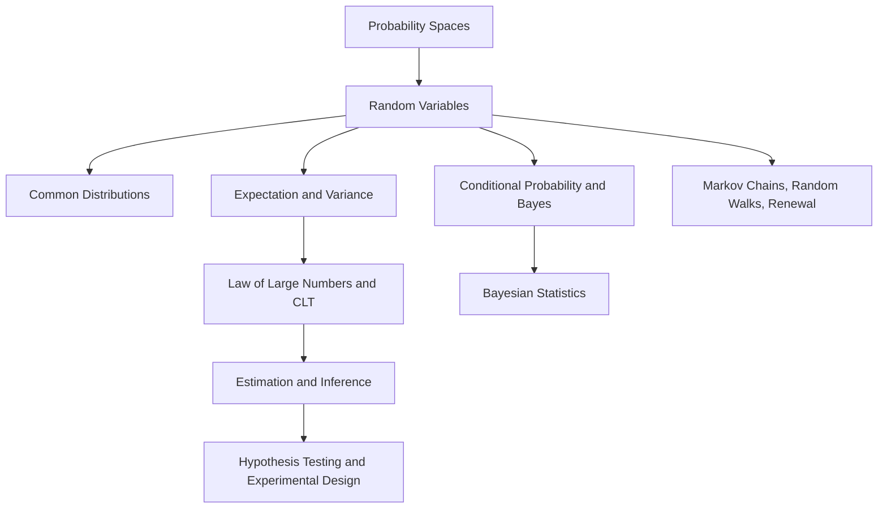

# Probability and Statistics

This section links the mathematical language of uncertainty to statistical inference and modelling. Start with the probability foundations, use the limit theorems to understand estimation error, then move to intervals, tests, process models, and experimental design.

## Knowledge map

Probability foundations feed both the limit theorems (which explain why estimation works) and the stochastic-process models, and together they support inference and experiment design.

## Reading path

Read the probability foundations, then limits and processes, then inference and modelling.

1. [Probability Spaces](probability-spaces.md): outcomes, events, and probability measures.
2. [Random Variables](random-variables.md): turning outcomes into measurable quantities with distributions.
3. [Common Distributions](common-distributions.md): reusable laws for counts, waiting times, errors, and positive quantities.
4. [Expectation and Variance](expectation-and-variance.md): averages, spread, and standard errors.
5. [Conditional Probability](conditional-probability.md): updating the reference population after evidence.
6. [Bayes Theorem](bayes-theorem.md): turning priors and likelihoods into posteriors.
7. [Covariance and Correlation](covariance-and-correlation.md): linear co-movement between variables.
8. [Law of Large Numbers](law-of-large-numbers.md): why averages converge.
9. [Central Limit Theorem](central-limit-theorem.md): why standardized sample means become normal.
10. [Markov Chains](markov-chains.md): memory-one state transitions.
11. [Random Walks](random-walks.md): accumulating random increments into paths.
12. [Renewal Theory](renewal-theory.md): repeated events separated by iid waiting times.
13. [Markov Renewal Processes](markov-renewal-processes.md): state transitions with transition-specific holding times.
14. [Statistical Estimation](statistical-estimation.md): estimands, estimators, estimates, and uncertainty.
15. [Maximum Likelihood](maximum-likelihood.md): fitting parameters by maximizing the observed-data likelihood.
16. [Maximum A Posteriori Estimation](maximum-a-posteriori-estimation.md): adding a prior and taking the posterior mode.
17. [Bayesian Statistics](bayesian-statistics.md): keeping the full posterior for inference and decisions.
18. [Confidence Intervals](confidence-intervals.md): reporting uncertainty through repeated-sampling coverage.
19. [Hypothesis Testing](hypothesis-testing.md): comparing an observed statistic with a null model.
20. [Statistical Modelling](statistical-modelling.md): specifying stochastic structure, parameters, and assumptions.
21. [Experimental Design](experimental-design.md): planning assignment and measurement so inference targets the intended question.

## Connections

- [Mathematical Foundations](../01-mathematical-foundations/index.md) supplies the calculus and linear algebra underneath these results.
- [Classical Machine Learning](../03-classical-machine-learning/index.md) and [Experimentation and Evaluation](../17-experimentation-and-evaluation/index.md) turn estimation and testing into model fitting and decisions.

> **Learning path — [Foundations](../00-home-and-navigation/learning-paths.md#foundations):** ← [Mathematical Foundations](../01-mathematical-foundations/index.md) · [Classical Machine Learning](../03-classical-machine-learning/index.md) →
