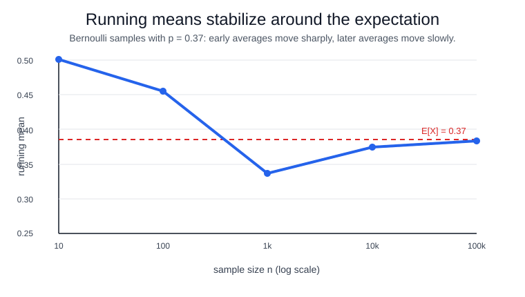

# Law of Large Numbers

The law of large numbers says that sample averages stabilize around their expected value. For independent copies $X_1,X_2,\ldots$ with $\mathbb E[|X_1|]<\infty$,

$$
\bar X_n=\frac{1}{n}\sum_{i=1}^n X_i \to \mathbb E[X_1]
$$

in probability for the weak law, and almost surely for the strong law under standard iid assumptions. This is the consistency mechanism behind [statistical estimation](statistical-estimation.md). The [central limit theorem](central-limit-theorem.md) then describes the remaining fluctuation around the limit.

## Intuition

Individual observations remain noisy; averaging divides the cumulative noise by $n$. If the data are representative and the mean exists, positive and negative deviations increasingly cancel. In a [random walk](random-walks.md), the position may wander, but the average step converges to the step mean.

## Worked simulation

This simulation draws Bernoulli trials with probability $0.37$ and prints running means at larger sample sizes to show convergence toward the true probability.

```python
import numpy as np

rng = np.random.default_rng(20260711)
x = rng.binomial(1, 0.37, size=100000)
for n in [10, 100, 1000, 10000, 100000]:
    print(f"n={n} running_mean={x[:n].mean():.5f}")
```

Observed output:

```text
n=10 running_mean=0.50000
n=100 running_mean=0.41000
n=1000 running_mean=0.35100
n=10000 running_mean=0.36600
n=100000 running_mean=0.36698
```

The early average is noisy: after 10 draws it is `0.50000`, and after 100 draws it is `0.41000`. By 100,000 draws the running mean is `0.36698`, close to the Bernoulli expectation $0.37$.



The line is jagged early because a few Bernoulli draws can move the average a lot. Later, each new draw changes $\bar X_n$ by only about $1/n$, so the curve settles near the expectation line at $0.37$.

## Caveats

More data does not repair a biased sample, changing population, dependence, leakage, or infinite mean. The theorem also does not say every finite prefix is close to the truth.

## References

- [Law of large numbers](https://en.wikipedia.org/wiki/Law_of_large_numbers)
- [OpenStax Introductory Statistics 2e, Chapter 7 introduction](https://openstax.org/books/introductory-statistics-2e/pages/7-introduction)

> [!nav]
> **Section** — [Probability and Statistics](index.md)
>
> [← Covariance and Correlation](covariance-and-correlation.md) [Central Limit Theorem →](central-limit-theorem.md)
