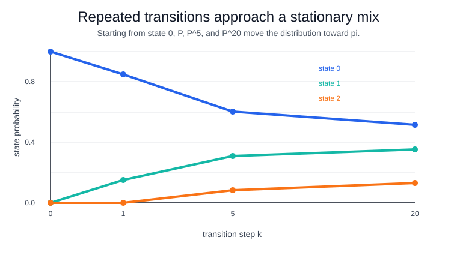

# Markov Chains

A Markov chain is a sequence of states whose future depends on the present state, not the full past. For a time-homogeneous discrete chain,

$$
P(X_{t+1}=j\mid X_t=i,X_{t-1},\ldots,X_0)=P(X_{t+1}=j\mid X_t=i)=P_{ij}.
$$

The transition matrix $P$ contains rows that sum to one, so each row is a [conditional probability](conditional-probability.md) distribution over the next state. A stationary distribution $\pi$ satisfies

$$
\pi=\pi P.
$$

[Random walks](random-walks.md) are a special case on integer or graph states. [Markov renewal processes](markov-renewal-processes.md) extend this structure by attaching random holding times to transitions.

## Worked computation

This snippet propagates an initial state distribution through a transition matrix and computes the stationary distribution that remains unchanged after one transition.

```python
import numpy as np

P = np.array([[.85, .15, 0.0], [.2, .65, .15], [.05, .35, .60]])
w, v = np.linalg.eig(P.T)
pi = np.real(v[:, np.argmin(np.abs(w - 1))])
pi = pi / pi.sum()
dist = np.array([1., 0., 0.])
for k in [1, 5, 20]:
    print(f"dist_after_{k}", np.round(dist @ np.linalg.matrix_power(P, k), 4).tolist())
print("stationary", np.round(pi, 4).tolist(), "check", np.round(pi @ P, 4).tolist())
```

Observed output:

```text
dist_after_1 [0.85, 0.15, 0.0]
dist_after_5 [0.6049, 0.3102, 0.085]
dist_after_20 [0.5155, 0.3526, 0.1319]
stationary [0.5147, 0.3529, 0.1324] check [0.5147, 0.3529, 0.1324]
```

Starting in state 0, repeated multiplication moves the distribution from `[0.85,0.15,0.0]` after one step to `[0.5155,0.3526,0.1319]` after 20 steps. That is close to the stationary distribution `[0.5147,0.3529,0.1324]`, which also satisfies $\pi P=\pi$ in the printed check.



The visualization makes the convergence pattern explicit: state 0 falls from certainty toward about `0.515`, state 1 rises toward about `0.353`, and state 2 approaches a smaller long-run share near `0.132`.

## Caveats

The memoryless assumption can be too strong when dwell time or earlier history matters. Rare transitions are hard to estimate, and nonstationary systems need time-varying transition probabilities.

## References

- [Markov chain](https://en.wikipedia.org/wiki/Markov_chain)
- [SciPy statistics reference](https://docs.scipy.org/doc/scipy/reference/stats.html)
