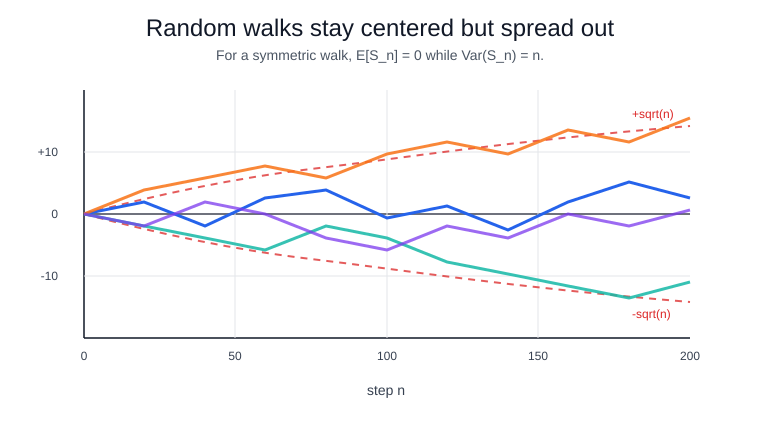

# Random Walks

A random walk accumulates random steps. In one dimension,

$$
S_n=S_0+\sum_{i=1}^n X_i,
$$

where the increments $X_i$ are often iid with mean $\mu$ and variance $\sigma^2$. Then

$$
\mathbb E[S_n]=S_0+n\mu, \qquad \operatorname{Var}(S_n)=n\sigma^2.
$$

A simple symmetric random walk has $X_i\in\{-1,1\}$ with equal probability. It is also a [Markov chain](markov-chains.md), because the next position depends on the current position and one new step.

## Worked simulation

This simulation runs many symmetric random walks, checks that final-position variance is near the number of steps, and estimates the chance of hitting level 20.

```python
import numpy as np

rng = np.random.default_rng(20260711)
steps = rng.choice([-1, 1], size=(20000, 200))
walk = steps.cumsum(axis=1)
final = walk[:, -1]
print("final_mean", round(final.mean(), 3),
      "final_var", round(final.var(ddof=1), 3),
      "theory_var", 200)
print("P(hit_20_by_200)", round((walk.max(axis=1) >= 20).mean(), 4))
```

Observed output:

```text
final_mean -0.061 final_var 197.853 theory_var 200
P(hit_20_by_200) 0.1576
```

The mean final position is near zero at `-0.061`, but the final variance is `197.853`, close to the theoretical value 200. The hit probability `0.1576` shows that individual paths can still reach level 20 even when the expected step is zero.



The paths keep crossing zero, but the vertical spread grows with time. The dashed guides mark the $\pm\sqrt n$ scale, matching the variance formula $\operatorname{Var}(S_n)=n$ for a simple symmetric walk.

## Connections and caveats

The [law of large numbers](law-of-large-numbers.md) says average step size converges; the [central limit theorem](central-limit-theorem.md) explains why $S_n/\sqrt n$ is approximately normal. Random walk baselines appear in time series, but real series can have mean reversion, seasonality, bounded states, and structural breaks.

## References

- [Random walk](https://en.wikipedia.org/wiki/Random_walk)
- [OpenStax Introductory Statistics 2e, Chapter 7 introduction](https://openstax.org/books/introductory-statistics-2e/pages/7-introduction)
