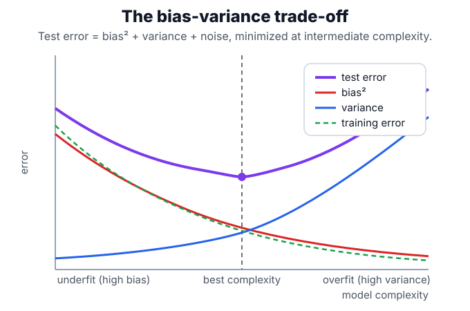

# Bias-Variance Trade-Off

The bias-variance trade-off explains why a model can fail by being too rigid or too sensitive. High-bias models underfit because the function class misses real structure; high-variance models overfit because small changes in the training data change the fitted function. [Regularization](regularization.md), [model selection](model-selection.md), and ensembling all manipulate this trade-off.

## Defining math

Consider squared-error regression where the model $\hat f_D$ is fit on a random training set $D$, and let $\mathbb E_D[\cdot]$ denote averaging over all such training sets. Writing $f(x)$ for the true regression function, $Y$ for the observed target (which equals $f(x)$ plus noise of variance $\sigma^2$), and $\hat f_D(x)$ for the model's prediction at $x$, the expected prediction error decomposes as

$$
\mathbb E_D[(Y-\hat f_D(x))^2] = \underbrace{(\mathbb E_D[\hat f_D(x)]-f(x))^2}_{\text{bias}^2} + \underbrace{\mathbb E_D[(\hat f_D(x)-\mathbb E_D[\hat f_D(x)])^2]}_{\text{variance}} + \underbrace{\sigma^2}_{\text{noise}}.
$$

The three terms are the squared bias (how far the average fit sits from the truth), the variance (how much the fit moves as the training set changes), and the irreducible noise. A single deep [decision tree](decision-trees.md) can have low bias and high variance; [random forests](random-forests.md) reduce variance by averaging many decorrelated trees.

## Intuition

Bias is being consistently wrong. Variance is being differently wrong depending on which sample you happened to collect. Training error mainly reveals fit to the observed sample; validation error reveals whether that fit survives new data.

## Worked example

Fix a single input $x$ and imagine refitting the model on many different training sets, recording its prediction at $x$ each time. Suppose the true value is $f(x)=5.0$, the predictions average to $\mathbb E_D[\hat f_D(x)]=4.5$ (the model runs low), they scatter with variance $0.8$, and the observation noise has variance $\sigma^2=1.0$. The decomposition then gives

$$
\underbrace{(4.5-5.0)^2}_{\text{bias}^2 = 0.25}
+ \underbrace{0.8}_{\text{variance}}
+ \underbrace{1.0}_{\text{noise}}
= 2.05.
$$

Only the first two terms are under the model's control, and they pull in opposite directions as complexity changes: a more flexible model lowers bias but raises variance. The sum — the test error — is therefore U-shaped, minimized at an intermediate complexity, while training error keeps falling toward zero:



The gap between the falling training curve and the U-shaped test curve is the visible signature of variance: a model that fits the training data far better than new data is on the right-hand, overfit side of the minimum.

## Overfitting in practice

The same trade-off appears empirically when a shallow and an unlimited-depth tree are fit to the same noisy data. The stump underfits; the deep tree drives training error to zero yet generalizes worse.

```python
from sklearn.datasets import make_regression
from sklearn.metrics import mean_squared_error
from sklearn.model_selection import train_test_split
from sklearn.tree import DecisionTreeRegressor

X, y = make_regression(n_samples=160, n_features=1, noise=35, random_state=2)
Xtr, Xte, ytr, yte = train_test_split(X, y, random_state=2)
for depth in [1, None]:
    tree = DecisionTreeRegressor(max_depth=depth, random_state=2).fit(Xtr, ytr)
    label = "unlimited" if depth is None else depth
    print("max_depth", label,
          "train_rmse", round(mean_squared_error(ytr, tree.predict(Xtr)) ** 0.5, 1),
          "test_rmse", round(mean_squared_error(yte, tree.predict(Xte)) ** 0.5, 1))
```

Observed output:

```text
max_depth 1 train_rmse 32.6 test_rmse 34.8
max_depth unlimited train_rmse 0.0 test_rmse 48.6
```

The unlimited tree memorizes the training set exactly (train RMSE $0.0$) but its test RMSE of $48.6$ is worse than the stump's $34.8$: it sits on the overfit side of the curve above, where variance dominates. The stump has more bias but lower variance on this sample.

## Caveats

The decomposition above is exact for squared-error regression, but classification losses do not decompose as cleanly. Also, validation error is itself noisy; choosing among many models on one small validation split can overfit the validation set.

## References

- [An Introduction to Statistical Learning](https://www.statlearning.com/)
- [scikit-learn User Guide: validation curves](https://scikit-learn.org/stable/modules/learning_curve.html#validation-curve)

> [!nav]
> **Section** — [Classical Machine Learning](index.md)
>
> [← Regularization](regularization.md) [Model Selection →](model-selection.md)
