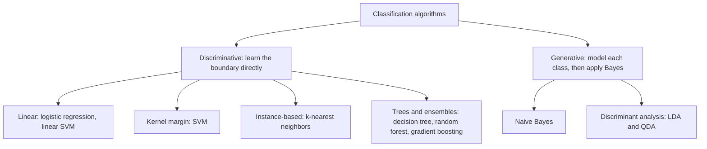
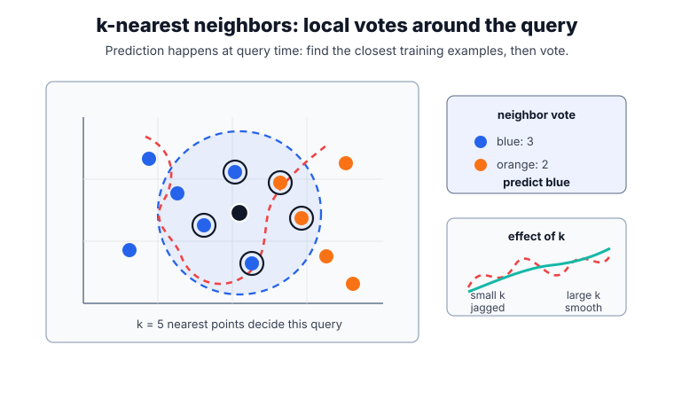
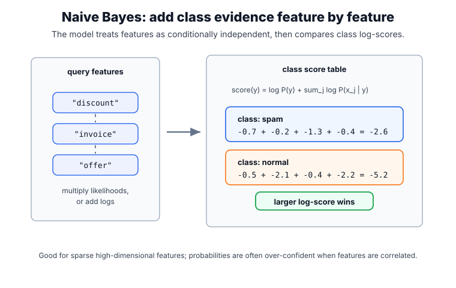
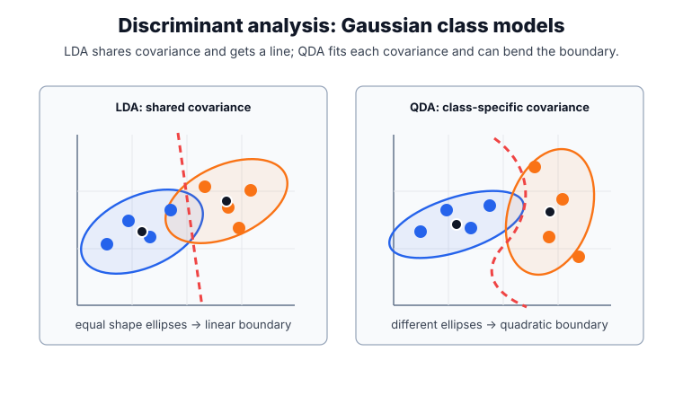
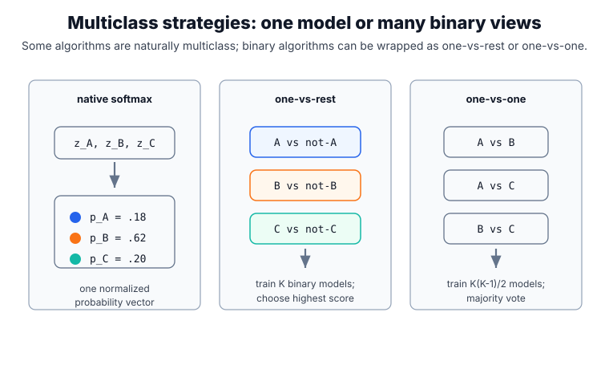

# Classification

Classification predicts a discrete label $y\in\{1,\dots,K\}$ from features $x$. It is the [supervised-learning](supervised-learning.md) task whose target is a category rather than a number — predicting a number is [regression](regression.md). Classifiers differ along two axes that organize this page: **what they output** — a probability per class, as [logistic regression](logistic-regression.md) does, or a score/margin, as [support vector machines](support-vector-machines.md) do — and **how they model the problem** — _discriminatively_, drawing a decision boundary directly, or _generatively_, modeling each class and applying Bayes' rule.

## From scores to decisions

A classifier's real job is to turn a score into an action. A **probabilistic** classifier estimates $\hat p_k(x)=P(Y=k\mid X=x)$ and predicts the highest-probability class, $\hat y=\arg\max_k \hat p_k(x)$. For a three-class score $\hat p(x)=(0.1,\,0.6,\,0.3)$ over $\{A,B,C\}$, the prediction is $B$.

A **binary** classifier usually exposes a single score $s(x)$ and a threshold $t$, predicting positive when the score clears it: $\hat y(t)=\mathbf 1\{s(x)\ge t\}$, where the indicator $\mathbf 1\{\cdot\}$ is $1$ when $s(x)\ge t$. If $s(x)=0.42$ and $t=0.5$ the prediction is negative; lowering $t$ to $0.4$ flips the same example to positive. The model has not changed — only the decision rule. The threshold is part of the decision system, not the model, so moving it trades [precision, recall](evaluation-metrics.md#classification-metrics), and false-positive against false-negative rates.

This separation of ranking from thresholding has three consequences that run through the rest of classification: a model can rank examples well even when its default threshold is wrong; high [accuracy](evaluation-metrics.md#classification-metrics) can be worthless under [class imbalance](class-imbalance.md); and probability outputs need [calibration](calibration.md) before they are trusted as risks or expected costs.

## Families of classifiers

Most classifiers fall into a few families that differ in the shape of boundary they can draw, whether they emit probabilities, and how they scale.



The **discriminative** methods learn the boundary between classes directly, modeling $P(y\mid x)$ or a decision rule. The **generative** methods instead model how each class produces features, $P(x\mid y)$, and combine that with the class prior $P(y)$ through Bayes' rule, $P(y\mid x)\propto P(x\mid y)\,P(y)$. Generative models can work with less data and tolerate missing features; discriminative models usually reach higher accuracy when data is plentiful.

| Algorithm                                            | Approach               | Decision boundary   | Probabilities?           | Where       |
| ---------------------------------------------------- | ---------------------- | ------------------- | ------------------------ | ----------- |
| [Logistic regression](logistic-regression.md)        | discriminative, linear | linear              | yes                      | linked page |
| [Support vector machine](support-vector-machines.md) | discriminative, margin | linear or kernel    | no (scores)              | linked page |
| [Decision tree](decision-trees.md)                   | recursive partition    | axis-aligned        | leaf frequencies         | linked page |
| [Random forest](random-forests.md)                   | bagged tree ensemble   | nonlinear           | vote fractions           | linked page |
| [Gradient boosting](gradient-boosting.md)            | boosted tree ensemble  | nonlinear           | yes                      | linked page |
| k-nearest neighbors                                  | instance-based         | local, nonlinear    | neighbor fractions       | below       |
| Naive Bayes                                          | generative             | (log-)linear        | yes (often uncalibrated) | below       |
| Discriminant analysis (LDA / QDA)                    | generative Gaussian    | linear or quadratic | yes                      | below       |

The five algorithms with dedicated pages, in one line each:

- **[Logistic regression](logistic-regression.md)** — a linear model of the log-odds trained with cross-entropy; the standard interpretable probabilistic baseline.
- **[Support vector machines](support-vector-machines.md)** — maximize the margin between classes; kernels bend the boundary into nonlinear shapes.
- **[Decision trees](decision-trees.md)** — recursive axis-aligned splits chosen by impurity decrease; readable but unstable on their own.
- **[Random forests](random-forests.md)** — bagged ensembles of decorrelated trees that vote, cutting the variance of a single tree.
- **[Gradient boosting](gradient-boosting.md)** — trees added stagewise to correct previous errors; often the strongest off-the-shelf tabular classifier.

Linear classifiers are treated more generally under [linear models](linear-models.md).

## Algorithms explained here

The families below are common enough to state in full, but do not yet have a dedicated page.

### k-nearest neighbors

k-NN builds no model at training time; it stores the training set and classifies a query from its closest neighbors.

1. Choose the number of neighbors $k$ and a distance, usually Euclidean $\lVert x-x_i\rVert_2$ over **standardized** features.
2. For a query $x$, compute its distance to every training point.
3. Keep the $k$ smallest distances — the $k$ nearest neighbors.
4. Predict the majority class among them; the estimated probability of class $c$ is the fraction of those $k$ neighbors in class $c$ (optionally weighted by $1/\text{distance}$).

Small $k$ gives a jagged, low-bias/high-variance boundary; large $k$ smooths it toward the majority class — a direct [bias-variance trade-off](bias-variance-trade-off.md). Because it works purely on distances, k-NN is very sensitive to feature scaling and to irrelevant features, and each prediction costs $O(n)$ without a spatial index. It is a strong nonparametric baseline when the boundary is irregular and the dataset is small enough to search quickly.



In the plot, the black point is the query and the blue dashed circle encloses its five nearest neighbors. The circled neighbors vote three blue to two orange, so the query is predicted blue. The orange-red dashed curve sketches the k-NN decision boundary: points on one side would be classified blue and points on the other side orange. It is schematic rather than fitted from every displayed point, but it shows the important behavior: for small $k$, the boundary can wiggle around local examples; larger $k$ averages over more neighbors and smooths the boundary.

### Naive Bayes

Naive Bayes applies Bayes' rule with one deliberately strong simplification: the features are assumed conditionally independent given the class, so their likelihoods multiply.

$$
P(y\mid x)\;\propto\; P(y)\prod_{j=1}^{d} P(x_j\mid y)
$$

1. Estimate the class prior $P(y)$ from label frequencies.
2. Estimate each per-feature likelihood $P(x_j\mid y)$ — a Gaussian for continuous features, or multinomial/Bernoulli counts for text.
3. For a query, add the log-prior and the log-likelihoods for each class (sums of logs, not products, for numerical stability).
4. Predict the class with the largest total; normalizing the class scores turns them into probabilities.

The independence assumption is almost always false, yet the $\arg\max$ is often right because the errors in individual likelihood terms tend to cancel. Naive Bayes trains in one pass, needs little data, and is a classic strong baseline for high-dimensional sparse problems such as text; its main weakness is that the probabilities are usually over-confident and benefit from [calibration](calibration.md).



The diagram uses text-style features because Naive Bayes is especially common for sparse counts. Each token contributes a class-specific likelihood term; in implementation those multiplicative terms are accumulated as log-sums. The winning class is the one with the largest total log-score, not necessarily the one with individually strongest evidence for every feature.

### Discriminant analysis (LDA and QDA)

Linear and quadratic discriminant analysis model each class as a multivariate Gaussian and classify with Bayes' rule.

1. Estimate each class mean $\mu_k$, prior $\pi_k$, and covariance. LDA assumes one shared covariance $\Sigma$; QDA gives each class its own $\Sigma_k$.
2. Score a query by its Gaussian log-density under each class, plus $\log\pi_k$.
3. Predict the highest-scoring class.

With a shared covariance the quadratic terms cancel and the boundary is **linear** (LDA); with per-class covariances it stays **quadratic** (QDA). LDA is closely related to logistic regression — both produce a linear boundary — but it arrives there through a generative Gaussian model rather than by directly fitting log-odds, so it can be more efficient on small, well-behaved data and worse when the Gaussian assumption fails.



The ellipses represent the Gaussian class densities learned from the data. In LDA, both classes share the same covariance shape, so the density comparison leaves a straight boundary. In QDA, each class has its own covariance shape, so the equality of class scores can bend into a quadratic curve.

### Multiclass strategies

Some algorithms handle $K>2$ classes natively: decision trees, k-NN, naive Bayes, and **multinomial (softmax) logistic regression**, which replaces the sigmoid with $\operatorname{softmax}(z)_k = e^{z_k}/\sum_j e^{z_j}$ over $K$ linear scores. Inherently binary models such as SVMs are extended by wrapping:

- **One-vs-rest (OvR):** train $K$ binary classifiers, each "class $k$ versus everything else," and predict the class with the highest score. $K$ models.
- **One-vs-one (OvO):** train a classifier for every pair of classes and take a majority vote. $K(K-1)/2$ models, each fit on a smaller, cleaner subset.



The softmax panel is one model with one normalized probability vector. One-vs-rest instead trains one binary model per class and compares their scores. One-vs-one trains pairwise models and lets them vote; this can make each binary task simpler, but the number of models grows quadratically with the number of classes.

## Baseline versus a real classifier

The example contrasts a majority-class baseline with a logistic classifier, making clear why accuracy alone is a weak classification summary.

```python
from sklearn.datasets import make_classification
from sklearn.dummy import DummyClassifier
from sklearn.linear_model import LogisticRegression
from sklearn.metrics import accuracy_score, precision_recall_fscore_support
from sklearn.model_selection import train_test_split

X, y = make_classification(n_samples=220, n_features=5, n_informative=3,
                           weights=[0.7, 0.3], random_state=10)
Xtr, Xte, ytr, yte = train_test_split(X, y, stratify=y, random_state=10)
for name, est in [("dummy", DummyClassifier(strategy="most_frequent")),
                  ("logistic", LogisticRegression(max_iter=1000, random_state=10))]:
    est.fit(Xtr, ytr)
    pred = est.predict(Xte)
    recall = precision_recall_fscore_support(yte, pred, zero_division=0)[1][1]
    print(name, "accuracy", round(accuracy_score(yte, pred), 3), "recall_pos", round(recall, 3))
```

Observed output:

```text
dummy accuracy 0.691 recall_pos 0.0
logistic accuracy 0.945 recall_pos 0.882
```

The dummy classifier looks decent by accuracy because the majority class is common, but it finds none of the positive class — the reason accuracy needs the richer [evaluation metrics](evaluation-metrics.md) and a threshold chosen for the task.

## Choosing a classifier

Start with a strong, cheap baseline and add only the complexity that pays off on validation, using [model selection](model-selection.md) to compare fairly:

- Tabular data, accuracy first: gradient boosting or random forests.
- Interpretable probabilities: logistic regression, then check [calibration](calibration.md).
- High-dimensional sparse text: linear SVM or naive Bayes.
- Small data with a roughly linear boundary: logistic regression or LDA.
- Irregular boundary, modest $n$: k-nearest neighbors.

Whatever the family, compare it against a majority-class baseline and choose the operating threshold from [evaluation metrics](evaluation-metrics.md), not the default $0.5$.

## History and adoption

Classification has one of the longest lineages in statistics and machine learning. Fisher introduced linear discriminant analysis in 1936. The perceptron (1958) recast a linear classifier as an online, mistake-driven learner and seeded neural networks. Logistic regression brought a probabilistic linear model from mid-century statistics into everyday use. Decision-tree induction (CART and ID3) arrived in the 1980s, and the 1990s added support vector machines and kernels. Ensembles then took over practical tabular work: AdaBoost (1997), random forests (2001), and gradient-boosted trees — later engineered into fast libraries such as XGBoost and LightGBM — remain the default winners on structured data, while deep networks dominate perceptual inputs like images, audio, and text.

## Caveats

Do not report only [accuracy](evaluation-metrics.md#classification-metrics) when class priors are skewed or costs are asymmetric; use precision, recall, ROC or PR curves, and cost-weighted metrics. The default $0.5$ threshold is rarely the right operating point. Distance- and covariance-based methods (k-NN, SVM, LDA) require feature scaling, whereas trees and naive Bayes do not. Probabilities from several classifiers — naive Bayes and margin-scaled SVMs especially — are poorly [calibrated](calibration.md). Multiclass labels may carry hierarchy or ordinal structure that a flat $\arg\max$ ignores. And train-test splits must preserve deployment boundaries, or [data leakage](data-leakage.md) inflates every metric.

## References

- [scikit-learn User Guide: Supervised learning](https://scikit-learn.org/stable/supervised_learning.html)
- [scikit-learn User Guide: Classification metrics](https://scikit-learn.org/stable/modules/model_evaluation.html#classification-metrics)
- [An Introduction to Statistical Learning](https://www.statlearning.com/)
- [The Elements of Statistical Learning](https://hastie.su.domains/ElemStatLearn/)

> [!nav]
> **Section** — [Classical Machine Learning](index.md)
>
> [← Regression](regression.md) [Linear Models →](linear-models.md)
