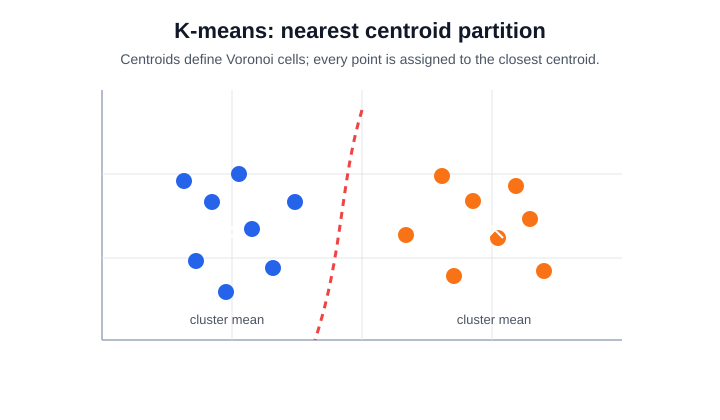
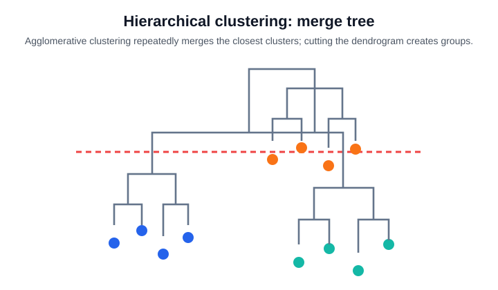
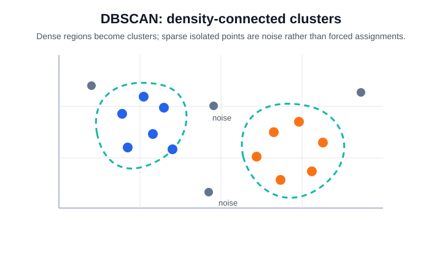
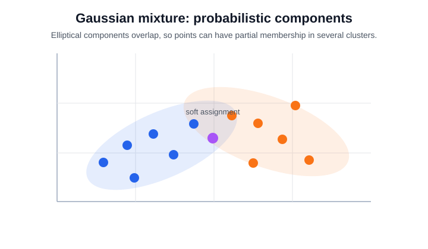
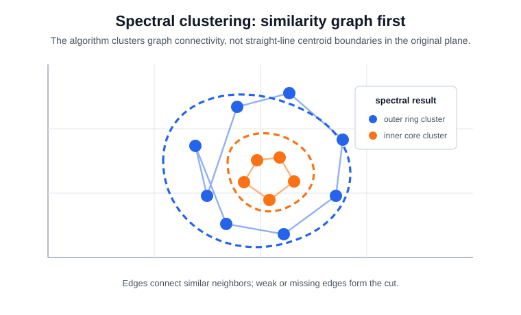

# Clustering

Clustering assigns examples to groups using features alone. The result is not a discovered truth by default; it is the partition implied by a chosen similarity definition. K-means uses Euclidean distance, DBSCAN uses density connectivity, and mixture models use likelihood.

## Shared evaluation

Cluster algorithms have different objectives, so one defining equation does not cover them all. A shared diagnostic is the silhouette score for point $i$: $s_i=(b_i-a_i)/\max(a_i,b_i)$, where $a_i$ is within-cluster distance and $b_i$ is the best average distance to another cluster. It is useful for compact distance-based clusters, but it can underrate density-based or non-convex structure.

## Intuition

K-means looks for compact spherical groups around centroids. If the real structure is elongated, nested, density-based, or categorical, a different [unsupervised learning](unsupervised-learning.md) assumption may be more honest. [PCA](pca.md) is often used before visualization, but it can change cluster geometry.

## Algorithms

### K-means

K-means solves

$$
\min_{C_1,\dots,C_K}\sum_{k=1}^{K}\sum_{x_i\in C_k}\lVert x_i-\mu_k\rVert_2^2,
\qquad
\mu_k=\frac{1}{|C_k|}\sum_{x_i\in C_k}x_i.
$$

The procedure is:

1. Choose $K$, the number of clusters.
2. Initialize $K$ centroids, often with k-means++.
3. Assign each point to the nearest centroid.
4. Recompute each centroid as the mean of its assigned points.
5. Repeat assignment and update until labels or centroids stop changing.

It alternates between assigning each point to the nearest centroid and recomputing each centroid as the mean of its assigned points. It optimizes within-cluster squared Euclidean distance, so it prefers compact, roughly spherical clusters with similar variance. The plot shows the implicit Voronoi boundary: every point is forced to the closest centroid even if it sits between groups.



K-means is useful for fast segmentation, vector quantization, prototype discovery, image color compression, and preprocessing when the goal is a simple partition. It is a poor default for clusters with different densities, elongated shapes, many outliers, or non-Euclidean similarity.

This snippet standardizes Iris features, fits $k$-means with three clusters, and reports inertia, silhouette score, and cluster sizes.

```python
from sklearn.cluster import KMeans
from sklearn.datasets import load_iris
from sklearn.metrics import silhouette_score
from sklearn.preprocessing import StandardScaler
import numpy as np

X, y = load_iris(return_X_y=True)
Xz = StandardScaler().fit_transform(X)
km = KMeans(n_clusters=3, random_state=21, n_init=10).fit(Xz)
print("inertia", round(km.inertia_, 1))
print("silhouette", round(silhouette_score(Xz, km.labels_), 3))
print("cluster_sizes", np.bincount(km.labels_))
```

Observed output:

```text
inertia 139.8
silhouette 0.46
cluster_sizes [47 50 53]
```

The cluster sizes are balanced, and the silhouette is moderate. The inertia value is only comparable for the same scaled dataset and number of clusters.

### Agglomerative hierarchical clustering

Agglomerative means "bottom up." The algorithm starts with every observation as a one-point cluster, then repeatedly joins the two closest clusters until only one tree remains. The user can then cut that tree at a chosen height to get a desired number of groups.

The procedure is:

1. Start with clusters $\{x_1\}, \{x_2\}, \dots, \{x_n\}$.
2. Compute a distance between every pair of current clusters.
3. Merge the closest pair.
4. Repeat steps 2 and 3; the sequence of merges is the dendrogram.

The only subtle part is step 2: once clusters contain multiple points, what does "distance between two clusters" mean? The linkage rule answers that question. For two clusters $A$ and $B$:

$$
d_{\text{single}}(A,B)=\min_{a\in A,b\in B}d(a,b),
\qquad
d_{\text{complete}}(A,B)=\max_{a\in A,b\in B}d(a,b).
$$

Single linkage merges clusters whose nearest points are close, so it can form long chains. Complete linkage requires all points across the two clusters to be close, so it favors tighter groups. Ward linkage chooses the merge that adds the least within-cluster squared error, so it behaves more like a variance-preserving version of k-means.

The plot shows the same idea visually: leaves are individual points, low branches are early local merges, high branches are broader merges, and the dashed horizontal line is the chosen cut that turns the tree into flat clusters.



Hierarchical clustering is useful when the number of clusters is unknown, when nested group relationships matter, or when analysts need an interpretable merge tree for taxonomy building, customer hierarchies, document grouping, or exploratory analysis. It becomes expensive for very large datasets and can be sensitive to the linkage choice.

### DBSCAN and HDBSCAN-style density clustering

DBSCAN defines a core point by a radius and neighbor count:

$$
N_{\varepsilon}(x_i)=\{x_j:\ d(x_i,x_j)\le \varepsilon\},
\qquad
x_i\ \text{is core if}\ |N_{\varepsilon}(x_i)|\ge \text{min\_samples}.
$$

The DBSCAN procedure is:

1. Pick `eps` and `min_samples`.
2. Mark each point as core if enough neighbors fall inside its `eps` radius.
3. Start a cluster from an unvisited core point.
4. Add all density-reachable core points and their border points to that cluster.
5. Repeat from other unvisited core points.
6. Label points that are never reached as noise.

Clusters grow by connecting density-reachable core points and their border points. Points that do not belong to any dense region are labeled as noise. The plot shows two irregular dense regions plus isolated outliers that are not forced into a cluster.



DBSCAN is useful for spatial data, anomaly-heavy datasets, and clusters with non-spherical shapes. Its main weakness is parameter sensitivity: one global `eps` can fail when densities vary. HDBSCAN generalizes the idea by building a hierarchy over density levels, which often works better when clusters have different densities, but it still requires careful interpretation of stability and noise labels.

### Gaussian mixture models

A Gaussian mixture model defines a density

$$
p(x)=\sum_{k=1}^{K}\pi_k\,\mathcal{N}(x\mid \mu_k,\Sigma_k),
\qquad
\sum_{k=1}^{K}\pi_k=1.
$$

The procedure is:

1. Choose $K$ mixture components and initialize their means, covariances, and weights.
2. E-step: compute each point's responsibility, meaning its probability of belonging to each component.
3. M-step: update component means, covariances, and weights using those responsibilities.
4. Repeat the E-step and M-step until the log-likelihood stops improving.
5. Use responsibilities for soft clusters, or assign each point to its most likely component for hard clusters.

Expectation-maximization alternates between soft assignment probabilities for each component and parameter updates for means, covariances, and mixture weights. The plot shows overlapping ellipses: a point can partly belong to more than one cluster.



Gaussian mixtures are useful when uncertainty matters, clusters are elliptical rather than spherical, or downstream decisions need probabilities instead of hard labels. They are common for soft segmentation, model-based density estimation, and anomaly scoring by low likelihood. They are less reliable when clusters are strongly non-Gaussian, dimensions are high relative to sample size, or covariance estimation is poorly regularized.

### Spectral clustering

Spectral clustering turns the data into a graph and clusters the graph. Each point is a node. The similarity matrix $W$ is the weighted adjacency matrix: $W_{ij}$ is large when points $i$ and $j$ should be considered neighbors, and small or zero when they should not. The degree matrix $D$ is diagonal; its entry $D_{ii}=\sum_j W_{ij}$ is the total similarity weight attached to node $i$.

The [graph Laplacian](../01-mathematical-foundations/graph-laplacian.md) compares each node with its neighbors. Common choices are

$$
L = D-W
\qquad \text{or} \qquad
L_{\text{sym}}=I-D^{-1/2}WD^{-1/2}.
$$

The procedure is:

1. Build a similarity graph, usually from nearest neighbors or an affinity kernel.
2. Construct the degree matrix and a graph Laplacian from the similarity matrix.
3. Compute a small number of informative eigenvectors of the Laplacian.
4. Treat those eigenvector coordinates as a new embedding of the points.
5. Run k-means or another simple clustering method in that spectral embedding.

The intuition is that Laplacian eigenvectors are nearly constant inside well-connected graph regions and change across weak graph cuts. The plot shows a ring around an inner core. A centroid method sees overlapping coordinates, but the graph has strong edges around the ring and strong edges inside the core, with weak connectivity between them.



An easy disconnected example makes the matrices concrete; the same setup is expanded with plots in the [Graph Laplacian worked example](../01-mathematical-foundations/graph-laplacian.md#worked-example). Suppose four points form two pairs, with point 1 connected to point 2 and point 3 connected to point 4:

$$
W=
\begin{bmatrix}
0&1&0&0\\
1&0&0&0\\
0&0&0&1\\
0&0&1&0
\end{bmatrix},
\qquad
D=
\begin{bmatrix}
1&0&0&0\\
0&1&0&0\\
0&0&1&0\\
0&0&0&1
\end{bmatrix}.
$$

Then $L=D-W$ has two zero-eigenvalue directions: one constant on nodes $\{1,2\}$ and one constant on nodes $\{3,4\}$. Spectral clustering uses those directions as coordinates, so the two pairs separate immediately. Real datasets are rarely perfectly disconnected, but small Laplacian eigenvectors still expose approximate graph components.

Spectral clustering is useful for non-convex clusters, graph communities, manifold-like data, and datasets where similarity is easier to define than coordinates. It is less useful when the similarity graph is huge, noisy, or hard to tune; the choice of affinity, neighborhood size, and number of clusters strongly controls the result.

## Caveats

Most clustering algorithms encode a distance, density, graph, or likelihood assumption. Standardization matters when features have different units. Categorical or mixed data may need a different similarity function before any algorithm is meaningful. Internal cluster scores can improve for partitions that are not useful, and a pretty two-dimensional plot can hide structure in discarded dimensions. If anomalies are the goal, [anomaly detection](anomaly-detection.md) methods may be more direct than forcing every point into a cluster.

## References

- [scikit-learn User Guide: Clustering](https://scikit-learn.org/stable/modules/clustering.html)
- [scikit-learn User Guide: K-means](https://scikit-learn.org/stable/modules/clustering.html#k-means)
- [scikit-learn User Guide: Hierarchical clustering](https://scikit-learn.org/stable/modules/clustering.html#hierarchical-clustering)
- [scikit-learn User Guide: DBSCAN](https://scikit-learn.org/stable/modules/clustering.html#dbscan)
- [scikit-learn User Guide: Gaussian mixture models](https://scikit-learn.org/stable/modules/mixture.html)
- [scikit-learn User Guide: Spectral clustering](https://scikit-learn.org/stable/modules/clustering.html#spectral-clustering)

> [!nav]
> **Section** — [Classical Machine Learning](index.md)
>
> [← PCA](pca.md) [Anomaly Detection →](anomaly-detection.md)
