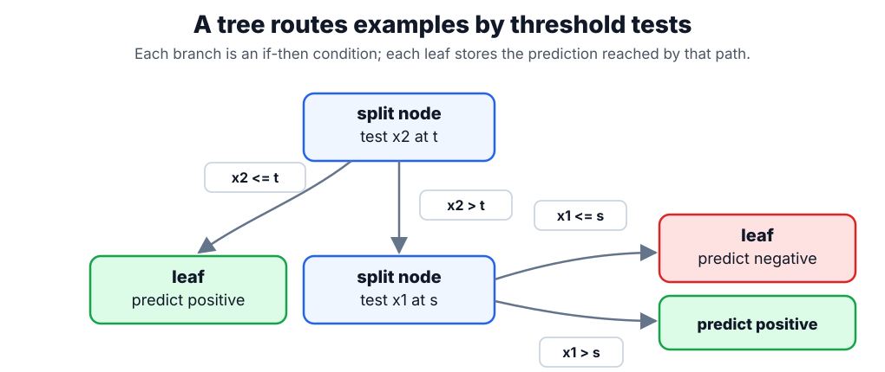

# Decision Trees

A decision tree predicts by routing an example through feature-threshold tests until it reaches a leaf. It is the base learner behind [random forests](random-forests.md) and most classical [gradient boosting](gradient-boosting.md) systems.

## How a tree is built

A decision tree is grown greedily, one split at a time, by recursively partitioning the training data. Each split asks for the single question — one feature, one threshold — that makes the two children purer than the parent:

1. **Start at the root** with all training samples in a single node.
2. **Search candidate splits.** For every feature and every candidate threshold, consider dividing the node's samples into a left group (feature below the threshold) and a right group (at or above it).
3. **Score each split** by how much purer the two children are than the parent — the impurity decrease $\Delta$ defined below. "Pure" means one class dominates (classification) or the target has low variance (regression).
4. **Keep the best split**, the one with the largest $\Delta$, and attach its two children to the node.
5. **Recurse** on each child, using only the samples routed to it.
6. **Stop** when a rule fires — maximum depth reached, too few samples to split further, or a node already pure — and turn the node into a leaf.

Prediction is then a lookup: route a new example down the threshold tests until it reaches a leaf, and return that leaf's majority class (classification) or mean target (regression). Each root-to-leaf path is an axis-aligned if-then rule, which is what makes trees easy to read with [interpretability](interpretability.md) tools — but also unstable, because a slightly different sample can change an early split and reshape the whole subtree.

## Splitting criteria

Step 3 needs a measure of node impurity. For classification, consider a node $m$ holding a subset of the training samples, and let $p_{mk}$ be the proportion of those samples that belong to class $k$. The node's impurity can be measured by Gini impurity $G_m=1-\sum_k p_{mk}^2$ or entropy $H_m=-\sum_k p_{mk}\log p_{mk}$; both are largest when classes are evenly mixed and zero when the node contains a single class. A candidate split $s$ divides node $m$ into a left and a right child, and is scored by the impurity decrease it produces:

$$
\Delta(s,m)=I_m-\frac{n_L}{n_m}I_L-\frac{n_R}{n_m}I_R,
$$

where $I_m$ is the impurity of node $m$ (Gini, entropy, or — for regression trees — the within-node variance of the target), $n_m$ is the number of samples at the node, $n_L$ and $n_R$ are the counts sent to the left and right children, and $I_L$, $I_R$ are those children's impurities. The tree keeps the split with the largest $\Delta$, and the prediction at a leaf is the majority class or mean target of the samples that reach it.

## Worked example

This is a **binary classification** example, where a split is scored by how pure it makes the resulting groups. Consider a node holding ten training samples, five from the positive class and five from the negative class, so each class proportion is $p_{mk}=\tfrac{5}{10}$. Its Gini impurity $G_{\text{parent}}$ is

$$
G_{\text{parent}} = 1 - \left(\tfrac{5}{10}\right)^2 - \left(\tfrac{5}{10}\right)^2 = 0.5,
$$

the maximum for a two-class node, because the classes are perfectly mixed. A candidate split on feature $x_2$ at threshold $t$ sends $n_L=4$ samples to the left child (all positive) and $n_R=6$ to the right child (one positive, five negative), whose impurities $G_L$ and $G_R$ are

$$
G_L = 1 - 1^2 - 0^2 = 0, \qquad
G_R = 1 - \left(\tfrac{1}{6}\right)^2 - \left(\tfrac{5}{6}\right)^2 = \tfrac{10}{36} \approx 0.278.
$$

Weighting each child impurity by its share of the $n_m=10$ samples ($n_L/n_m$ and $n_R/n_m$) gives the split impurity, and the impurity decrease $\Delta$ is the parent impurity minus that weighted child impurity:

$$
\tfrac{4}{10}(0) + \tfrac{6}{10}(0.278) = 0.167, \qquad
\Delta = 0.5 - 0.167 = 0.333.
$$

The tree keeps the split with the largest $\Delta$, then recurses on each child until a stopping rule fires. The left child is already pure, so it becomes a leaf; the right child can be split again on another feature:

Each path from root to leaf is an if-then rule built from axis-aligned threshold tests, and a prediction is simply the majority class (or mean target) of the leaf an example reaches.

## Caveats

Deep unpruned trees have low bias and high variance, which is why they are often averaged in [random forests](random-forests.md). Axis-aligned splits can approximate curved boundaries only with many rectangles. Standard impurity-based feature importance can favor continuous or high-cardinality features.

## References

- [scikit-learn User Guide: Decision Trees](https://scikit-learn.org/stable/modules/tree.html)
- [An Introduction to Statistical Learning](https://www.statlearning.com/)

> [!nav]
> **Section** — [Classical Machine Learning](index.md)
>
> [← Feature Engineering](feature-engineering.md) [Random Forests →](random-forests.md)
