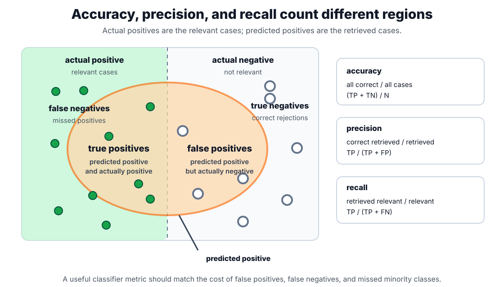
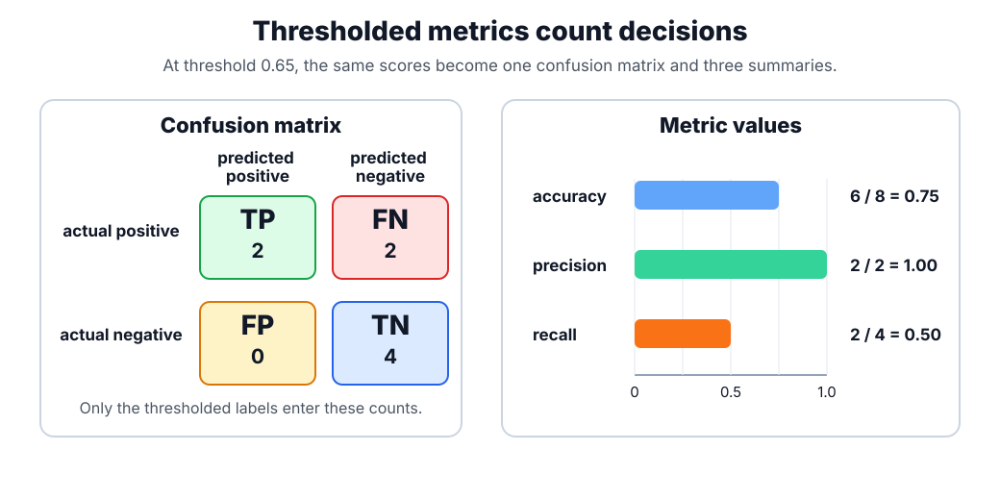
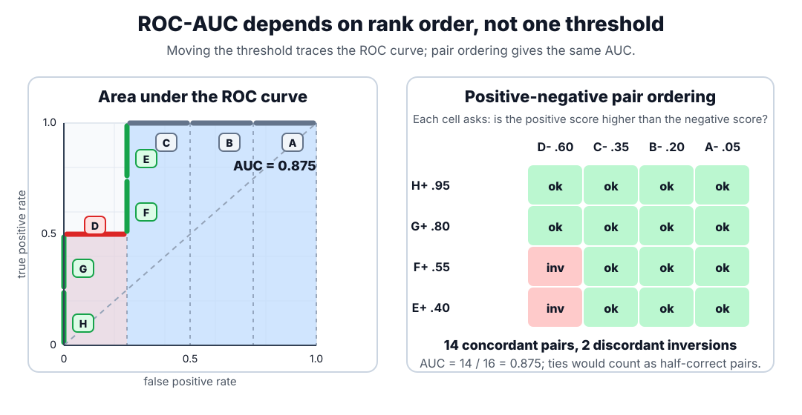

# Evaluation Metrics

Evaluation metrics are loss or scoring functions used after fitting to estimate usefulness. The metric must match the prediction type and decision cost: RMSE belongs to [regression](regression.md), precision and recall to [classification](classification.md), and Brier/log loss to probability quality and [calibration](calibration.md).

## Defining math

### Regression metrics

For regression, let $y_i$ be the observed target, $\hat y_i$ the prediction, and $n$ the number of evaluated examples:

$$
\operatorname{MSE}=\frac{1}{n}\sum_{i=1}^{n}(y_i-\hat y_i)^2,\qquad
\operatorname{RMSE}=\sqrt{\operatorname{MSE}},\qquad
\operatorname{MAE}=\frac{1}{n}\sum_{i=1}^{n}|y_i-\hat y_i|.
$$

MSE is the **mean squared error**: average squared prediction error. RMSE is the **root mean squared error**: the square root of MSE, bringing the score back to target units. MAE is the **mean absolute error**: average absolute prediction error, also in target units and usually less sensitive to outliers than RMSE.

### Classification metrics

For binary classification, $TP$, $TN$, $FP$, and $FN$ count true positives, true negatives, false positives, and false negatives at a chosen threshold:

$$
\operatorname{accuracy}=\frac{TP+TN}{TP+TN+FP+FN},
\qquad
\operatorname{precision}=P=\frac{TP}{TP+FP},
\qquad
\operatorname{recall}=R=\frac{TP}{TP+FN}.
$$

Accuracy is the fraction of all examples classified correctly. Precision is the fraction of predicted positives that are actually positive. Recall is the fraction of actual positives recovered by the model; it is also called sensitivity or true positive rate in some domains.

The same precision and recall terms also appear in ranked retrieval, where they measure the cleanliness and coverage of a result list rather than a classifier threshold. See [Precision, Recall, MAP, MRR, and NDCG](../12-information-retrieval-and-search/precision-recall-map-mrr-ndcg.md) for the retrieval-side definitions.

The $F_1$ score is the harmonic mean of precision $P$ and recall $R$:

$$
F_1=\frac{2PR}{P+R}.
$$

For $K$ classes, let $TP_c$, $FP_c$, and $FN_c$ be the one-vs-rest counts for class $c$. Micro averages pool counts before computing the metric, while macro averages compute a per-class metric first:

$$
\operatorname{precision}_{micro}=
\frac{\sum_{c=1}^{K}TP_c}{\sum_{c=1}^{K}(TP_c+FP_c)},
\qquad
\operatorname{precision}_{macro}=
\frac{1}{K}\sum_{c=1}^{K}\frac{TP_c}{TP_c+FP_c}.
$$

Recall and $F_1$ use the same micro-versus-macro idea with their own per-class formulas.

### Probability and ranking metrics

For probabilistic binary classifiers, let $y_i\in\{0,1\}$ and let $\hat p_i$ be the predicted probability of the positive class. Log loss is

$$
\operatorname{logloss}=-\frac{1}{n}\sum_{i=1}^{n}
\left[y_i\log \hat p_i+(1-y_i)\log(1-\hat p_i)\right].
$$

Log loss, also called binary cross-entropy in many machine-learning contexts, rewards assigning high probability to the true label and punishes confident wrong probabilities strongly.

ROC-AUC summarizes how well positive examples are ranked above negative examples across all possible score thresholds:

$$
\operatorname{AUC}=P(s(x^+)>s(x^-))+\frac{1}{2}P(s(x^+)=s(x^-)).
$$

Here $s(x)$ is the model score, $x^+$ is a randomly chosen positive example, and $x^-$ is a randomly chosen negative example. This probability form is the same idea as the Mann-Whitney $U$ statistic, also called the Wilcoxon rank-sum statistic after a change of scale: AUC counts concordant positive-negative pairs, gives tied pairs half credit, and divides by the number of positive-negative pairs.

Average precision summarizes the precision-recall curve and is often reported as PR-AUC for rare-positive ranking tasks. Unlike ROC-AUC, precision-recall curves are strongly affected by the positive-class prevalence, which is why they are often more revealing under [class imbalance](class-imbalance.md).

## Intuition

A metric is a compression of many errors into one number. Compression is useful only when the number preserves what the decision maker cares about. In classification, the starting point is usually the confusion matrix: examples can be actually positive or negative, and the model can predict positive or negative.

Thresholded metrics answer a decision question: after choosing a threshold, how many cases went into each cell of the confusion matrix? Accuracy measures the share of all decisions that were correct. Precision asks, "When the model predicted positive, how often was it right?" Recall asks, "Of all actual positives, how many did the model catch?" Raising the threshold often increases precision and decreases recall; lowering it often does the opposite.

Accuracy can be a poor summary when classes are imbalanced. If only 1% of transactions are fraudulent, a model that predicts "not fraud" for every case reaches 99% accuracy while detecting none of the fraud. Precision and recall force the report to say which positive-class errors are happening: false alarms, missed positives, or both. This is why [class imbalance](class-imbalance.md) changes metric choice rather than merely changing the dataset description.

For multi-class classification, the same ideas can be averaged in different ways. A micro average first pools all per-class $TP$, $FP$, and $FN$ counts and then computes the metric; large classes therefore dominate the result. A macro average computes the metric separately for each class and then takes the unweighted mean; rare classes therefore count equally with frequent classes. Weighted macro averages sit between those extremes by weighting each class metric by its support.

ROC-AUC answers a different question. It ignores any one threshold and evaluates the score ranking. To draw the ROC curve, sort examples by score and lower the threshold through that ranked list. When the next example is positive, the curve steps upward because the true positive rate increases. When the next example is negative, the curve steps right because the false positive rate increases. If every positive has a higher score than every negative, AUC is $1$. If positives and negatives are randomly interleaved, AUC is near $0.5$. A strictly increasing transformation of the scores changes calibration and threshold positions, but not AUC, because it preserves the order.

The pair-count view is often the clearest intuition. With $m$ positives and $n$ negatives, there are $mn$ positive-negative pairs. A concordant pair has $s(x^+)>s(x^-)$; a discordant pair has the negative ranked above the positive. Discordant pairs are rank inversions: the adjacent swaps needed to move all positives above all negatives would count these misordered positive-negative pairs. AUC is high when few such inversions exist.

## Worked example

Suppose a binary classifier produces these positive-class scores:

| sample | actual label | score |
| ------ | -----------: | ----: |
| A      |            0 |  0.05 |
| B      |            0 |  0.20 |
| C      |            0 |  0.35 |
| D      |            0 |  0.60 |
| E      |            1 |  0.40 |
| F      |            1 |  0.55 |
| G      |            1 |  0.80 |
| H      |            1 |  0.95 |

At threshold $0.65$, only G and H are predicted positive. The confusion matrix is $TP=2$, $FP=0$, $TN=4$, and $FN=2$. Therefore

$$
\operatorname{accuracy}=\frac{2+4}{8}=0.75,\qquad
\operatorname{precision}=\frac{2}{2+0}=1.00,\qquad
\operatorname{recall}=\frac{2}{2+2}=0.50.
$$

The thresholded metrics say that this operating point is conservative: every positive prediction is correct, but half of the actual positives are missed.

ROC-AUC uses the same scores without fixing a threshold. First sort the examples by predicted positive-class score in descending order. In this example, that score permutation is H+, G+, D-, F+, E+, C-, B-, A-.

The curve moves upward for H and G, moves right for D, moves upward for F and E, then moves right for the remaining negatives. The plot labels each step with the sample that crosses the moving threshold. Because the ROC x-axis is false-positive rate rather than threshold, threshold crossings are shown as step labels rather than as a separate threshold axis. A positive that appears before a negative creates correctly ordered area; a negative that appears before later positives creates rank inversions.

There are four positives and four negatives, so there are $4\cdot 4=16$ positive-negative pairs. Two pairs are misordered because negative sample D with score $0.60$ ranks above positive samples E and F. The other 14 pairs are correctly ordered, so

$$
\operatorname{AUC}=\frac{14}{16}=0.875.
$$

This explains why AUC can be high even when recall at one chosen threshold is low: the ranking is mostly good, but the chosen threshold is too strict for catching all positives.

## Caveats

Do not tune on the test metric repeatedly and still call it an unbiased test estimate. Confidence intervals matter when model differences are small. Always pair aggregate metrics with slice checks when errors have unequal operational cost.

Accuracy is often misleading when the majority class dominates. Precision can be improved by making fewer positive predictions, even if recall becomes poor. Recall can be improved by predicting positive more often, even if precision collapses. ROC-AUC can look stable under severe class imbalance because the false-positive rate divides by all negatives; for rare-positive retrieval, average precision or the full precision-recall curve is usually more diagnostic.

Log loss and Brier score evaluate probabilities rather than hard labels. A model can have a good AUC and poor log loss when it ranks cases well but assigns badly calibrated probabilities; see [calibration](calibration.md).

## References

- [scikit-learn User Guide: Metrics and scoring](https://scikit-learn.org/stable/modules/model_evaluation.html)
- [scikit-learn API: `roc_auc_score`](https://scikit-learn.org/stable/modules/generated/sklearn.metrics.roc_auc_score.html)
- [scikit-learn User Guide: Tuning the decision threshold](https://scikit-learn.org/stable/modules/classification_threshold.html)
- [Fawcett, T. (2006). An introduction to ROC analysis. Pattern Recognition Letters.](https://doi.org/10.1016/j.patrec.2005.10.010)

> [!nav]
> **Section** — [Classical Machine Learning](index.md)
>
> [← Anomaly Detection](anomaly-detection.md) [Calibration →](calibration.md)
>
> **Learning path** — [Foundations](../00-home-and-navigation/learning-paths.md#foundations)
>
> [← Supervised Learning](supervised-learning.md)
