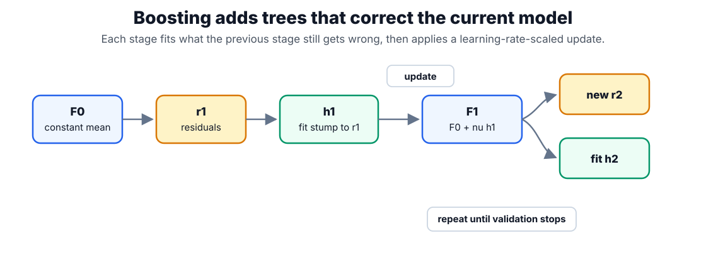

# Gradient Boosting

Gradient boosting builds an additive model by fitting each new learner to the direction that most reduces the current loss. In tabular classical ML, the weak learner is usually a small [decision tree](decision-trees.md), giving a sequence of trees rather than the parallel averaging used by [random forests](random-forests.md).

## How the algorithm works

Gradient boosting builds the model one small tree at a time, each tree correcting the errors of the ones before it:

1. **Start simple.** Begin with a single constant prediction — the value that minimizes the loss on its own, which is the mean of the targets for squared error.
2. **Measure what is still wrong.** For each training example, compute the residual: how far the current model's prediction is from the target. (More precisely, the negative gradient of the loss, which for squared error is just the ordinary residual.)
3. **Fit a weak learner to the errors.** Train a small tree to predict those residuals — not the original target. This tree captures the pattern the model is currently missing.
4. **Take a shrunken step.** Add that tree to the model, scaled down by a learning rate between 0 and 1, so each stage nudges the prediction toward the target rather than jumping.
5. **Repeat** steps 2–4 for a fixed number of stages or until validation error stops improving.

The result is an additive model: a sum of many small trees, each one a small correction. This is why boosting is described as **functional gradient descent** — instead of adjusting a coefficient vector, each step moves the whole prediction function a little downhill on the loss. That power comes with a need for [regularization](regularization.md): shallow trees, a small learning rate, subsampling, and early stopping keep the stagewise corrections from chasing noise.

## The gradient-descent view

The steps above have a compact formal statement. Write $F_m(x)$ for the model's prediction after $m$ stages and $L(y,F)$ for the loss between a target $y$ and a prediction $F$. Training starts from the best constant, $F_0=\arg\min_\gamma\sum_i L(y_i,\gamma)$, where $\gamma$ is that single fitted value (the mean, for squared error). At step $m$ each example $i$ gets a pseudo-residual

$$
r_{im}=-\left[\frac{\partial L(y_i,F(x_i))}{\partial F(x_i)}\right]_{F=F_{m-1}},
$$

the negative gradient of the loss with respect to the current prediction — the direction that most reduces the loss. A new weak learner $h_m$ (a small tree) is fit to those residuals, scaled by the step size $\gamma_m=\arg\min_\gamma\sum_i L(y_i,F_{m-1}(x_i)+\gamma h_m(x_i))$ that minimizes the loss, and added to the model with a learning rate $\nu\in(0,1]$ that shrinks each step:

$$
F_m(x)=F_{m-1}(x)+\nu\,\gamma_m\,h_m(x).
$$

## Worked example

This is a **regression** example — the model predicts a continuous number, not a class. We use squared-error loss, for which the pseudo-residual reduces to the ordinary residual $r = y - F$.

Take three training examples whose continuous targets are $y = [2, 4, 6]$ (one value per example). Boosting starts from the single constant prediction $F_0$ that minimizes squared error, which is the mean of the targets; subtracting it from each target gives the stage-1 residual vector $r_1$:

$$
F_0 = 4, \qquad r_1 = y - F_0 = [-2,\,0,\,2].
$$

A depth-1 tree (a stump), written $h_m$ at stage $m$, is fit to those residuals. With two leaves it can isolate the first example and group the other two, and each leaf predicts the mean residual of the examples that fall in it:

$$
h_1 = [-2,\; 1,\; 1],
$$

so $h_1$ predicts $-2$ for the first example and $+1$ (the mean of $0$ and $2$) for the other two. With learning rate $\nu = 0.5$, the updated model $F_1 = F_0 + \nu\,h_1$ produces a prediction for each of the three examples, and its new residuals are $r_2 = y - F_1$:

$$
F_1 = [3,\; 4.5,\; 4.5], \qquad r_2 = y - F_1 = [-1,\, -0.5,\, 1.5].
$$

The residual magnitudes shrank from $|r_1|$ summing to $4$ down to $|r_2|$ summing to $3$. Each stage nudges the prediction function toward the targets instead of jumping to them, and the learning rate $\nu$ controls how large each nudge is:



Because each tree fits the _residual_ left by the ones before it, a small learning rate needs more trees, and too many trees eventually fit noise — which is why the stopping point is chosen by validation, not by training loss.

## Watching the stages improve

The same stagewise idea works for classification. On a binary classification task, staged predictions expose the additive sequence: test accuracy climbs as trees are added, then flattens once later stages only chase noise. That flattening is the signal that more trees stop helping.

```python
from sklearn.datasets import make_classification
from sklearn.ensemble import GradientBoostingClassifier
from sklearn.metrics import accuracy_score
from sklearn.model_selection import train_test_split

X, y = make_classification(n_samples=300, n_features=8, n_informative=4, random_state=8)
Xtr, Xte, ytr, yte = train_test_split(X, y, stratify=y, random_state=8)
gb = GradientBoostingClassifier(n_estimators=60, learning_rate=0.1,
                                max_depth=2, random_state=8).fit(Xtr, ytr)
staged = [accuracy_score(yte, p) for p in gb.staged_predict(Xte)]
print("test_acc", round(gb.score(Xte, yte), 3))
print("staged_first3", [round(s, 3) for s in staged[:3]])
print("staged_last", round(staged[-1], 3))
```

Observed output:

```text
test_acc 0.853
staged_first3 [0.813, 0.827, 0.827]
staged_last 0.853
```

The first three trees already reach 0.827; the remaining trees add only the final 0.026. Validation curves — not training loss — decide where on that curve to stop.

## Caveats

Boosting can overfit mislabeled examples because later stages focus on hard residuals. Low learning rates usually require more trees. The best hyperparameters are coupled, so tune depth, learning rate, number of estimators, and subsampling together through [model selection](model-selection.md).

## References

- [Friedman, 2001, Greedy Function Approximation: A Gradient Boosting Machine](https://doi.org/10.1214/aos/1013203451)
- [scikit-learn User Guide: Gradient Tree Boosting](https://scikit-learn.org/stable/modules/ensemble.html#gradient-tree-boosting)

> [!nav]
> **Section** — [Classical Machine Learning](index.md)
>
> [← Random Forests](random-forests.md) [Interpretability →](interpretability.md)
