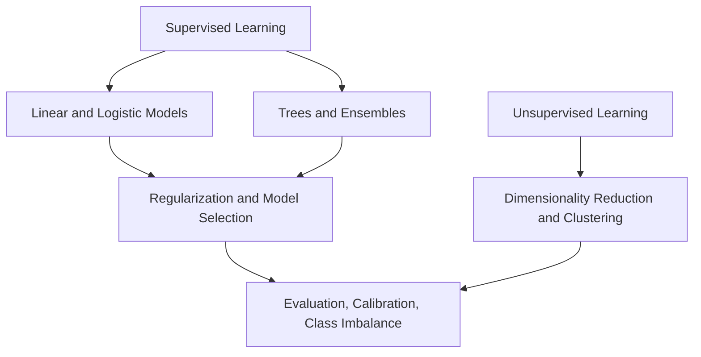

# Classical Machine Learning

Classical machine learning is the part of statistical learning where the model class, loss, validation protocol, and diagnostic quantities are usually explicit. This section is organized around the questions a practitioner actually has to answer: what is being predicted or discovered, what objective is optimized, how the model fails, and how the result should be measured.

## Knowledge map

Supervised prediction (linear models and tree ensembles) and unsupervised structure are the two trunks; complexity control and evaluation cut across both.

## Reading path

Start with supervised prediction, then complexity control, tree ensembles, unsupervised structure, and evaluation.

1. [Supervised Learning](supervised-learning.md): the empirical-risk framing for learning a map from features to targets.
2. [Regression](regression.md): continuous-target prediction and its losses.
3. [Classification](classification.md): discrete-label prediction through argmax or thresholds.
4. [Linear Models](linear-models.md): weighted sums of features, including least squares.
5. [Logistic Regression](logistic-regression.md): a linear log-odds model for class probabilities.
6. [Support Vector Machines](support-vector-machines.md): maximum-margin classification with hinge loss and kernels.
7. [Regularization](regularization.md): penalties that shrink unstable fits toward simpler functions.
8. [Bias-Variance Trade-Off](bias-variance-trade-off.md): underfitting versus sensitivity to the training sample.
9. [Model Selection](model-selection.md): choosing families and hyperparameters without spending the test set.
10. [Data Leakage](data-leakage.md): contamination that makes validation estimates unrealistically good.
11. [Feature Engineering](feature-engineering.md): changing the representation so simple models can express the structure.
12. [Decision Trees](decision-trees.md): recursive partitions with impurity or variance-reduction splits.
13. [Random Forests](random-forests.md): bagged, feature-randomized trees that reduce variance.
14. [Gradient Boosting](gradient-boosting.md): additive trees fit stage by stage to negative gradients.
15. [Interpretability](interpretability.md): connecting model behavior back to features and examples.
16. [Unsupervised Learning](unsupervised-learning.md): learning structure without target labels.
17. [Dimensionality Reduction](dimensionality-reduction.md): lower-dimensional representations for compression and denoising.
18. [PCA](pca.md): the linear projection that maximizes retained variance.
19. [Clustering](clustering.md): partitioning by distance, density, or probabilistic structure.
20. [Anomaly Detection](anomaly-detection.md): flagging observations unlikely under the fitted normality.
21. [Evaluation Metrics](evaluation-metrics.md): task-specific functions that turn predictions into comparable numbers.
22. [Calibration](calibration.md): whether predicted probabilities match observed frequencies.
23. [Class Imbalance](class-imbalance.md): rare-class settings where accuracy and default thresholds mislead.

## Connections

- [Probability and Statistics](../02-probability-and-statistics/index.md) supplies the estimation and testing these methods rely on.
- [Deep Learning](../06-deep-learning/index.md) generalizes these ideas to learned representations and larger models.

> **Learning path — [Foundations](../00-home-and-navigation/learning-paths.md#foundations):** ← [Probability and Statistics](../02-probability-and-statistics/index.md) · [Supervised Learning](supervised-learning.md) →
