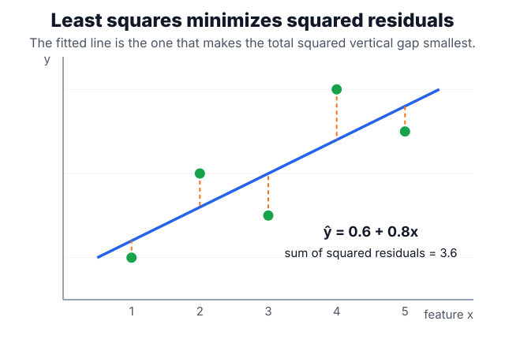

# Linear Models

A linear model predicts through a score $\eta = \beta_0 + x^\top\beta$. What changes across [regression](regression.md), [logistic regression](logistic-regression.md), and linear margin classifiers is the link from $\eta$ to the output and the loss used for fitting.

## Defining math

For squared-error regression,

$$
\hat y_i = \beta_0 + x_i^\top\beta, \qquad \min_{\beta_0,\beta}\sum_i (y_i - \hat y_i)^2,
$$

where $x_i$ is the feature vector for example $i$, $\beta_0$ is the intercept, $\beta$ is the vector of coefficients (one per feature), $y_i$ is the observed target, and $\hat y_i$ is the prediction. For binary logistic regression, the same linear score $\eta=\beta_0+x^\top\beta$ is passed through the [sigmoid](../06-deep-learning/activation-functions.md#defining-math) $\sigma$ to produce a probability:

$$
P(Y=1\mid x) = \sigma(\eta)=\frac{1}{1+e^{-\eta}},
$$

fitted with cross-entropy loss instead of squared error. With ridge [regularization](regularization.md), many linear objectives add a penalty

$$
\lambda \lVert\beta\rVert_2^2,
$$

where $\lVert\beta\rVert_2^2=\sum_j \beta_j^2$ is the squared coefficient norm and $\lambda\ge 0$ is the penalty strength that trades fit against shrinkage. Lasso regularization instead uses an $\ell_1$ penalty and can set coefficients exactly to zero, which turns coefficient shrinkage into feature pruning; see [regularization](regularization.md) for the ridge-lasso comparison. The geometry is simple: a one-unit feature change moves the score by the corresponding coefficient, holding other features fixed. That interpretability is only meaningful when preprocessing, interactions, and scaling are explicit.

## Intuition

Linear models are strong baselines because they ask whether the representation already contains the answer. If a linear model works well, the features encode the signal in an almost additive way. If it fails with systematic residuals or segment errors, the next move is often [feature engineering](feature-engineering.md), not immediately a larger model.

## Worked example

Fit a one-feature line $\hat y = \beta_0 + \beta_1 x$ to five points $(1,1),(2,3),(3,2),(4,5),(5,4)$ by least squares. With $\bar x = 3$ and $\bar y = 3$, the slope and intercept are

$$
\beta_1 = \frac{\sum_i (x_i-\bar x)(y_i-\bar y)}{\sum_i (x_i-\bar x)^2} = \frac{8}{10} = 0.8,
\qquad
\beta_0 = \bar y - \beta_1 \bar x = 3 - 0.8(3) = 0.6.
$$

So $\hat y = 0.6 + 0.8x$. The residuals $y_i - \hat y_i$ are $-0.4, 0.8, -1.0, 1.2, -0.6$, and their squares sum to $3.6$. No other line achieves a smaller squared total — that is exactly the quantity least squares minimizes:

The slope $0.8$ is the model's whole story: a one-unit increase in $x$ raises the prediction by $0.8$, regardless of where on the line you stand. That constant, additive effect is what makes linear models interpretable — and also what fails when the true effect depends on $x$ or on other features, the case for [feature engineering](feature-engineering.md) or a nonlinear method.

## Caveats

Coefficient magnitude is not comparable across differently scaled features. Correlated predictors make individual coefficient stories fragile even when predictions are stable, and lasso may prune one correlated feature while keeping another. Linear additivity also hides interactions: if risk rises only when two conditions co-occur, the model needs interaction features or a nonlinear method such as [decision trees](decision-trees.md).

## References

- [scikit-learn User Guide: Linear Models](https://scikit-learn.org/stable/modules/linear_model.html)
- [An Introduction to Statistical Learning](https://www.statlearning.com/)

> [!nav]
> **Section** — [Classical Machine Learning](index.md)
>
> [← Classification](classification.md) [Logistic Regression →](logistic-regression.md)
