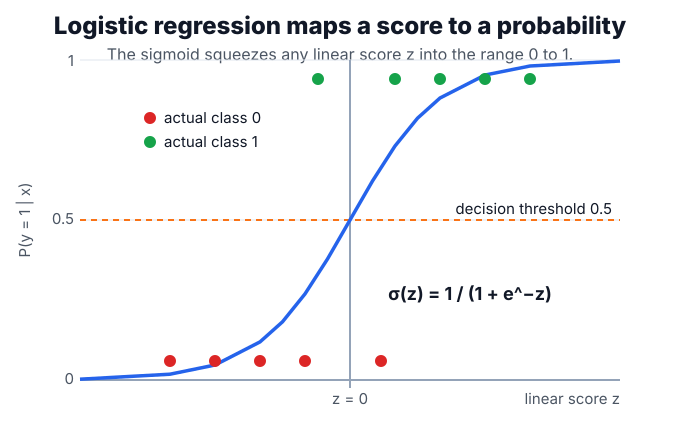

# Logistic Regression

Logistic regression is a [linear model](linear-models.md) for class probability, not a regression model for continuous targets. Compared with [regression](regression.md), it keeps the linear score but replaces squared error on $y\in\mathbb R$ with Bernoulli likelihood and cross-entropy on $y\in\{0,1\}$.

## Defining math

For example $i$ with feature vector $x_i$, the linear score $z_i$ and its sigmoid transform are

$$
z_i = \beta_0 + x_i^\top\beta, \qquad \sigma(z_i)=\frac{1}{1+e^{-z_i}},
$$

where $\beta_0$ is the intercept and $\beta$ the coefficient vector. The predicted probability of the positive class is

$$
P(Y_i=1\mid x_i)=p_i=\sigma(z_i).
$$

Fitting maximizes the Bernoulli likelihood, equivalently minimizing the negative log-likelihood

$$
\ell(\beta_0,\beta)=-\sum_{i=1}^n\left[y_i\log p_i + (1-y_i)\log(1-p_i)\right],
$$

where $y_i\in\{0,1\}$ is the label and $n$ the number of examples. Its gradient has a compact form,

$$
\nabla_\beta \ell = X^\top(p-y),
$$

where $X$ is the $n\times d$ design matrix (one row per example), $p=(p_1,\dots,p_n)^\top$ is the vector of predicted probabilities, and $y=(y_1,\dots,y_n)^\top$ is the vector of labels — so $p-y$ is simply the vector of prediction errors.

Most practical fits add [regularization](regularization.md), for example $\lambda\lVert\beta\rVert_2^2/2$, because high-dimensional or nearly separable data can drive coefficients to unstable values.

## Intuition

A coefficient is an additive effect on log-odds: increasing feature $x_j$ by one unit changes $\log(p/(1-p))$ by $\beta_j$, holding other features fixed. The sigmoid then maps any score to $[0,1]$. This makes logistic regression a natural baseline when [classification](classification.md) decisions need probabilities, thresholds, and [calibration](calibration.md), not just labels.

## Worked example

Suppose a fitted model has intercept $\beta_0 = -1$ and a single coefficient $\beta_1 = 2$, so the score is $z = -1 + 2x$. Take an example with $x = 1.2$:

$$
z = -1 + 2(1.2) = 1.4, \qquad
p = \sigma(1.4) = \frac{1}{1+e^{-1.4}} \approx 0.80.
$$

The model assigns an 80% probability to the positive class. The coefficient acts on the log-odds: because $\beta_1 = 2$, increasing $x$ by one unit adds $2$ to $z$, which multiplies the odds $p/(1-p)$ by $e^{2}\approx 7.4$. At $x = 1.2$ the odds are $0.80/0.20 = 4$; at $x = 2.2$ they become $4 \times 7.4 \approx 29.6$, i.e. $p \approx 0.97$.

The sigmoid turns any score into a probability, and a threshold (often $0.5$, i.e. $z = 0$) turns the probability into a label:

Because the decision boundary is the line $z = 0$, moving the threshold slides it left or right, trading false positives against false negatives — a trade best reported with [evaluation metrics](evaluation-metrics.md) rather than accuracy alone.

## Caveats

Perfectly separable data makes the maximum-likelihood coefficients diverge; regularization gives a finite solution. A linear log-odds assumption can be wrong even when accuracy is acceptable, so inspect calibration curves and segment-level errors. Coefficients are not causal effects unless the data-generating and adjustment assumptions support that interpretation.

## References

- [scikit-learn User Guide: Logistic regression](https://scikit-learn.org/stable/modules/linear_model.html#logistic-regression)
- [An Introduction to Statistical Learning](https://www.statlearning.com/)

> [!nav]
> **Section** — [Classical Machine Learning](index.md)
>
> [← Linear Models](linear-models.md) [Support Vector Machines →](support-vector-machines.md)
