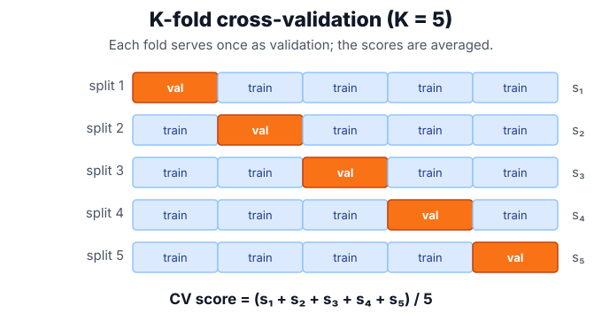

# Model Selection

Model selection chooses the model class, preprocessing, hyperparameters, and sometimes thresholds. It is where [regularization](regularization.md), the [bias-variance trade-off](bias-variance-trade-off.md), and [evaluation metrics](evaluation-metrics.md) meet.

## Defining math

Let $\lambda$ index a candidate configuration — a choice of model, preprocessing, and hyperparameters — drawn from a search space $\Lambda$, and let $\hat f_\lambda$ be the model fit with that configuration. Validation picks the configuration with the lowest validation risk $\hat R_{val}$, that is $\hat\lambda=\arg\min_{\lambda\in\Lambda}\hat R_{val}(\hat f_\lambda)$. K-fold cross-validation estimates that risk by splitting the data into $K$ folds and averaging the loss on each held-out fold:

$$
CV(\lambda)=\frac{1}{K}\sum_{k=1}^K \frac{1}{|V_k|}\sum_{i\in V_k} L(y_i, \hat f_{\lambda}^{(-k)}(x_i)),
$$

where $V_k$ is the $k$-th validation fold, $|V_k|$ its size, $\hat f_\lambda^{(-k)}$ is the model trained on all folds except $k$, and $L$ is the loss. The final test set estimates performance after selection. It must not influence candidate generation, preprocessing, or threshold decisions, or [data leakage](data-leakage.md) has occurred.

## Intuition

Training loss asks "can this model fit the sample?" Validation asks "which modelling choice survives new examples?" Test loss asks "after all choices are frozen, what performance estimate should we believe?" Mixing those roles creates optimistic estimates.

## Worked example

Cross-validation turns a single train/validation split into $K$ of them, so every example is used for validation exactly once. Suppose 5-fold validation of one configuration yields per-fold errors $[12, 9, 11, 10, 13]$. The cross-validation estimate is their mean:

$$
CV = \frac{12+9+11+10+13}{5} = \frac{55}{5} = 11.
$$

Rotating the validation block across folds makes this estimate far less dependent on one lucky or unlucky split than a single hold-out would be:



The winning configuration is the one with the best averaged score — but the spread across folds matters too, because a small gap between candidates can be noise rather than signal.

## Grid search in practice

A grid search runs this averaging for every candidate and keeps the best. The margins between candidates are often small, which is exactly the caution the fold spread implies.

```python
from sklearn.datasets import make_classification
from sklearn.linear_model import LogisticRegression
from sklearn.model_selection import GridSearchCV
from sklearn.pipeline import make_pipeline
from sklearn.preprocessing import StandardScaler
import numpy as np

X, y = make_classification(n_samples=240, n_features=12, n_informative=5, random_state=14)
pipe = make_pipeline(StandardScaler(), LogisticRegression(max_iter=1000, random_state=14))
grid = GridSearchCV(pipe, {"logisticregression__C": [0.01, 0.1, 1, 10]},
                    cv=5, scoring="roc_auc").fit(X, y)
print("best_C", grid.best_params_["logisticregression__C"])
print("best_cv_auc", round(grid.best_score_, 3))
print("mean_scores", np.round(grid.cv_results_["mean_test_score"], 3))
```

Observed output:

```text
best_C 10
best_cv_auc 0.771
mean_scores [0.755 0.77  0.77  0.771]
```

The best setting scores 0.771 against 0.770 for two rivals — a margin far smaller than typical fold-to-fold spread, so it should be treated as uncertain unless repeated validation or domain cost supports the choice.

## Caveats

Searching many configurations overfits validation data. Nested cross-validation is the clean estimate when the selection process itself is complex. Pipelines matter: scalers, imputers, encoders, PCA, and feature selection must be fit inside each training fold.

## References

- [scikit-learn User Guide: Cross-validation](https://scikit-learn.org/stable/modules/cross_validation.html)
- [scikit-learn User Guide: Tuning hyperparameters](https://scikit-learn.org/stable/modules/grid_search.html)

> [!nav]
> **Section** — [Classical Machine Learning](index.md)
>
> [← Bias-Variance Trade-Off](bias-variance-trade-off.md) [Data Leakage →](data-leakage.md)
