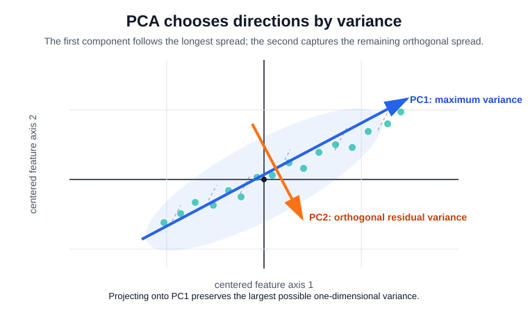

# PCA

Principal component analysis finds orthogonal directions of maximum variance in centered numeric data. It is a specific [dimensionality reduction](dimensionality-reduction.md) method, not a generic feature-selection algorithm. It is usually used inside [unsupervised learning](unsupervised-learning.md) workflows, but its linear projection geometry is closest in spirit to [linear models](linear-models.md), [eigendecomposition](../01-mathematical-foundations/eigenvalues-and-eigenvectors.md), and [singular value decomposition](../01-mathematical-foundations/singular-value-decomposition.md).

## Defining math

Let $X_c$ be centered. The first component solves

$$
w_1=\arg\max_{\lVert w\rVert_2=1} w^\top X_c^\top X_cw.
$$

Subsequent components solve the same problem subject to orthogonality. Equivalently, PCA uses the eigendecomposition

$$
\frac{1}{n-1}X_c^\top X_c=V\Lambda V^\top
$$

or the [SVD](../01-mathematical-foundations/singular-value-decomposition.md)

$$
X_c=U\Sigma V^\top.
$$

The principal axes are the columns of $V$, scores are $Z=X_cV_d$, and explained variance ratios are

$$
\frac{\lambda_j}{\sum_k\lambda_k}
=\frac{\sigma_j^2}{\sum_k\sigma_k^2}.
$$

This is the same low-rank geometry used in [low-rank approximation](../01-mathematical-foundations/low-rank-approximation.md), but the matrix being approximated is centered data and the objective is retained variance.

## Intuition

PCA rotates the coordinate system so the first axis captures the largest spread, the second captures the largest remaining orthogonal spread, and so on. For [clustering](clustering.md), this can remove noise or make plots readable; it can also hide low-variance structure that matters.



The plot shows why PCA is a projection method rather than feature selection. The first component is not necessarily one original column; it is a new axis through feature space chosen to maximize variance after centering. The second component must be orthogonal to the first, so it captures remaining variation rather than repeating the same direction.

## Worked example

This snippet standardizes Iris features, fits two principal components, and reports the component directions, explained variance ratios, and one projected score vector.

```python
from sklearn.datasets import load_iris
from sklearn.decomposition import PCA
from sklearn.preprocessing import StandardScaler
import numpy as np

X, y = load_iris(return_X_y=True)
Xz = StandardScaler().fit_transform(X)
pca = PCA(n_components=2).fit(Xz)
print("components")
print(np.round(pca.components_, 3))
print("explained_variance_ratio", np.round(pca.explained_variance_ratio_, 3))
print("first_row_scores", np.round(pca.transform(Xz[:1]), 3))
```

Observed output:

```text
components
[[ 0.521 -0.269  0.58   0.565]
 [ 0.377  0.923  0.024  0.067]]
explained_variance_ratio [0.73  0.229]
first_row_scores [[-2.265  0.48 ]]
```

The first component loads positively on three standardized Iris features and negatively on the second. Component signs are arbitrary; flipping all signs gives the same subspace.

| Quantity                    | Interpretation                                                                           |
| --------------------------- | ---------------------------------------------------------------------------------------- |
| `components_`               | Rows are principal axes in standardized feature space.                                   |
| `explained_variance_ratio_` | Fraction of total variance captured by each axis.                                        |
| `transform(X)`              | Coordinates of samples after projection onto the component axes.                         |
| Component sign              | Arbitrary; multiplying one component and its scores by `-1` preserves the same subspace. |

In this run, the first two components retain about `0.73 + 0.229 = 0.959` of standardized Iris variance. That makes a two-dimensional plot informative, but it does not prove that every classification or clustering task should discard the remaining components.

## Caveats

PCA is scale-sensitive, so standardize features when units differ. Outliers can dominate variance. Components are not causal factors, and they can be unstable when eigenvalues are close. Fit scalers and PCA inside the training fold; fitting them before a train-test split leaks validation distribution information into the projection.

## References

- [scikit-learn User Guide: PCA](https://scikit-learn.org/stable/modules/decomposition.html#pca)
- [An Introduction to Statistical Learning](https://www.statlearning.com/)

> **Section — [Classical Machine Learning](index.md):** ← [Dimensionality Reduction](dimensionality-reduction.md) · [Clustering](clustering.md) →
