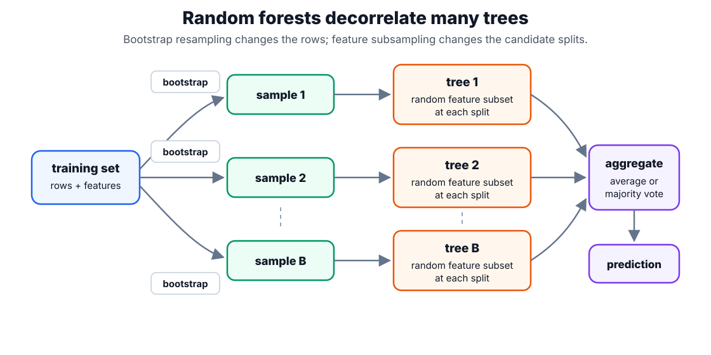

# Random Forests

A random forest averages many noisy [decision trees](decision-trees.md). Each tree is trained on a bootstrap sample, and each split considers only a random subset of features. The goal is to reduce variance without increasing bias as much as a single shallow tree would.

## How the algorithm works

A random forest trains many decision trees on randomized versions of the problem, then combines them. Two sources of randomness make the trees disagree:

1. **Bootstrap sampling (bagging).** For each tree $b=1,\dots,B$, draw a bootstrap sample — $n$ examples sampled with replacement from the $n$ training rows — so every tree sees a slightly different dataset.
2. **Feature subsampling.** At each split, a tree may choose only from a random subset of the features rather than all of them, which stops every tree from keying on the same one or two dominant features.
3. **Grow deep trees.** Each tree is grown with little or no pruning, so on its own it is low-bias but high-variance.
4. **Aggregate.** Combine the $B$ trees — average their outputs for regression, or take a majority vote (equivalently, the average class-vote share) for classification.

Because each tree is fit on a different bootstrap sample, the rows left out of a given tree's sample — its out-of-bag (OOB) set — act as a free held-out set for that tree, giving an error estimate without a separate validation split. The whole design targets the [bias-variance trade-off](bias-variance-trade-off.md): a single deep tree may latch onto one accidental split, but averaging many decorrelated trees cancels those idiosyncratic errors, so variance falls while bias stays low.

## Aggregating the trees

The forest combines $B$ trees, where $T_b(x)$ is the prediction of the $b$-th tree for input $x$. For regression, the forest prediction $\hat f_{RF}(x)$ is their average:

$$
\hat f_{RF}(x)=\frac{1}{B}\sum_{b=1}^B T_b(x).
$$

For classification, the estimated probability of class $k$, written $\hat p_k(x)$, is the fraction of trees that vote for that class:

$$
\hat p_k(x)=\frac{1}{B}\sum_{b=1}^B \mathbf 1\{T_b(x)=k\},
$$

where $\mathbf 1\{\cdot\}$ is the indicator function, equal to $1$ when the tree predicts class $k$ and $0$ otherwise. Averaging helps most when individual trees are strong but not too correlated: feature subsampling lowers the correlation between trees, and bootstrap sampling leaves out-of-bag examples that can estimate error.

## Worked example

Averaging reduces variance, but only as far as the trees are decorrelated. Let each of the $B$ trees produce a prediction $T_b$ with the same variance $\sigma^2$ — the sensitivity of a single tree to the particular training sample — and let every pair of trees have correlation $\rho$. The forest averages the $B$ trees, so the variance of that averaged prediction is

$$
\operatorname{Var}\!\left(\tfrac{1}{B}\sum_{b=1}^{B} T_b\right)
= \rho\sigma^2 + \frac{1-\rho}{B}\,\sigma^2,
$$

where $\operatorname{Var}(\cdot)$ is the variance of the forest's prediction across training samples. (For regression this is the averaged output directly; for classification the same decorrelation argument applies to the class-vote proportions.)

Take $\sigma^2 = 1$, correlation $\rho = 0.2$, and $B = 100$ trees:

$$
0.2(1) + \frac{1-0.2}{100}(1) = 0.2 + 0.008 = 0.208,
$$

about five times lower than a single tree's variance of $1$. The second term vanishes as $B$ grows, so beyond a few hundred trees the variance floor is $\rho\sigma^2 = 0.2$. That is the key lesson: once there are enough trees, further gains come from _lowering the correlation_ $\rho$ — which is exactly what bootstrap sampling and per-split feature subsampling do — not from adding still more trees.



Examples left out of a tree's bootstrap sample form its out-of-bag set, which gives a built-in held-out error estimate without a separate validation split.

## One tree versus a forest

The variance argument is easy to see empirically: the same data, one deep tree versus a hundred averaged trees. The forest also reports an out-of-bag score computed only from the examples each tree did not train on.

```python
from sklearn.datasets import make_classification
from sklearn.ensemble import RandomForestClassifier
from sklearn.model_selection import train_test_split
from sklearn.tree import DecisionTreeClassifier

X, y = make_classification(n_samples=300, n_features=8, n_informative=4, random_state=6)
Xtr, Xte, ytr, yte = train_test_split(X, y, stratify=y, random_state=6)
for est in [DecisionTreeClassifier(random_state=6),
            RandomForestClassifier(n_estimators=100, random_state=6, oob_score=True)]:
    est.fit(Xtr, ytr)
    extra = f" oob {est.oob_score_:.3f}" if hasattr(est, "oob_score_") else ""
    print(est.__class__.__name__, "test_acc", round(est.score(Xte, yte), 3), extra)
```

Observed output:

```text
DecisionTreeClassifier test_acc 0.733
RandomForestClassifier test_acc 0.827  oob 0.742
```

The forest lifts held-out accuracy from 0.733 to 0.827 by averaging away the single tree's variance, and its out-of-bag estimate (0.742) tracks the true test score without a separate split.

## Random forests versus boosting

Forests train trees mostly independently and average them. [Gradient boosting](gradient-boosting.md) trains trees sequentially so later trees correct earlier residuals. Forests are often easier to tune and parallelize; boosting can achieve lower bias but is more sensitive to learning rate, depth, and early stopping.

## Caveats

Forests do not extrapolate outside the training target range in regression. Correlated features split importance among themselves, and impurity importance can be biased toward variables with many split points. For calibrated probabilities, inspect [calibration](calibration.md) rather than assuming vote shares are decision-ready probabilities.

## References

- [Breiman, 2001, Random Forests](https://doi.org/10.1023/A:1010933404324)
- [scikit-learn User Guide: Forests of randomized trees](https://scikit-learn.org/stable/modules/ensemble.html#forests-of-randomized-trees)

> [!nav]
> **Section** — [Classical Machine Learning](index.md)
>
> [← Decision Trees](decision-trees.md) [Gradient Boosting →](gradient-boosting.md)
