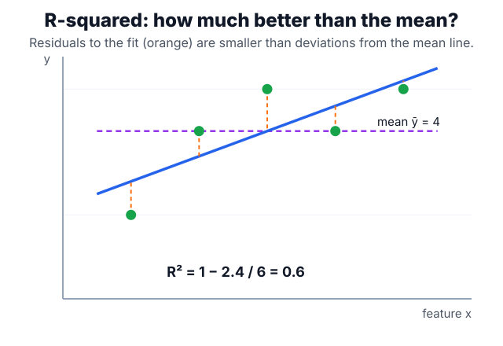

# Regression

Regression estimates a numeric target $y \in \mathbb R$ from features $x$. In the standard linear case, [linear models](linear-models.md) estimate the conditional mean $\mathbb E[Y\mid X=x]$ by minimizing residual error; [logistic regression](logistic-regression.md) uses a similar linear score but changes the target from a continuous value to a class probability and changes the loss from squared error to cross-entropy.

## Defining math

Ordinary least squares writes the prediction for a feature vector $x$ as

$$
\hat y = x^\top \beta,
$$

where $\beta$ is the vector of coefficients. Stacking the $n$ examples into a design matrix $X$ (one row per example) and targets $y$, it chooses $\beta$ to minimize the squared residual:

$$
\hat\beta = \arg\min_\beta \lVert y - X\beta\rVert_2^2.
$$

When $X^\top X$ is invertible, this has the closed-form solution

$$
\hat\beta = (X^\top X)^{-1}X^\top y.
$$

Fit is often summarized by the coefficient of determination

$$
R^2=1-\frac{\sum_i(y_i-\hat y_i)^2}{\sum_i(y_i-\bar y)^2},
$$

where $y_i$ is the observed target, $\hat y_i$ the prediction, and $\bar y$ the sample mean. The numerator is the model's squared residual error and the denominator is the error from always predicting $\bar y$, so $R^2$ is the fraction of variance the model explains beyond that baseline.

Residuals $e_i = y_i - \hat y_i$ are not just errors; their pattern is a diagnostic. Curvature suggests missing [feature engineering](feature-engineering.md), changing variance suggests heteroscedasticity, and large leverage points can dominate the fitted line. Penalized versions such as ridge replace the objective with $\lVert y-X\beta\rVert_2^2 + \lambda\lVert\beta\rVert_2^2$, connecting regression directly to [regularization](regularization.md).

## Intuition

OLS projects the target vector onto the column space of the design matrix. The fitted values are the closest points, in Euclidean distance, that the model class can express. If the true signal is mostly linear in the chosen features, this is efficient and transparent; if the signal is nonlinear, OLS gives the best linear shadow, not the underlying mechanism.

## Worked example

Fit $\hat y = 2.2 + 0.6x$ to five points $(1,2),(2,4),(3,5),(4,4),(5,5)$, whose mean is $\bar y = 4$. The two sums that define $R^2$ compare the fit against the baseline of always predicting the mean:

$$
\mathrm{SS_{res}} = \sum_i (y_i-\hat y_i)^2 = 2.4,
\qquad
\mathrm{SS_{tot}} = \sum_i (y_i-\bar y)^2 = 6,
$$

$$
R^2 = 1 - \frac{\mathrm{SS_{res}}}{\mathrm{SS_{tot}}} = 1 - \frac{2.4}{6} = 0.6.
$$

The fitted line explains 60% of the variance around the mean: the points hug it more tightly than they hug the flat mean line, and $R^2$ is exactly that reduction in squared error.

$R^2$ is unitless and always improves as features are added, so pair it with an error in target units. [RMSE](evaluation-metrics.md#regression-metrics) here is $\sqrt{2.4/5} \approx 0.69$, which can be compared against an operational tolerance rather than only against the mean.

## Caveats

OLS coefficients become unstable when features are nearly collinear because $X^\top X$ is close to singular. Outliers affect squared error strongly. Extrapolation is linear forever, so a plausible fit inside the training range can produce impossible predictions outside it. Report regression with [evaluation metrics](evaluation-metrics.md) that match the decision: [RMSE](evaluation-metrics.md#regression-metrics) punishes large misses, [MAE](evaluation-metrics.md#regression-metrics) is more robust, and residual plots often reveal failures that aggregate scores hide.

## References

- [scikit-learn User Guide: Ordinary Least Squares](https://scikit-learn.org/stable/modules/linear_model.html#ordinary-least-squares)
- [An Introduction to Statistical Learning](https://www.statlearning.com/)

> [!nav]
> **Section** — [Classical Machine Learning](index.md)
>
> [← Supervised Learning](supervised-learning.md) [Classification →](classification.md)
