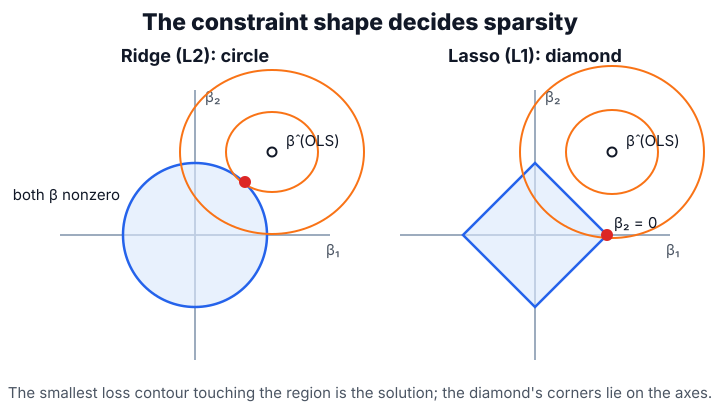

# Regularization

Regularization changes the training problem so a model must buy fit with complexity. In [linear models](linear-models.md) this usually means shrinking coefficients; in [gradient boosting](gradient-boosting.md) it means small learning rates, shallow trees, subsampling, and early stopping.

## Defining math

A regularized estimator adds a complexity penalty to the average training loss:

$$
\hat\theta = \arg\min_\theta \frac{1}{n}\sum_{i=1}^n L(y_i, f_\theta(x_i)) + \lambda\Omega(\theta),
$$

where $\theta$ are the model parameters, $f_\theta$ is the model, $L$ is the per-example loss over the $n$ training examples, $\Omega(\theta)$ measures model complexity, and $\lambda\ge 0$ is the penalty strength that trades fit against simplicity. Ridge uses the squared $\ell_2$ norm $\Omega(\beta)=\lVert\beta\rVert_2^2$, giving the closed-form linear estimator $\hat\beta_{ridge}=(X^\top X+\lambda I)^{-1}X^\top y$ (with $I$ the identity matrix). The lasso uses the $\ell_1$ norm $\Omega(\beta)=\lVert\beta\rVert_1=\sum_j |\beta_j|$, which can set coefficients exactly to zero. For [logistic regression](logistic-regression.md), the same penalties apply to cross-entropy rather than squared error.

## Intuition

Regularization encodes skepticism. A large coefficient, deep tree, or late boosting stage must improve validation loss enough to justify the added sensitivity. This is why regularization belongs with the [bias-variance trade-off](bias-variance-trade-off.md): it often increases bias slightly to reduce variance substantially.

## Worked example

Regularization shrinks coefficients toward zero, and in the one-feature case ridge does so with an exact closed form. With $X^\top X = 10$ and $X^\top y = 20$, ordinary least squares gives $\hat\beta = 20/10 = 2$. Ridge divides by $X^\top X + \lambda$ instead:

$$
\hat\beta_{\text{ridge}} = \frac{X^\top y}{X^\top X + \lambda}
= \frac{20}{10+\lambda}
\;\Rightarrow\;
\lambda=10 \to 1.0, \qquad \lambda=40 \to 0.4.
$$

Larger $\lambda$ shrinks the coefficient smoothly toward zero but never exactly to zero. The lasso's $\ell_1$ penalty behaves differently because its constraint region is a diamond whose corners lie on the axes: the lowest loss contour often first touches at a corner, setting a coefficient exactly to zero. Ridge's circular region has no corners, so it shrinks without eliminating:



That geometric difference is why the lasso doubles as feature selection while ridge only stabilizes.

## Comparing ridge and lasso

On real data the difference shows up as a coefficient count: the lasso zeroes some out, ridge keeps them all, and which wins on held-out error depends on the problem.

```python
from sklearn.datasets import make_regression
from sklearn.linear_model import LinearRegression, Ridge, Lasso
from sklearn.metrics import mean_squared_error
from sklearn.model_selection import train_test_split
import numpy as np

X, y, _ = make_regression(n_samples=100, n_features=8, n_informative=3,
                          noise=25, coef=True, random_state=3)
Xtr, Xte, ytr, yte = train_test_split(X, y, random_state=3)
for est in [LinearRegression(), Ridge(alpha=20), Lasso(alpha=2, max_iter=10000)]:
    est.fit(Xtr, ytr)
    rmse = mean_squared_error(yte, est.predict(Xte)) ** 0.5
    print(est.__class__.__name__, "rmse", round(rmse, 2),
          "nonzero", int(np.sum(np.abs(est.coef_) > 1e-6)))
```

Observed output:

```text
LinearRegression rmse 23.75 nonzero 8
Ridge rmse 24.07 nonzero 8
Lasso rmse 23.33 nonzero 7
```

The lasso removes one coefficient and slightly improves this held-out [RMSE](evaluation-metrics.md#regression-metrics). That does not prove lasso is universally better; it shows how a sparsity penalty can trade a little fit flexibility for stability.

## Caveats

The scale of features changes the effective penalty, so standardize numeric predictors before comparing coefficients. Regularization strength is a hyperparameter and belongs inside [model selection](model-selection.md), not on the test set. Lasso feature selection is unstable when predictors are strongly correlated; ridge is usually more stable but not sparse.

## References

- [scikit-learn User Guide: Ridge regression and Lasso](https://scikit-learn.org/stable/modules/linear_model.html#ridge-regression-and-classification)
- [Tibshirani, 1996, Regression Shrinkage and Selection via the Lasso](https://doi.org/10.1111/j.2517-6161.1996.tb02080.x)

> [!nav]
> **Section** — [Classical Machine Learning](index.md)
>
> [← Support Vector Machines](support-vector-machines.md) [Bias-Variance Trade-Off →](bias-variance-trade-off.md)
