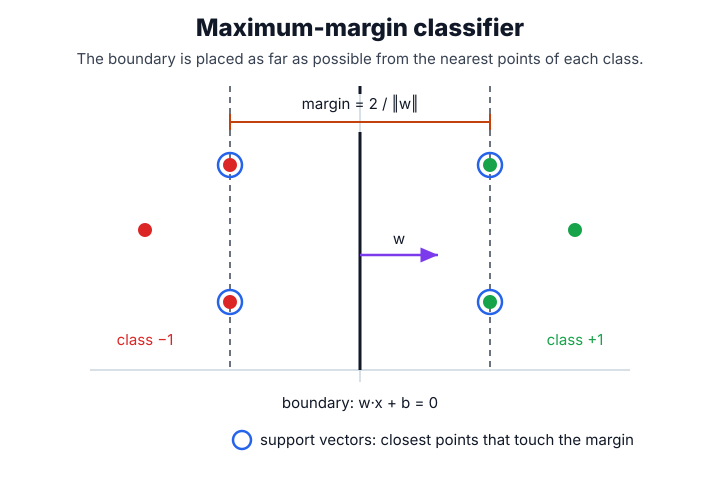

# Support Vector Machines

Support vector machines learn a decision boundary with a large margin. Unlike [logistic regression](logistic-regression.md), an SVM is not primarily a probability model; it optimizes margin violations through hinge loss. Kernels make the boundary nonlinear while preserving a linear separator in an implicit feature space.

## How it works

An SVM places the decision boundary — the hyperplane where the score $w^\top x + b = 0$ — so that the gap to the nearest training points of each class is as wide as possible. That gap is the **margin**, and the handful of points touching its edges are the **support vectors**: they alone pin down the boundary, so moving or deleting any other point leaves it unchanged.

1. **Maximize the margin.** Among all boundaries that separate the classes, prefer the one with the widest margin. More empty space around the boundary leaves the most room for unseen points to land on the correct side, which tends to generalize well in high-dimensional, sparse data.
2. **Allow some violations (soft margin).** Real data rarely separates cleanly, so each point is given a slack allowance to sit inside or past the margin. A penalty $C$ sets how costly those violations are: a large $C$ enforces the margin strictly, a small $C$ tolerates violations in exchange for a wider, simpler boundary.
3. **Go nonlinear with kernels.** A kernel replaces the inner product between inputs with a similarity that corresponds to a richer feature space, letting the same linear-margin machinery draw curved boundaries without ever building those features explicitly.

Because it optimizes the margin rather than a likelihood, an SVM outputs a signed distance from the boundary, not a probability; those scores need [calibration](calibration.md) before they are read as probabilities.

## The margin objective

Each example has a label $y_i\in\{-1,1\}$, and the model scores an input with $f(x)=w^\top x+b$, where $w$ is the weight vector whose direction is perpendicular to the decision boundary and $b$ is the bias (offset) term. The soft-margin primal objective is

$$
\min_{w,b,\xi}\frac{1}{2}\lVert w\rVert_2^2 + C\sum_i \xi_i
\qquad\text{subject to}\qquad
y_i(w^\top x_i+b)\ge 1-\xi_i,\;\; \xi_i\ge0.
$$

Here $\lVert w\rVert_2^2$ is small when the margin is wide (the margin width is $2/\lVert w\rVert_2$), each slack variable $\xi_i\ge 0$ measures how far example $i$ falls inside or past the margin, and $C>0$ sets how heavily those violations are penalized. Substituting the constraint gives the equivalent unconstrained form with the hinge loss $\max(0,1-y_i f(x_i))$:

$$
\min_{w,b}\;\frac12\lVert w\rVert_2^2+C\sum_i\max\!\big(0,\,1-y_i f(x_i)\big).
$$

So $C$ acts as inverse [regularization](regularization.md): a large $C$ punishes margin violations strongly (low bias, high variance), while a small $C$ favors a wider, simpler margin.

## Worked example

Take a **binary classification** problem with one feature: two positive examples at $x=2$ and two negatives at $x=-2$ (labels $y=+1$ and $y=-1$). By symmetry the widest-margin boundary sits at $x=0$. The support vectors are the points at $x=\pm 2$, and each must satisfy $y_i(w x_i + b)=1$:

$$
w(2)+b = 1, \qquad w(-2)+b = -1.
$$

Adding the two equations gives $b=0$; subtracting them gives $4w=2$, so $w=0.5$. The margin width is then

$$
\frac{2}{\lVert w\rVert} = \frac{2}{0.5} = 4,
$$

so the boundary at $x=0$ sits a distance $2$ from each support vector. The same picture in two dimensions puts the support vectors on the dashed margin lines, with every other point irrelevant to where the boundary falls:



## Fitting a linear SVM

On real data, `LinearSVC` finds $w$ and $b$ by minimizing the margin objective above after the features are standardized. Its `decision_function` returns the signed margin score $f(x)=w^\top x+b$: negative scores are one class, positive scores are the other, and larger absolute values are farther from the learned boundary.

```python
from sklearn.datasets import make_classification
from sklearn.model_selection import train_test_split
from sklearn.pipeline import make_pipeline
from sklearn.preprocessing import StandardScaler
from sklearn.svm import LinearSVC
import numpy as np

X, y = make_classification(n_samples=180, n_features=4, n_informative=2,
                           n_redundant=0, class_sep=1.2, random_state=18)
Xtr, Xte, ytr, yte = train_test_split(X, y, stratify=y, random_state=18)
svm = make_pipeline(StandardScaler(), LinearSVC(C=1.0, random_state=18, max_iter=10000)).fit(Xtr, ytr)
print("accuracy", round(svm.score(Xte, yte), 3))
print("decision_first5", np.round(svm.decision_function(Xte[:5]), 3))
```

Observed output:

```text
accuracy 0.956
decision_first5 [-1.973 -0.781  1.463  0.301 -0.661]
```

The held-out accuracy is `0.956`, so the linear margin separates most test examples in this synthetic problem. The first five scores predict classes by sign: the first two and fifth are on the negative side, while the third and fourth are on the positive side. The magnitude is distance-like confidence, not a calibrated probability.

## Caveats

Feature scaling is essential because the margin is geometric. Kernel SVMs can be expensive on large datasets. Probability estimates from SVMs are post-hoc calibrated and should be validated with [calibration](calibration.md) metrics.

## References

- [Cortes and Vapnik, 1995, Support-vector networks](https://doi.org/10.1007/BF00994018)
- [scikit-learn User Guide: Support Vector Machines](https://scikit-learn.org/stable/modules/svm.html)

> [!nav]
> **Section** — [Classical Machine Learning](index.md)
>
> [← Logistic Regression](logistic-regression.md) [Regularization →](regularization.md)
