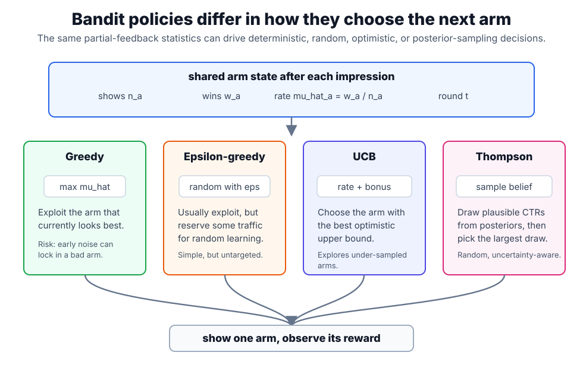

# Bandit Algorithms

Bandit algorithms are policies for the [multi-armed bandit](multi-armed-bandits.md) problem: choose one arm, observe reward only for the arm shown, and update the policy before the next round. This page focuses on the concrete policies. The base notation, partial-feedback setup, and regret definition live on [Multi-Armed Bandits](multi-armed-bandits.md).

In recommendation systems, these policies are useful when the product must learn from live exposure: a new headline, notification template, recommendation module, or item bucket may be better than the current winner, but the system cannot know that without showing it to users.

## Shared state

For each arm $a$, a basic bandit policy maintains:

| Quantity            | Meaning                                           |
| ------------------- | ------------------------------------------------- |
| $n_a$               | number of times arm $a$ has been shown            |
| $w_a$               | number of observed successes, such as clicks      |
| $\hat\mu_a=w_a/n_a$ | empirical reward rate                             |
| $t$                 | current round or total number of decisions so far |

Different algorithms use this same state differently. Greedy trusts $\hat\mu_a$ immediately. Epsilon-greedy injects random exploration. UCB adds an uncertainty bonus. Thompson sampling samples from a posterior belief.

The diagram shows the distinction between estimate, uncertainty, and randomized belief. The algorithm changes how the next arm is chosen; the underlying bandit feedback remains the same partial-feedback loop from [Multi-Armed Bandits](multi-armed-bandits.md).

## Greedy

A greedy policy always chooses the arm with the largest empirical reward:

$$
a_t=\arg\max_a \hat\mu_a.
$$

It is simple and cheap, but brittle. If a mediocre arm gets a few lucky early clicks, greedy can keep exploiting it and never gather enough evidence about the other arms. Greedy is useful as a baseline, not as a safe default for cold-start or changing content.

## Epsilon-Greedy

Epsilon-greedy chooses randomly with probability $\epsilon$ and otherwise chooses the current empirical winner:

$$
a_t=
\begin{cases}
\text{random arm}, & \text{with probability }\epsilon,\\
\arg\max_a \hat\mu_a, & \text{with probability }1-\epsilon.
\end{cases}
$$

The parameter $\epsilon$ is the exploration rate. Larger $\epsilon$ learns more about alternatives but spends more traffic on arms that currently look worse. Smaller $\epsilon$ protects short-term reward but can converge slowly or prematurely. In production, $\epsilon$ is often bounded by eligibility, safety, fatigue, and product-quality rules rather than applied to every possible item.

## UCB

Upper-confidence-bound policies choose the arm with the largest optimistic score:

$$
a_t=\arg\max_a
\left(
\hat\mu_a+\sqrt{\frac{2\log t}{n_a}}
\right).
$$

The first term exploits high empirical reward. The second term explores arms with fewer observations. As $n_a$ grows, the bonus shrinks; as $t$ grows, arms that have been neglected become worth checking again. UCB is deterministic once the observed rewards are fixed, which makes it easier to debug than random exploration.

## Thompson Sampling

Thompson sampling is randomized, but not uniformly random. It samples one plausible reward rate for each arm from the current posterior belief, then chooses the arm with the largest sampled value.

For binary rewards, a common model is a Beta-Bernoulli bandit:

$$
\theta_a \sim \operatorname{Beta}(\alpha_a,\beta_a),
\qquad
a_t=\arg\max_a \theta_a.
$$

Here $\theta_a$ is a sampled plausible click rate for arm $a$. After a click, update $\alpha_a \leftarrow \alpha_a+1$. After a non-click, update $\beta_a \leftarrow \beta_a+1$. Arms with little data have wider posterior distributions, so they occasionally sample high values and get explored. Arms with much data have tighter posteriors, so the policy becomes more stable.

## Worked example

Suppose a homepage can show one of three modules. The product optimizes immediate clicks, and the current logged state is:

| Arm               | Shows $n_a$ | Clicks $w_a$ | Empirical CTR $\hat\mu_a$ |
| ----------------- | ----------: | -----------: | ------------------------: |
| A: sports roundup |         120 |            6 |                     0.050 |
| B: finance tips   |          40 |            3 |                     0.075 |
| C: weather alerts |           8 |            1 |                     0.125 |

At first glance, arm C has the largest empirical CTR. But it also has only eight observations, so the estimate is uncertain. Different policies make different next decisions:

| Policy            | Decision rule                              | Next arm             | Reason                                               |
| ----------------- | ------------------------------------------ | -------------------- | ---------------------------------------------------- |
| Greedy            | choose largest $\hat\mu_a$                 | C                    | highest observed CTR                                 |
| Epsilon-greedy    | usually greedy, sometimes random           | usually C            | random exploration may choose A or B                 |
| UCB               | choose empirical CTR plus confidence bonus | C                    | high CTR and high uncertainty                        |
| Thompson sampling | sample plausible CTRs from posteriors      | often C, sometimes B | C has a wide posterior; B still has plausible upside |

Now imagine C receives 30 more impressions and no more clicks. Its empirical CTR drops from $1/8=0.125$ to $1/38\approx0.026$. A greedy policy would stop showing it only after the damage is visible. UCB and Thompson sampling are designed to make that trial bounded: early uncertainty earns C a chance, but disappointing evidence reduces its future score.

This example also shows why bandit logs need action propensities. If yesterday's policy rarely showed C, ordinary supervised evaluation cannot infer what would have happened had C been shown more often. See [Offline Versus Online Evaluation](offline-versus-online-evaluation.md) for replay and inverse-propensity evaluation.

## Choosing a policy

| Policy            | Strength                                        | Weakness                                          | Good fit                                     |
| ----------------- | ----------------------------------------------- | ------------------------------------------------- | -------------------------------------------- |
| Greedy            | simple and stable after exploration is complete | can lock onto early noise                         | mature arms with enough randomized history   |
| Epsilon-greedy    | easy to reason about and control                | wastes exploration uniformly                      | simple experiments and low-risk surfaces     |
| UCB               | explores uncertain arms more deliberately       | confidence formula assumes a clean reward process | small arm sets with fast feedback            |
| Thompson sampling | naturally balances uncertainty and reward       | needs a reward model and randomized serving       | click, conversion, or binary success rewards |

For personalized ranking, move to [Contextual Bandits](contextual-bandits.md): the policy should condition on user, item, query, device, and time features rather than treating every request as exchangeable.

## Production considerations

- Define the reward before choosing the algorithm: clicks, saves, purchases, retention, and satisfaction can point to different arms.
- Keep eligibility filters outside the bandit: exploration should not show unavailable, unsafe, or permission-ineligible items.
- Log the chosen arm, reward, timestamp, policy version, and selection probability when available.
- Separate exploration traffic from final product ranking when the cost of mistakes is high.
- Use minimum exposure floors or priors for new arms so cold-start items can be evaluated without taking over the surface.
- Watch non-stationarity: stale arms, news cycles, seasonality, and product changes can make old reward estimates misleading.

## Caveats

Bandit algorithms optimize observed rewards, not necessarily user welfare. A click reward can over-promote sensational content, repeated notifications, or short-term engagement at the cost of trust. Delayed rewards, repeated exposure, interference between users, and position effects violate the clean assumptions behind the simplest algorithms. For high-impact recommenders, combine bandits with guardrails, diversity constraints, and [online experiments](../17-experimentation-and-evaluation/online-experiments.md).

## References

- [Auer et al., 2002, Finite-time Analysis of the Multiarmed Bandit Problem](https://link.springer.com/article/10.1023/A:1013689704352)
- [Chapelle and Li, 2011, An Empirical Evaluation of Thompson Sampling](https://proceedings.neurips.cc/paper/2011/hash/e53a0a2978c28872a4505bdb51db06dc-Abstract.html)
- [Li et al., 2010, A Contextual-Bandit Approach to Personalized News Article Recommendation](https://arxiv.org/abs/1003.0146)
- [Li et al., 2010, Unbiased Offline Evaluation of Contextual-bandit-based News Article Recommendation Algorithms](https://arxiv.org/abs/1003.5956)

> [!nav]
> **Section** — [Recommendation Systems and Personalization](index.md)
>
> [← Multi-Armed Bandits](multi-armed-bandits.md) [Contextual Bandits →](contextual-bandits.md)
