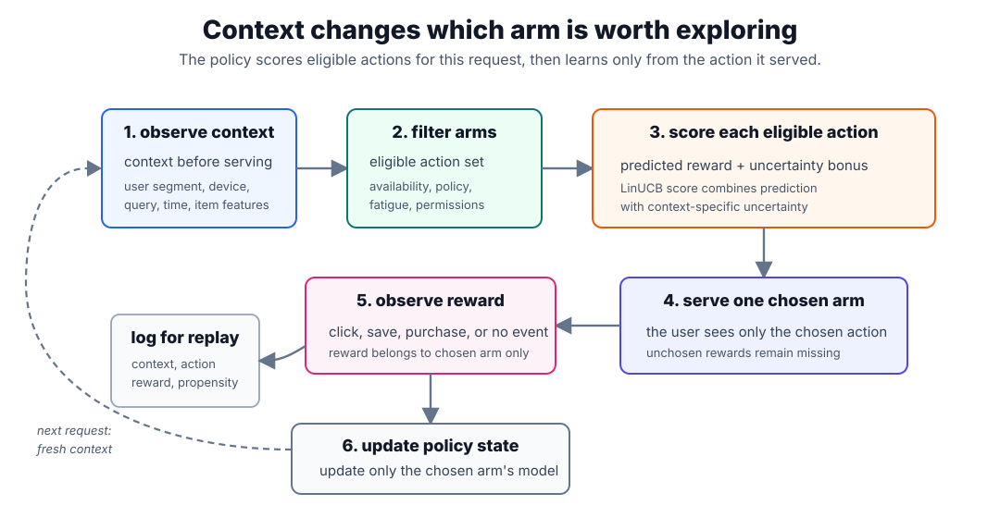

# Contextual Bandits

Contextual bandits extend [multi-armed bandits](multi-armed-bandits.md) by using features available at decision time. A stateless bandit asks, "Which arm is best on average?" A contextual bandit asks, "Which arm is best for this user, request, and situation?"

The bandit part remains the same: after choosing an action, the system observes reward only for the action it showed. The contextual part changes the decision rule: user segment, device, query, location, time, item age, price, or content embeddings can all influence the exploration decision. This is the bridge between simple [bandit algorithms](bandit-algorithms.md) and personalized recommendation.

## Decision loop

At round $t$, a contextual bandit:

1. observes context $x_t$ before choosing;
2. builds the eligible action set $\mathcal A_t$;
3. scores each action $a\in\mathcal A_t$ using reward estimates and uncertainty;
4. chooses one action $a_t$;
5. observes reward $r_t$ only for $a_t$;
6. logs the context, action, reward, policy version, and propensity when available.

The diagram emphasizes two boundaries. Eligibility filtering happens before exploration, so the policy never explores unavailable or unsafe items. Logging happens after serving, because future [offline versus online evaluation](offline-versus-online-evaluation.md) needs to know what context was visible, which action was eligible, which action was chosen, and what reward was observed.

## Formal setup

Let $x_t$ be the context vector at round $t$, $\mathcal A_t$ the eligible arms, $a_t$ the chosen arm, and $r_t$ the observed reward. A contextual policy estimates the conditional reward:

$$
\mathbb E[r_t\mid x_t,a].
$$

The goal is not to learn one global $\mu_a$ per arm, as in the stateless page. The goal is to learn which arm works for which contexts while still handling partial feedback. For example, a finance article may perform well for desktop users reading market news, while a weather alert may perform well for mobile users in the morning.

| Feature family   | Examples                                    | Risk                                       |
| ---------------- | ------------------------------------------- | ------------------------------------------ |
| User features    | segment, locale, tenure, subscription tier  | privacy, stale profiles, sensitive proxies |
| Request features | query, device, hour, surface, referrer      | seasonality and traffic shifts             |
| Item features    | topic, freshness, price, creator, embedding | leakage if computed after exposure         |
| Policy features  | eligibility, inventory, fatigue state       | accidental exploration of ineligible items |

Only use features known before the recommendation is shown. Post-click features, later conversions, updated popularity, or downstream rank positions leak information from the future and make evaluation invalid.

## LinUCB

LinUCB is a common contextual bandit for continuous feature vectors. It assumes each arm has an approximately linear reward model:

$$
\mathbb E[r\mid x,a]\approx x^\top\theta_a.
$$

Here $x$ is the feature vector visible before serving the recommendation, $a$ is an arm, $r$ is the reward, and $\theta_a$ is the unknown coefficient vector for arm $a$. If $x$ has $d$ features, then $\theta_a$ also has $d$ entries. A common choice is to include an intercept feature, so the first coordinate of $x$ is always $1$.

For each arm $a$, LinUCB maintains a matrix $A_a$ and vector $b_a$ from past observations where that arm was chosen. With regularization strength $\lambda>0$, initialize:

$$
A_a \leftarrow \lambda I_d
$$

$$
b_a \leftarrow 0_d
$$

for every arm $a$. Here $I_d$ is the $d\times d$ identity matrix and $0_d$ is the $d$-dimensional zero vector. This initialization is the ridge-regression prior: before seeing data for an arm, the estimated coefficients are zero, but $A_a$ is invertible. In practice, $\lambda=1$ is a common starting point; larger values make early estimates more conservative.

After several observations for arm $a$, the estimate is:

$$
\hat\theta_a=A_a^{-1}b_a.
$$

This is the same shape as a ridge linear-regression solution. If arm $a$ has been chosen on contexts $x_1,\ldots,x_m$ with rewards $r_1,\ldots,r_m$, then:

$$
A_a=\lambda I_d+\sum_{i=1}^m x_i x_i^\top
$$

$$
b_a=\sum_{i=1}^m r_i x_i.
$$

The matrix $A_a$ records where the algorithm has evidence for this arm. Repeatedly showing arm $a$ to users with similar feature vectors makes $A_a$ large in that feature direction. The vector $b_a$ records reward-weighted evidence: contexts that produced higher rewards pull $\hat\theta_a$ toward predicting higher rewards for similar contexts.

For the current context $x_t$, it chooses

$$
a_t=\arg\max_{a\in\mathcal A_t}
\left(
x_t^\top\hat\theta_a
+\alpha\sqrt{x_t^\top A_a^{-1}x_t}
\right).
$$

The first term, $x_t^\top\hat\theta_a$, is exploitation. It is the predicted reward under the current fitted linear model for arm $a$. If this term is high, the arm looks good based on observed rewards in similar contexts.

The second term, $\alpha\sqrt{x_t^\top A_a^{-1}x_t}$, is exploration. The quantity inside the square root is large when the current context points in a direction where arm $a$ has little data. It is small when the algorithm has already shown arm $a$ many times in similar contexts. Geometrically, $A_a^{-1}$ describes the remaining uncertainty in the coefficient estimate, and $x_t^\top A_a^{-1}x_t$ projects that uncertainty onto the specific context being served now.

This is why LinUCB can choose an arm with a lower predicted reward: the upper confidence score asks, "How good could this arm plausibly be, given what we still do not know?" The parameter $\alpha$ controls how much uncertainty is rewarded. Larger $\alpha$ explores more aggressively; smaller $\alpha$ behaves more greedily. Setting $\alpha=0$ turns the policy into a greedy contextual linear model.

After observing reward $r_t$ for the chosen arm $a_t$, the policy updates only that arm:

$$
A_{a_t}\leftarrow A_{a_t}+x_tx_t^\top
$$

$$
b_{a_t}\leftarrow b_{a_t}+r_tx_t.
$$

The unchosen arms are not updated, because their rewards were not observed. That partial-feedback discipline is the reason contextual bandits need different evaluation from ordinary supervised ranking.

An implementation usually stores one `d x d` matrix and one `d`-vector per arm:

| State variable | Initialization                | Update after choosing arm $a_t$          | Interpretation                                      |
| -------------- | ----------------------------- | ---------------------------------------- | --------------------------------------------------- |
| $A_a$          | $\lambda I_d$                 | add $x_t x_t^\top$ only to $A_{a_t}$     | feature directions where this arm has been observed |
| $b_a$          | $0_d$                         | add $r_t x_t$ only to $b_{a_t}$          | reward-weighted evidence for this arm               |
| $\hat\theta_a$ | $A_a^{-1}b_a=0_d$             | recompute or solve $A_a\hat\theta_a=b_a$ | fitted reward coefficients for this arm             |
| uncertainty    | $\sqrt{x_t^\top A_a^{-1}x_t}$ | shrinks in observed directions           | context-specific reason to explore                  |

## Worked example

Suppose a news homepage can choose one module for a returning user. The current context is:

| Feature                | Value |
| ---------------------- | ----: |
| intercept              |   1.0 |
| market-news interest   |   0.7 |
| morning mobile session |   1.0 |

The eligible arms are:

| Arm | Module                |
| --- | --------------------- |
| A   | market briefing       |
| B   | personal finance tips |
| C   | local weather alert   |

A LinUCB policy evaluates each arm for this context:

| Arm | Predicted reward $x^\top\hat\theta_a$ | Uncertainty bonus | LinUCB score | Interpretation                                 |
| --- | ------------------------------------: | ----------------: | -----------: | ---------------------------------------------- |
| A   |                                 0.071 |             0.018 |        0.089 | good match to market interest, enough history  |
| B   |                                 0.062 |             0.034 |        0.096 | weaker prediction, but less certainty          |
| C   |                                 0.055 |             0.052 |        0.107 | uncertain in this context, so it gets explored |

The policy chooses C even though A has the highest predicted reward. That is not random noise: C has enough plausible upside for this user context that the exploration bonus makes it worth trying. If C gets a click, the model updates C's parameters toward this context. If C does not get a click, the uncertainty for similar contexts shrinks and future scores fall.

This is different from a non-contextual UCB policy. A stateless bandit would see only arm-level click rates. LinUCB can learn that weather alerts may be weak on average but strong for morning mobile sessions, while market briefings may be strong for market-news readers.

## Algorithm families

| Family                     | Decision idea                                                                           | Typical use                                            |
| -------------------------- | --------------------------------------------------------------------------------------- | ------------------------------------------------------ |
| Contextual epsilon-greedy  | train a reward model, usually choose the best predicted arm, sometimes explore randomly | simple deployments with bounded randomization          |
| LinUCB                     | choose predicted reward plus a context-specific uncertainty bonus                       | small or medium arm sets with numeric features         |
| Linear Thompson sampling   | sample plausible model parameters, then choose the arm with the largest sampled reward  | binary or continuous rewards with Bayesian uncertainty |
| Logistic contextual bandit | model click probability through a logistic reward model                                 | binary click or conversion rewards                     |
| Neural contextual bandit   | use a neural model for reward prediction plus an uncertainty or exploration layer       | high-dimensional text, image, or embedding features    |

The more flexible the model, the harder the uncertainty estimate becomes. A strong reward model without reliable exploration can become a greedy ranker with biased logs.

## Logging and evaluation

Contextual bandit logs should include:

- request context features or stable feature IDs;
- eligible actions after filtering;
- chosen action;
- observed reward and reward timestamp;
- policy version and model version;
- action probability or propensity when the policy is randomized;
- position, surface, and guardrail decisions that affected exposure.

This logging makes replay, inverse-propensity scoring, and online experiments possible. Without propensities or randomized traffic, historical logs mostly answer "what happened under the old policy," not "what would happen under the new policy." See [Offline Versus Online Evaluation](offline-versus-online-evaluation.md) for the evaluation mechanics.

## When to use contextual bandits

Use contextual bandits when the choice should adapt to request features and the reward is observed soon enough to update the policy. They are useful for homepage modules, notification templates, article slots, ad creatives, and candidate-source selection. They are less appropriate when rewards are very delayed, actions interact strongly with each other, or the product needs multi-step planning; those cases may need delayed attribution, slate methods, or reinforcement learning.

## Caveats

Contextual bandits optimize the reward they observe, so reward design matters as much as the algorithm. Clicks can reward sensational or repetitive items. Conversion rewards can under-value exploration for early-funnel content. Repeated exposure creates fatigue, and users can influence each other's rewards through popularity effects.

Feature leakage is a common failure mode. Do not train on popularity, position, or engagement features that were computed after the item was exposed unless the serving system will know those exact values at decision time. Also keep eligibility filters outside the model: a contextual bandit should rank allowed actions, not learn to bypass availability, policy, or safety rules.

## References

- [Li et al., 2010, A Contextual-Bandit Approach to Personalized News Article Recommendation](https://arxiv.org/abs/1003.0146)
- [Li et al., 2010, Unbiased Offline Evaluation of Contextual-bandit-based News Article Recommendation Algorithms](https://arxiv.org/abs/1003.5956)
- [Auer et al., 2002, Finite-time Analysis of the Multiarmed Bandit Problem](https://link.springer.com/article/10.1023/A:1013689704352)

> [!nav]
> **Section** — [Recommendation Systems and Personalization](index.md)
>
> [← Bandit Algorithms](bandit-algorithms.md) [Matchmaking Systems →](matchmaking-systems.md)
