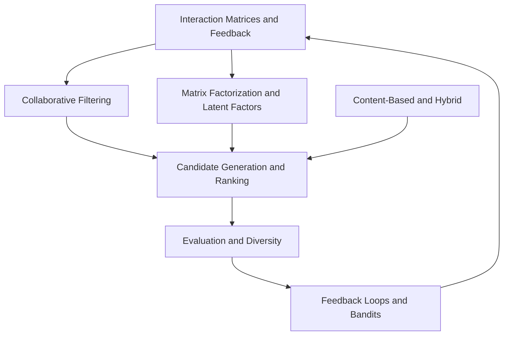

# Recommendation Systems and Personalization

Recommendation systems choose, order, and diversify items for a user or context. A recommender is usually a multi-stage system: candidate generation finds a tractable set, ranking orders it, and post-processing applies constraints such as diversity, freshness, eligibility, or safety. The hard part is often not the scoring model but the feedback loop between exposure, user behavior, and future training data.

This section connects [linear algebra](../01-mathematical-foundations/linear-algebra.md), [classical machine learning](../03-classical-machine-learning/index.md), [information retrieval](../12-information-retrieval-and-search/index.md), and [experimentation](../17-experimentation-and-evaluation/index.md).

## Knowledge map

Interaction representations feed collaborative and latent-factor models; those feed the retrieval-and-ranking stack; evaluation and online exploration close the loop.

## Reading path

Read from data representation through models, ranking, evaluation, and online learning; the applied recommenders come last.

1. [Recommendation System Overview](recommendation-system-overview.md): the multi-stage framing of a recommender.
2. [Utility and Interaction Matrices](utility-and-interaction-matrices.md): how user-item signal is represented.
3. [Explicit Versus Implicit Feedback](explicit-versus-implicit-feedback.md): what the model should treat as preference.
4. [Content-Based Recommendation](content-based-recommendation.md): scoring by item and user features.
5. [Collaborative Filtering](collaborative-filtering.md): using patterns across users and items.
6. [User-Based Collaborative Filtering](user-based-collaborative-filtering.md): neighborhoods over users.
7. [Item-Based Collaborative Filtering](item-based-collaborative-filtering.md): neighborhoods over items.
8. [Matrix Factorization for Recommender Systems](matrix-factorization.md): latent factors for sparse interactions.
9. [Latent Factor Models](latent-factor-models.md): the general latent-embedding view.
10. [Classical SVD](classical-svd.md): the exact decomposition and why it struggles with missing data.
11. [Truncated SVD](truncated-svd.md): low-rank projection of the interaction matrix.
12. [Sparse Utility Matrices and Ordinary SVD](sparse-utility-matrices-and-svd.md): why zero-filling distorts SVD.
13. [SVD versus Matrix Factorization](svd-versus-matrix-factorization.md): reconciling the two families.
14. [Funk SVD](funk-svd.md): gradient-trained latent factors on observed entries only.
15. [Alternating Least Squares](alternating-least-squares.md): closed-form alternating factor updates.
16. [Weighted Matrix Factorization](weighted-matrix-factorization.md): confidence-weighted implicit feedback.
17. [Implicit Feedback Recommendation](implicit-feedback.md): modeling clicks and views rather than ratings.
18. [Bayesian Personalized Ranking](bayesian-personalized-ranking.md): a pairwise ranking objective.
19. [Cold Start Problem](cold-start-problem.md): recommending for new users and items.
20. [Hybrid Recommenders](hybrid-recommenders.md): combining collaborative and content signals.
21. [Candidate Generation](candidate-generation.md): recalling a tractable set from a huge catalog.
22. [Ranking](ranking.md): ordering candidates for the final list.
23. [Retrieval and Ranking Architectures](retrieval-and-ranking-architectures.md): the two-stage system design.
24. [Evaluation of Recommenders](evaluation-of-recommenders.md): offline metrics for ranking quality.
25. [Offline Versus Online Evaluation](offline-versus-online-evaluation.md): why offline gains may not hold live.
26. [Diversity, Novelty, Coverage, and Serendipity](diversity-novelty-coverage-serendipity.md): beyond-accuracy objectives.
27. [Feedback Loops](feedback-loops.md): how exposure biases the data future models train on.
28. [Exploration Versus Exploitation](exploration-versus-exploitation.md): the core online trade-off.
29. [Multi-Armed Bandits](multi-armed-bandits.md): the stateless exploration formulation.
30. [Bandit Algorithms](bandit-algorithms.md): epsilon-greedy, UCB, and Thompson sampling.
31. [Contextual Bandits](contextual-bandits.md): exploration conditioned on features.
32. [Matchmaking Systems](matchmaking-systems.md): reciprocal, two-sided recommendation.
33. [Image-Based Recommendation](image-based-recommendation.md): recommending from visual content.
34. [Content-Based Image Retrieval](content-based-image-retrieval.md): nearest-neighbor retrieval over image embeddings.

## Connections

- [Information Retrieval and Search](../12-information-retrieval-and-search/index.md) shares the candidate-generation and ranking machinery.
- [Experimentation and Evaluation](../17-experimentation-and-evaluation/index.md) provides the online tests that decide whether a recommender actually helps.

> **Learning path — [Recommender systems](../00-home-and-navigation/learning-paths.md#recommender-systems):** [Collaborative Filtering](collaborative-filtering.md) →
