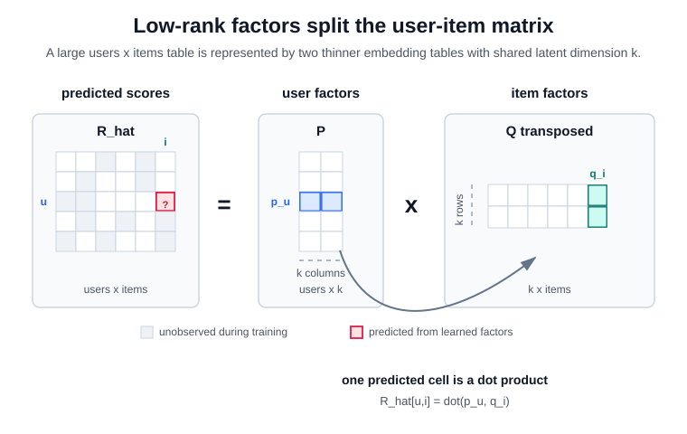
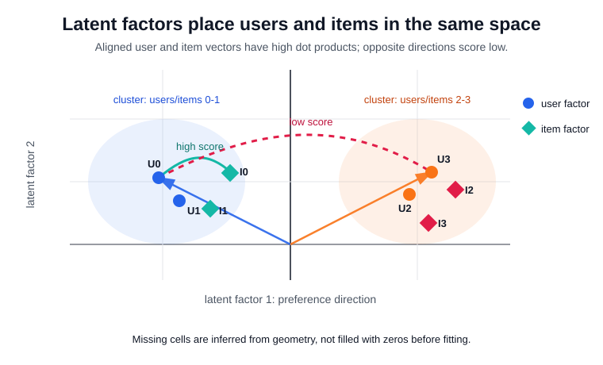

# Matrix Factorization for Recommender Systems

Matrix factorization represents each user and item with learned vectors, then scores a pair by their dot product. In [collaborative filtering](collaborative-filtering.md), this turns a sparse [utility matrix](utility-and-interaction-matrices.md) into dense latent coordinates: two users can look similar because their factors point toward the same item factors, even if they have rated few identical items.

## The factorization objective

For explicit ratings observed on $\Omega$, the basic objective is

$$
\min_{P,Q}\sum_{(u,i)\in\Omega}(r_{ui}-p_u^\top q_i)^2+\lambda(\lVert p_u\rVert_2^2+\lVert q_i\rVert_2^2).
$$

Some production variants add biases, $\hat r_{ui}=\mu+b_u+b_i+p_u^\top q_i$, while [weighted matrix factorization](weighted-matrix-factorization.md) changes the loss for [implicit feedback](implicit-feedback.md). Unlike [classical SVD](classical-svd.md), the optimization is over observed or weighted entries; missing cells are not silently treated as zeros, which is the core issue in [sparse utility matrices and SVD](sparse-utility-matrices-and-svd.md).

In shape terms, $P\in\mathbb R^{|\mathcal U|\times k}$ stores one $k$-dimensional embedding row $p_u$ per user, and $Q\in\mathbb R^{|\mathcal I|\times k}$ stores one embedding row $q_i$ per item. Multiplying $P Q^\top$ reconstructs a dense score matrix $\hat R\in\mathbb R^{|\mathcal U|\times|\mathcal I|}$, where the cell $\hat r_{ui}$ is the dot product $p_u^\top q_i$. The bottleneck dimension $k$ is intentionally much smaller than the number of users or items, so the model must explain many cells through shared latent structure.



## Intuition

The model compresses repeated co-preference patterns. If users who like quiet documentaries also like long-form interviews, the two item factors can land near the same direction, and a user factor aligned with that direction will score both highly. The factor dimensions are not guaranteed to be interpretable, but they are useful because they share statistical strength across sparse rows and columns.



The plot shows the geometric view of the dot product. User factors and item factors live in the same latent coordinate system: nearby or directionally aligned points score high, while points on opposite sides of the space score low. This is why the model can infer missing cells from shared structure rather than filling missing ratings with zeros before fitting.

## Worked example

This snippet factorizes a small partially observed rating matrix, reports observed-entry RMSE, and prints the completed score matrix used for recommendations.

```python
import numpy as np
rng = np.random.default_rng(7)
R = np.array([[5., 4., np.nan, 1.],
              [4., np.nan, 1., 1.],
              [1., 1., 5., 4.],
              [np.nan, 1., 4., 5.]])
obs = np.argwhere(~np.isnan(R))
P = 0.1 * rng.normal(size=(4, 2))
Q = 0.1 * rng.normal(size=(4, 2))
for _ in range(2500):
    rng.shuffle(obs)
    for u, i in obs:
        err = R[u, i] - P[u] @ Q[i]
        pu = P[u].copy()
        P[u] += 0.035 * (err * Q[i] - 0.03 * P[u])
        Q[i] += 0.035 * (err * pu - 0.03 * Q[i])
pred = P @ Q.T
rmse = np.sqrt(np.mean([(R[u, i] - pred[u, i]) ** 2 for u, i in obs]))
print("observed_rmse", round(float(rmse), 3))
print("rounded_prediction_matrix")
print(np.round(pred, 2))
print("user0_unseen_scores", np.round(pred[0, [2]], 2).tolist())
```

Observed output:

```text
observed_rmse 0.279
rounded_prediction_matrix
[[4.96 3.94 1.01 1.01]
 [3.93 3.13 1.01 1.01]
 [1.01 0.99 4.48 4.47]
 [1.01 1.   4.5  4.49]]
user0_unseen_scores [1.01]
```

The two-dimensional factors reconstruct the observed ratings and infer that user 0 probably dislikes item 2. [Alternating least squares](alternating-least-squares.md) solves a related objective by ridge-regression subproblems; [Funk SVD](funk-svd.md) popularized simple SGD updates for the same low-rank idea.

## Caveats

The loss only sees logged data, so exposure bias, position bias, and popularity feedback can become factor geometry. Sparse users and rare items need regularization or [cold-start](cold-start-problem.md) fallbacks. Optimizing rating RMSE does not guarantee good top-k [ranking](ranking.md), so matrix factorization is usually evaluated as part of a retrieval or ranking pipeline.

## References

- [Koren, Bell, and Volinsky, 2009, Matrix Factorization Techniques for Recommender Systems](https://doi.org/10.1109/MC.2009.263)
- [Hu, Koren, and Volinsky, 2008, Collaborative Filtering for Implicit Feedback Datasets](https://doi.org/10.1109/ICDM.2008.22)

> [!nav]
> **Section** — [Recommendation Systems and Personalization](index.md)
>
> [← Item-Based Collaborative Filtering](item-based-collaborative-filtering.md) [Latent Factor Models →](latent-factor-models.md)
>
> **Learning path** — [Recommender systems](../00-home-and-navigation/learning-paths.md#recommender-systems)
>
> [← Collaborative Filtering](collaborative-filtering.md) [SVD versus Matrix Factorization →](svd-versus-matrix-factorization.md)
