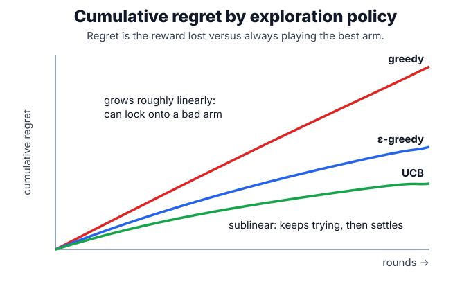

# Multi-Armed Bandits

A multi-armed bandit repeatedly chooses one action and observes reward only for that action. In recommendation, an arm can be a headline, module, notification, or item bucket. The missing labels for unchosen arms are the key difference from ordinary supervised [ranking](ranking.md).

## Regret

Regret after $T$ rounds compares the policy with always choosing the best arm:

$$
R_T=T\mu^\*-\sum_{t=1}^T \mu_{a_t}.
$$

UCB-style methods choose arms with high estimated reward plus uncertainty:

$$
\hat\mu_a+\sqrt{\frac{2\log t}{n_a}}.
$$

[Contextual bandits](contextual-bandits.md) condition the choice on user and item features.

## Worked example

After 55 total pulls, a UCB policy combines the empirical win rate with an uncertainty bonus:

| Arm | Wins / pulls | Empirical rate | Exploration bonus | UCB score |
| --- | -----------: | -------------: | ----------------: | --------: |
| 0   |       4 / 40 |          0.100 |             0.448 |     0.548 |
| 1   |       2 / 10 |          0.200 |             0.895 |     1.095 |
| 2   |        0 / 5 |          0.000 |             1.266 |     1.266 |

Arm 2 has no wins, but its low count gives it the largest exploration bonus, so it is chosen next. This is the mechanism behind [exploration versus exploitation](exploration-versus-exploitation.md).

## Caveats

Bandits need reward definitions that match product goals. Delayed rewards, repeated exposure, and interference between users violate the simplest assumptions. Use replay or randomized traffic for [offline versus online evaluation](offline-versus-online-evaluation.md), not ordinary logged-label accuracy.

## References

- [Li et al., 2010, A Contextual-Bandit Approach to Personalized News Article Recommendation](https://arxiv.org/abs/1003.0146)
- [Li et al., 2010, Unbiased Offline Evaluation of Contextual-bandit-based News Article Recommendation Algorithms](https://arxiv.org/abs/1003.5956)

> [!nav]
> **Section** — [Recommendation Systems and Personalization](index.md)
>
> [← Exploration Versus Exploitation](exploration-versus-exploitation.md) [Bandit Algorithms →](bandit-algorithms.md)
