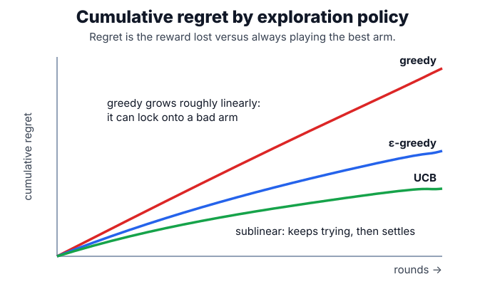

# Multi-Armed Bandits

A multi-armed bandit repeatedly chooses one action and observes reward only for that action. In recommendation, an arm can be a headline, module, notification, or item bucket. The missing labels for unchosen arms are the key difference from ordinary supervised [ranking](ranking.md): the system only learns from what it showed.

Bandits sit between pure ranking and full [contextual bandits](contextual-bandits.md). They are the simplest online exploration setting: there is no user feature vector yet, just repeated choices, partial feedback, and the need to learn while serving traffic.

## Formal setup

Let there be $K$ arms. At round $t$, a policy chooses an arm $a_t \in \{1,\dots,K\}$, shows it to a user, and observes reward $r_t$ only for that chosen arm. Each arm $a$ has an unknown mean reward $\mu_a$, which is the long-run expected click, conversion, or other product reward for that arm.

| Symbol      | Meaning                                      |
| ----------- | -------------------------------------------- |
| $K$         | number of available arms                     |
| $a_t$       | arm chosen at round $t$                      |
| $r_t$       | reward observed after showing $a_t$          |
| $\mu_a$     | expected reward of arm $a$                   |
| $a^\star$   | best arm, $\arg\max_a \mu_a$                 |
| $\mu^\star$ | mean reward of the best arm, $\mu_{a^\star}$ |
| $T$         | horizon, or number of rounds                 |

Because rewards are random, bandit papers often measure **pseudo-regret**: how much reward the policy left on the table compared with always showing the best arm.

$$
R_T = \sum_{t=1}^{T}(\mu^\star - \mu_{a_t}),
\qquad
\mu^\star = \max_a \mu_a.
$$

The same quantity can also be written as

$$
R_T = T\mu^\star - \sum_{t=1}^{T}\mu_{a_t}.
$$

This formula is easiest to read as: each suboptimal choice costs the gap between the best arm and the arm actually shown. The larger the gap, and the longer the system keeps choosing the wrong arm, the larger the regret.

## Regret

Regret is the main lens for bandits because it captures the exploration cost directly. A greedy policy can have low regret early if it gets lucky, then high regret later if it locks onto a mediocre arm. A good bandit policy pays some short-term regret to reduce long-term regret by learning which arm is actually best.

UCB-style methods choose arms with high estimated reward plus uncertainty:

$$
\hat\mu_a+\sqrt{\frac{2\log t}{n_a}}.
$$

[Contextual bandits](contextual-bandits.md) condition the choice on user and item features.

## Why recommenders use bandits

A recommender usually wants two things at once:

- good immediate reward from the items it shows now;
- better future decisions from the feedback those items generate.

That makes bandits a natural fit for news headlines, homepage modules, notification templates, and item buckets where the system must pick one option per impression and only learns from the displayed option. If the system never explores, it can miss a better arm that just had bad luck early. If it explores too much, user experience suffers. The bandit formulation makes that trade-off explicit.

## Worked example

Suppose a homepage has three newsletter modules:

| Arm | Content               |
| --- | --------------------- |
| 0   | sports roundup        |
| 1   | personal finance tips |
| 2   | weather alerts        |

Their true click-through rates are unknown to the system, but in reality they are:

| Arm | True click rate |
| --- | --------------: |
| 0   |            0.03 |
| 1   |            0.05 |
| 2   |            0.08 |

The system starts with only a few impressions, so the observed data are noisy:

| Arm | Wins / pulls | Empirical rate |
| --- | -----------: | -------------: |
| 0   |       1 / 10 |           0.10 |
| 1   |       1 / 10 |           0.10 |
| 2   |        0 / 2 |           0.00 |

A greedy policy would keep showing arm 0 or 1 because they currently look best, even though arm 2 is actually the best arm. That is the danger of early luck: a small sample can make a mediocre arm look strong and a strong arm look weak.

After 55 total pulls, a UCB policy combines the empirical win rate with an uncertainty bonus:

| Arm | Wins / pulls | Empirical rate | Exploration bonus | UCB score |
| --- | -----------: | -------------: | ----------------: | --------: |
| 0   |       4 / 40 |          0.100 |             0.448 |     0.548 |
| 1   |       2 / 10 |          0.200 |             0.895 |     1.095 |
| 2   |        0 / 5 |          0.000 |             1.266 |     1.266 |

Arm 2 has no wins, but its low count gives it the largest exploration bonus, so it is chosen next. That is the point of the upper-confidence-bound rule: if an arm has not been tried much, the policy treats it as promising until it has enough evidence to prove otherwise. If arm 2 keeps losing, its empirical rate stays low and the bonus shrinks as the count rises; if it starts winning, the policy learns that it should be shown more often.

In regret terms, each round spent on arm 0 instead of arm 2 loses about $0.08 - 0.03 = 0.05$ expected clicks. Over 1,000 impressions, that gap costs about 50 expected clicks. The bandit algorithm is trying to discover and then avoid that persistent loss.

This is the mechanism behind [exploration versus exploitation](exploration-versus-exploitation.md). The next page, [Bandit Algorithms](bandit-algorithms.md), gives the concrete policies such as epsilon-greedy, UCB, and Thompson sampling.

## Caveats

Bandits need reward definitions that match product goals. Delayed rewards, repeated exposure, and interference between users violate the simplest assumptions. The reward should reflect the thing the product actually values, not just clicks. Use replay or randomized traffic for [offline versus online evaluation](offline-versus-online-evaluation.md), not ordinary logged-label accuracy.

## References

- [Li et al., 2010, A Contextual-Bandit Approach to Personalized News Article Recommendation](https://arxiv.org/abs/1003.0146)
- [Li et al., 2010, Unbiased Offline Evaluation of Contextual-bandit-based News Article Recommendation Algorithms](https://arxiv.org/abs/1003.5956)

> [!nav]
> **Section** — [Recommendation Systems and Personalization](index.md)
>
> [← Exploration Versus Exploitation](exploration-versus-exploitation.md) [Bandit Algorithms →](bandit-algorithms.md)
