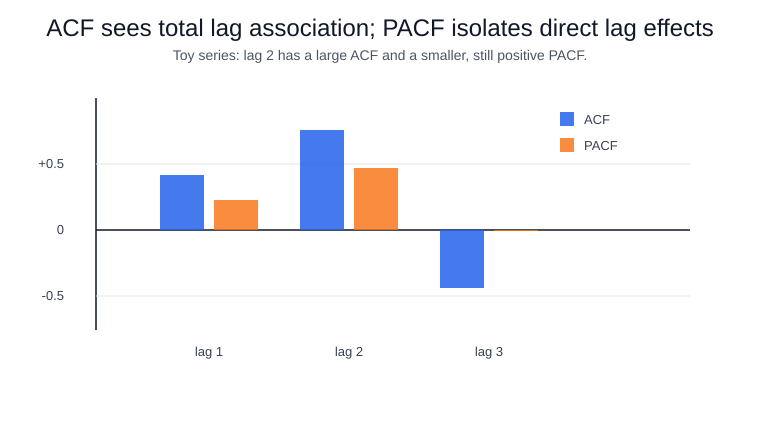

## Summary

Autocorrelation measures how a time series relates to lagged versions of itself. Partial autocorrelation isolates the direct relationship at a lag after accounting for shorter lags.

## Autocorrelation

The autocorrelation at lag $k$ compares $y_t$ with $y_{t-k}$. High autocorrelation at lag 1 means adjacent observations tend to be similar. Seasonal autocorrelation appears when lags match a recurring period, such as 7 days or 12 months.

## Partial autocorrelation

Partial autocorrelation at lag $k$ estimates the remaining relationship between $y_t$ and $y_{t-k}$ after controlling for lags 1 through $k-1$. It helps distinguish direct lag effects from correlations inherited through intermediate lags.

## Example

Daily electricity demand often has strong lag-1 autocorrelation because today resembles yesterday, and strong lag-7 autocorrelation because weekdays resemble the same weekday last week. A PACF plot can help decide whether an autoregressive model needs only recent lags or an explicit weekly lag.

## Practical use

ACF and PACF plots are diagnostic tools for stationarity, seasonality, and ARIMA-style model selection. They should be interpreted with domain knowledge and validation, not as automatic model-order rules.

## Failure modes

Trends and seasonality can create misleading autocorrelation. Difference or detrend the series when appropriate, and use rolling-origin validation to confirm that lag choices improve forecasts.

## Executed example

This snippet computes early autocorrelations and partial autocorrelations for a synthetic series so the lag structure can be read numerically.

```python
import numpy as np

y = np.array([0.0, 0.8, 0.9, 1.42, 1.08, 1.448, 1.109, 1.4436, 1.1049, 1.4420])
yc = y - y.mean()
acf = [1.0]
for k in range(1, 4):
    acf.append(np.corrcoef(yc[k:], yc[:-k])[0, 1])

def pacf_ols(series, lag):
    target = series[lag:]
    X = np.column_stack([series[lag - j:-j] for j in range(1, lag + 1)])
    X = np.column_stack([np.ones(len(X)), X])
    beta = np.linalg.lstsq(X, target, rcond=None)[0]
    return beta[-1]

print("acf_lags_0_3", np.round(acf, 3).tolist())
print("pacf_lags_1_3", np.round([pacf_ols(y, k) for k in range(1, 4)], 3).tolist())
```

Observed output:

```text
acf_lags_0_3 [1.0, 0.414, 0.76, -0.436]
pacf_lags_1_3 [0.23, 0.467, -0.008]
```

The lag-2 ACF is large because the series alternates around a pattern; the PACF calculation asks what each lag adds after shorter lags are already in the regression.



The ACF bars show total lag association, while the PACF bars show direct lag contribution after shorter lags are included. That distinction is why the lag-2 ACF can be large even when model selection should still check whether lag 2 improves validation performance.

## Connections

ACF/PACF diagnostics connect [time-series fundamentals](time-series-fundamentals.md) to [autoregressive models](autoregressive-models.md), [moving-average models](moving-average-models.md), and [ARIMA](arima.md). Interpret them after checking [stationarity](stationarity.md), because trend can create spurious lag structure.

## References

- [Hyndman & Athanasopoulos, FPP3: Autocorrelation](https://otexts.com/fpp3/acf.html)
- [statsmodels ACF API](https://www.statsmodels.org/stable/generated/statsmodels.tsa.stattools.acf.html)
- [statsmodels PACF API](https://www.statsmodels.org/stable/generated/statsmodels.tsa.stattools.pacf.html)
