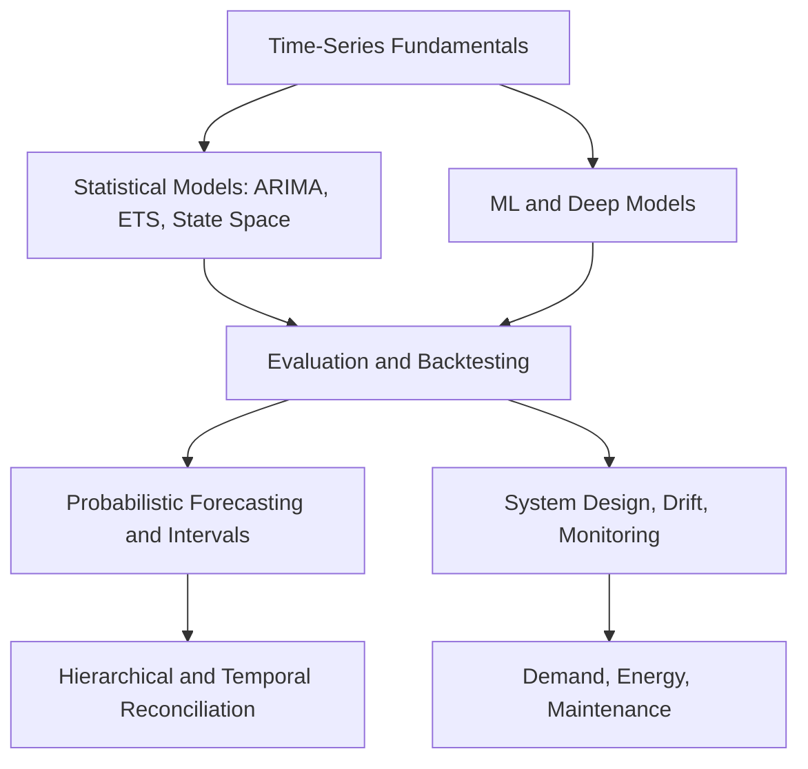

# Time-Series Forecasting

Time-series forecasting predicts future values from observations ordered in time. The modeling problem is inseparable from the decision: what is known at the forecast origin, which horizon matters, how uncertainty is represented, and how errors translate into cost. Validation must respect temporal order, otherwise future information leaks into training.

This section moves from basic time-series structure to statistical models, machine-learning and deep models, evaluation, probabilistic forecasts, reconciliation, system operation, and domain examples.

## Knowledge map

Fundamentals feed both statistical and learned model families; all of them route through evaluation, then uncertainty, reconciliation, and production operation before reaching applications.

## Reading path

Read the fundamentals, then the model families, evaluation, uncertainty, reconciliation, operation, and applications.

1. [Time Series Fundamentals](time-series-fundamentals.md): the vocabulary of series, horizons, and origins.
2. [Trend Seasonality Cycles Noise](trend-seasonality-cycles-noise.md): the components a forecaster decomposes.
3. [Stationarity](stationarity.md): when statistical properties hold still enough to model.
4. [Autocorrelation and Partial Autocorrelation](autocorrelation-and-partial-autocorrelation.md): reading lag structure.
5. [Forecasting Problem Formulation](forecasting-problem-formulation.md): tying the target and horizon to a decision.
6. [Forecasting Data and Covariates](forecasting-data-and-covariates.md): what is known at the origin, including future-known inputs.
7. [Feature Engineering for Forecasting](feature-engineering-for-forecasting.md): lags, calendar, and rolling features without leakage.
8. [Autoregressive Models](autoregressive-models.md): regressing on a series' own past.
9. [Moving Average Models](moving-average-models.md): regressing on past shocks.
10. [ARMA](arma.md): combining autoregressive and moving-average terms.
11. [ARIMA](arima.md): adding differencing for non-stationary series.
12. [SARIMA](sarima.md): seasonal extensions of ARIMA.
13. [Exponential Smoothing](exponential-smoothing.md): weighted recency for level, trend, and season.
14. [State Space Models](state-space-models.md): latent-state formulation of many classical models.
15. [Kalman Filters](kalman-filters.md): recursive prediction and update for linear Gaussian state space.
16. [Statistical Forecasting](statistical-forecasting.md): the practical statistical baseline stack.
17. [Machine Learning Forecasting](machine-learning-forecasting.md): tabular ML with engineered features.
18. [Deep Learning Forecasting](deep-learning-forecasting.md): when neural models earn their complexity.
19. [RNN and LSTM Forecasting](rnn-and-lstm-forecasting.md): recurrent sequence models for forecasting.
20. [Temporal Convolutional Networks](temporal-convolutional-networks.md): dilated causal convolutions.
21. [Transformer-Based Forecasting](transformer-based-forecasting.md): attention models for long horizons.
22. [N-BEATS and N-HiTS](n-beats-and-nhits.md): deep basis-expansion architectures.
23. [Forecast Evaluation](forecast-evaluation.md): judging forecasts against the decision.
24. [Backtesting](backtesting.md): replaying history to estimate real performance.
25. [Rolling Origin Validation](rolling-origin-validation.md): time-respecting cross-validation.
26. [Forecast Error Metrics](forecast-error-metrics.md): MAE, RMSE, WAPE, and bias.
27. [Business-Cost-Aware Forecasting Losses](business-cost-aware-forecasting-losses.md): metrics tied to asymmetric cost.
28. [Forecasting Pitfalls and Worked Examples](forecasting-pitfalls-and-worked-examples.md): common leakage and evaluation traps.
29. [Probabilistic Forecasting](probabilistic-forecasting.md): forecasting distributions, not points.
30. [Prediction Intervals](prediction-intervals.md): quantifying forecast uncertainty.
31. [Quantile Loss](quantile-loss.md): the pinball loss for quantile forecasts.
32. [Forecast Calibration](forecast-calibration.md): whether stated intervals cover as claimed.
33. [Conformal Prediction for Forecasting](conformal-prediction-for-forecasting.md): distribution-free coverage guarantees.
34. [Hierarchical Forecasting](hierarchical-forecasting.md): forecasting across an aggregation structure.
35. [Hierarchical Reconciliation](hierarchical-reconciliation.md): making cross-level forecasts add up.
36. [Temporal Reconciliation](temporal-reconciliation.md): coherence across time granularities.
37. [Intermittent Demand](intermittent-demand.md): forecasting many-zero series.
38. [Cold-Start Forecasting](cold-start-forecasting.md): series with little or no history.
39. [Forecast Ensembling](forecast-ensembling.md): combining models and weighting them safely.
40. [Hyperparameter Optimization for Forecasting](hyperparameter-optimization-for-forecasting.md): tuning without leaking the backtest.
41. [Forecasting System Design](forecasting-system-design.md): the end-to-end pipeline.
42. [Concept Drift in Forecasting](concept-drift-in-forecasting.md): when the process itself changes.
43. [Online Learning for Forecasting](online-learning-for-forecasting.md): updating models as data arrives.
44. [Forecast Monitoring](forecast-monitoring.md): watching residuals and coverage in production.
45. [Demand Forecasting](demand-forecasting.md): the retail and supply-chain application.
46. [Energy Consumption Forecasting](energy-consumption-forecasting.md): load and consumption under weather and calendar effects.
47. [Predictive Maintenance](predictive-maintenance.md): failure and remaining-useful-life forecasting.

## Connections

- [Probability and Statistics](../02-probability-and-statistics/index.md) supplies the stationarity, estimation, and interval theory.
- [ML Engineering and MLOps](../14-ml-engineering-and-mlops/index.md) and [Experimentation and Evaluation](../17-experimentation-and-evaluation/index.md) cover the pipelines and tests forecasts run inside.
- [Domain Applications](../19-domain-applications/index.md) shows these methods used end to end.

> [!nav]
> **Learning path** — [Forecasting](../00-home-and-navigation/learning-paths.md#forecasting)
>
> [Time Series Fundamentals →](time-series-fundamentals.md)
