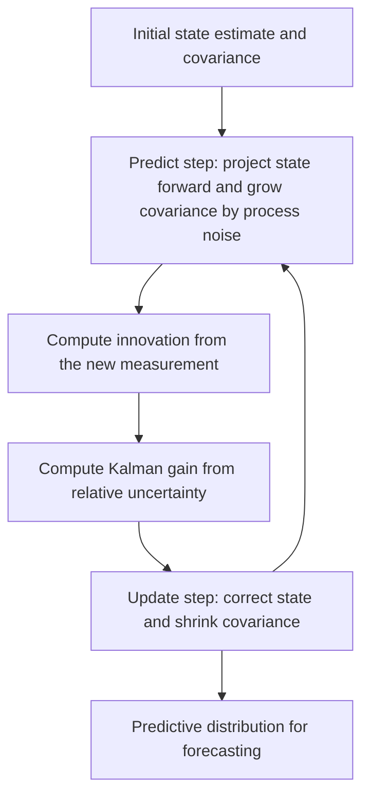

# Kalman Filters

A Kalman filter estimates a hidden state over time by alternating **prediction** and **correction**. It is the recursive inference engine for many [state-space models](state-space-models.md): the model predicts how the latent state should evolve, observes a noisy measurement, then blends the two in proportion to their relative uncertainty. It is exactly the Bayesian filtering recursion for the special case where everything is linear and Gaussian, and in that case it is optimal in the mean-squared-error sense.

## Linear Gaussian State-Space Model

The filter assumes a latent state $x_t$ that evolves linearly and is observed through a linear measurement:

$$
x_t = F x_{t-1} + w_t,\qquad z_t = H x_t + v_t,
$$

where $F$ is the transition matrix, $H$ the observation matrix, $w_t \sim \mathcal{N}(0, Q)$ is process noise, and $v_t \sim \mathcal{N}(0, R)$ is measurement noise. The state is summarized by a mean $\hat{x}$ and covariance $P$; the filter propagates both.

## The Predict–Update Cycle

Each step runs two phases. Prediction pushes the state through the dynamics and grows uncertainty by the process noise. Update pulls the state toward the new measurement by an amount set by the Kalman gain.

| Phase   | Computes                      | Effect on uncertainty      |
| ------- | ----------------------------- | -------------------------- |
| Predict | prior mean and covariance     | grows by process noise $Q$ |
| Update  | posterior mean and covariance | shrinks by the measurement |

**Predict:**

$$
\hat{x}_{t|t-1}=F\hat{x}_{t-1|t-1},\qquad
P_{t|t-1}=FP_{t-1|t-1}F^\top+Q.
$$

**Update.** Form the innovation (measurement residual) and the Kalman gain:

$$
y_t = z_t-H\hat{x}_{t|t-1},\qquad
K_t=P_{t|t-1}H^\top\left(HP_{t|t-1}H^\top+R\right)^{-1},
$$

then correct the state and covariance:

$$
\hat{x}_{t|t}=\hat{x}_{t|t-1}+K_t y_t,\qquad
P_{t|t}=(I-K_tH)P_{t|t-1}.
$$

## Why the Gain Is the Whole Story

The gain $K_t$ interpolates between trusting the model and trusting the measurement. If measurement noise $R$ is large, $K_t$ is small and the filter mostly keeps its prediction. If state uncertainty $P_{t|t-1}$ is large, $K_t$ approaches the value that snaps the estimate onto the observation. This adaptive weighting is what makes Kalman filtering useful for online forecasting, object tracking, sensor smoothing, and any model where [prediction intervals](prediction-intervals.md) should reflect evolving state uncertainty.

## Worked Scalar Example

Track a scalar position with $F=1$, $H=1$, process noise $Q=0.01$, measurement noise $R=1$, starting from $\hat{x}=0$, $P=1$. A measurement $z=2$ arrives.

1. Predict: $\hat{x}_{t|t-1}=0$, and $P_{t|t-1}=1\cdot 1\cdot 1+0.01=1.01$.
2. Innovation: $y_t = 2-0 = 2$.
3. Gain: $K_t=\dfrac{1.01}{1.01+1}=\dfrac{1.01}{2.01}\approx 0.502$.
4. Update: $\hat{x}_{t|t}=0+0.502\cdot 2\approx 1.005$, and $P_{t|t}=(1-0.502)\cdot 1.01\approx 0.503$.

The estimate moves about halfway to the observation because the prior and the measurement carry almost equal uncertainty, and the posterior variance drops from $1.01$ to $0.503$.

## Filtering, Prediction, and Smoothing

- **Filtering** gives $\hat{x}_{t|t}$, the best estimate of the current state from data up to now.
- **Prediction** gives $\hat{x}_{t+h|t}$ and its covariance, the one-step or multi-step forecast distribution before observations arrive. This is the object used for live forecasting.
- **Smoothing** (for example, the Rauch–Tung–Striebel recursion) revisits earlier states using later observations. It is more accurate for retrospective analysis but is not causal, so it cannot be used to generate real-time forecasts.

## When Linearity Breaks

Real systems are often nonlinear. Three standard extensions relax the linear-Gaussian assumption:

| Method                  | Idea                                                          | Trade-off                                      |
| ----------------------- | ------------------------------------------------------------- | ---------------------------------------------- |
| Extended Kalman Filter  | linearize $f$ and $h$ with Jacobians around the estimate      | cheap, but biased under strong curvature       |
| Unscented Kalman Filter | propagate a set of sigma points through the true nonlinearity | more accurate, no Jacobians, slightly costlier |
| Particle Filter         | represent the posterior with weighted samples                 | handles nonlinear, non-Gaussian; expensive     |

The Kalman filter also generalizes several simpler methods: a suitable state-space form makes [exponential smoothing](exponential-smoothing.md) and recursive least squares special cases of the same recursion.

## Practical Guidance

- The filter is only as good as $F$, $H$, $Q$, and $R$. A mis-specified $Q$ or $R$ makes the state sluggish or jittery; $Q$ and $R$ are often tuned by maximizing the innovation likelihood.
- Monitor innovations $y_t$ like any other [forecast monitoring](forecast-monitoring.md) signal. Under a correct model they are zero-mean and white with covariance $HP_{t|t-1}H^\top+R$; persistent bias or autocorrelation flags model drift, especially after sensor changes or regime shifts.
- For numerical stability, use the Joseph form of the covariance update or a square-root filter, which keep $P$ symmetric and positive semi-definite.
- When the regime changes, adaptive noise estimates or [online retraining](online-learning-for-forecasting.md) may be needed.

## Connections

- [State-Space Models](state-space-models.md) provide the $F, H, Q, R$ structure the filter operates on.
- [Exponential Smoothing](exponential-smoothing.md) is a special case recoverable from a local-level state-space model.
- [Prediction Intervals](prediction-intervals.md) can be built directly from the filter's predictive covariance.

## References

- [Kalman, 1960, A New Approach to Linear Filtering and Prediction Problems](https://doi.org/10.1115/1.3662552)
- [Särkkä, 2013, Bayesian Filtering and Smoothing](https://users.aalto.fi/~ssarkka/pub/cup_book_online_20131111.pdf)
- [statsmodels state-space documentation](https://www.statsmodels.org/stable/statespace.html)

> [!nav]
> **Section** — [Time-Series Forecasting](index.md)
>
> [← State Space Models](state-space-models.md) [Statistical Forecasting →](statistical-forecasting.md)
