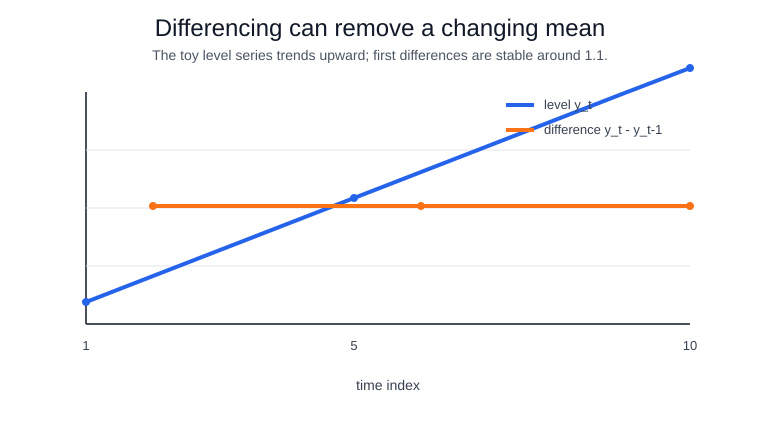

# Stationarity

Stationarity means the probabilistic behavior of a time series does not change with calendar time. In weak stationarity, the mean is constant, the variance is finite and constant, and covariance depends only on lag, not on the absolute timestamp:

$$
E[y_t] = \mu,\qquad Var(y_t)=\sigma^2,\qquad Cov(y_t,y_{t-k})=\gamma_k.
$$

This matters because [ARMA](arma.md), many ACF/PACF diagnostics, and standard residual assumptions are statements about stable dependence. If the mean drifts upward, the sample autocorrelation may look strong simply because early values are low and late values are high. If variance changes over time, prediction intervals built from a single residual scale can be misleading.

Stationarity is often pursued through transformations rather than assumed in raw data. Logs or Box-Cox transforms can stabilize variance; first differencing $(1-B)y_t = y_t-y_{t-1}$ can remove a stochastic trend; seasonal differencing $(1-B^m)y_t$ can remove repeating seasonal level shifts. In [ARIMA](arima.md), the $d$ parameter is exactly this differencing count.

## Executed example

This snippet compares summary statistics for a stationary-looking series and a trending series, including an Augmented Dickey-Fuller style stationarity check.

```python
import numpy as np
from scipy import stats

y = np.array([2.0, 3.1, 4.2, 5.3, 6.4, 7.5, 8.6, 9.7, 10.8, 11.9])
d = np.diff(y)
for name, s in [("level", y), ("difference", d)]:
    x = np.arange(len(s))
    slope, intercept, r, p, se = stats.linregress(x, s)
    acf1 = np.corrcoef(s[1:], s[:-1])[0, 1]
    print(name, "mean", round(float(s.mean()), 3),
          "trend_slope", round(float(slope), 3),
          "acf1", round(float(acf1), 3))
```

Observed output:

```text
level mean 6.95 trend_slope 1.1 acf1 1.0
difference mean 1.1 trend_slope 0.0 acf1 -0.414
```

The level series has a deterministic upward slope. First differencing removes that slope in this toy example, which is why differencing is checked before fitting ARIMA-style models.



The level plot violates weak stationarity because its mean changes with time. The differenced plot is centered around a stable value in this toy example, so its covariance structure is more plausible to model with stationary ARMA-style assumptions.

Stationarity tests and plots are aids, not commands. Over-differencing can create artificial negative autocorrelation and remove useful low-frequency signal. A better workflow is to compare transformations with [autocorrelation and partial autocorrelation](autocorrelation-and-partial-autocorrelation.md), residual diagnostics, and [backtesting](backtesting.md) rather than declaring a page-level test result decisive.

## References

- [Hyndman & Athanasopoulos, FPP3: Stationarity and differencing](https://otexts.com/fpp3/stationarity.html)
- [statsmodels Augmented Dickey-Fuller API](https://www.statsmodels.org/stable/generated/statsmodels.tsa.stattools.adfuller.html)
