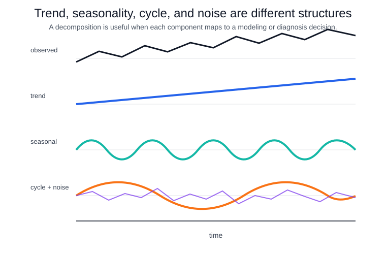

# Trend Seasonality Cycles Noise

Trend, seasonality, cycles, and noise are a vocabulary for separating different kinds of temporal structure. A common additive view is

$$
y_t = T_t + S_t + C_t + R_t,
$$

where $T_t$ is long-run movement, $S_t$ is regular calendar repetition, $C_t$ is slower irregular cyclic behavior, and $R_t$ is residual variation. Multiplicative decompositions use products instead of sums when seasonal amplitude grows with the level.

Trend is directional movement over a period relevant to the decision. It may be deterministic, such as a planned rollout, or stochastic, such as a random walk-like level. Seasonality is tied to a known period: hour of day, day of week, month of year. Cycles are recurrent but not fixed to a precise calendar period, such as business-cycle demand. Noise is the part left after the modeled structure, but "noise" can still reveal missing drivers, outliers, or regime changes.

These components affect model choice. [SARIMA](sarima.md) is appropriate when seasonal dependence is regular and captured by seasonal lags. [Exponential smoothing](exponential-smoothing.md) handles level, trend, and seasonal states directly. [Feature engineering for forecasting](feature-engineering-for-forecasting.md) can encode holidays, events, and multiple seasonalities when a pure univariate model is too restrictive.

The diagram separates components that are often mixed in the raw series. The trend changes the long-run level, the seasonal component repeats at a fixed period, the cycle moves more slowly without a fixed calendar alignment, and the residual is the remaining irregular variation.

Decomposition is descriptive unless it improves forecasting or diagnosis. A visually pleasing trend line can leak future data if computed over the full sample before validation. Seasonal plots can hide changing seasonal strength. Residual plots should be checked with [autocorrelation and partial autocorrelation](autocorrelation-and-partial-autocorrelation.md), and any modeling choice should be validated with [forecast evaluation](forecast-evaluation.md).

## References

- [Hyndman & Athanasopoulos, FPP3: Time series decomposition](https://otexts.com/fpp3/decomposition.html)
- [Hyndman & Athanasopoulos, FPP3: Time series patterns](https://otexts.com/fpp3/graphics.html)
