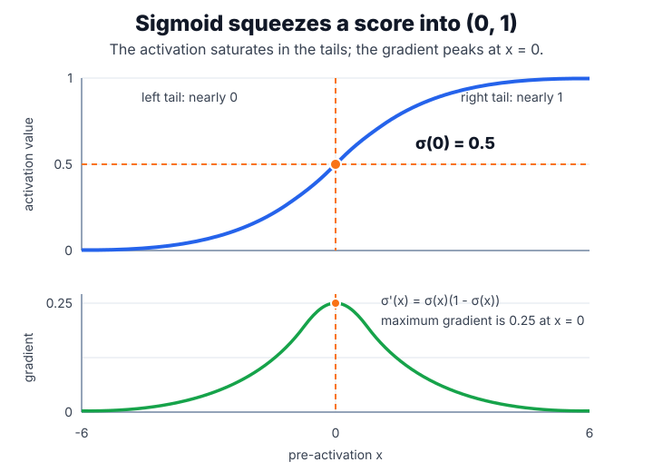
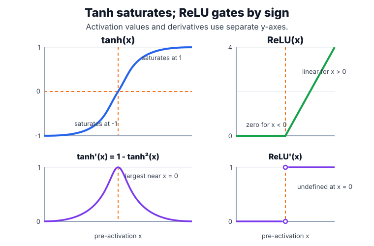
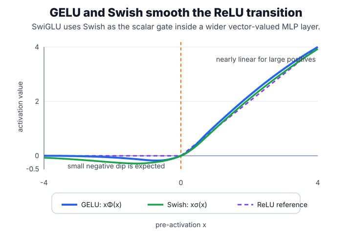

# Activation Functions

Activation functions turn affine layers into nonlinear [neural networks](neural-network-fundamentals.md). They also decide how much gradient reaches earlier layers during [backpropagation](backpropagation.md), so activation choice is inseparable from [initialization](initialization.md) and sometimes [normalization](normalization.md).

## Defining math

Common elementwise activations include

$$
\sigma(x)=\frac{1}{1+e^{-x}}, \qquad
\tanh(x)=\frac{e^x-e^{-x}}{e^x+e^{-x}}, \qquad
\operatorname{ReLU}(x)=\max(0,x).
$$

The scalar $x$ is one pre-activation value from an affine layer. Sigmoid maps it to $(0,1)$, tanh maps it to $(-1,1)$, and ReLU keeps positive values while zeroing negative values.



Their derivatives show the training behavior:

$$
\sigma'(x)=\sigma(x)(1-\sigma(x)), \qquad
\tanh'(x)=1-\tanh^2(x), \qquad
\operatorname{ReLU}'(x)=\begin{cases}1 & x>0\\0 & x<0.\end{cases}
$$

Sigmoid and tanh saturate for large magnitudes; ReLU keeps a unit derivative on the positive side but can produce dead units on the negative side.



## GELU and SwiGLU

Modern transformer MLPs often use smoother or gated activations instead of plain ReLU.

The Gaussian error linear unit, GELU, is

$$
\operatorname{GELU}(x)=x\Phi(x),
$$

where $x$ is one scalar pre-activation value and $\Phi(x)$ is the cumulative distribution function of the standard normal distribution. Intuitively, GELU keeps large positive values, suppresses large negative values, and gives values near zero a smooth probabilistic transition instead of the hard ReLU cutoff.

SwiGLU is a gated feed-forward variant. Instead of applying one activation to one projection, the layer creates two learned projections and uses one to gate the other:

$$
\operatorname{SwiGLU}(x)=(xW_a+b_a)\odot\operatorname{Swish}(xW_g+b_g),
\qquad
\operatorname{Swish}(z)=z\sigma(z).
$$

Here $x$ is an input vector, $W_a,b_a$ are the value-projection parameters, $W_g,b_g$ are the gate-projection parameters, $\sigma$ is the sigmoid function, and $\odot$ means elementwise multiplication. The gate can amplify, dampen, or suppress each hidden feature before the next linear projection.



In a [transformer](transformers.md), GELU or SwiGLU usually appears inside the position-wise [MLP](multilayer-perceptrons.md). Attention mixes information between token positions; the activation inside the MLP shapes nonlinear feature interactions within each token vector.

## Worked example

This snippet evaluates common activation functions on the same input grid and prints both activations and gradients for comparison.

```python
import torch
import torch.nn.functional as F

x = torch.tensor([-3., 0., 3.], requires_grad=True)
for name, fn in [("sigmoid", torch.sigmoid), ("tanh", torch.tanh), ("relu", F.relu)]:
    x.grad = None
    y = fn(x).sum()
    y.backward()
    print(name, "values", torch.round(fn(x.detach()), decimals=3).tolist(),
          "grads", torch.round(x.grad, decimals=3).tolist())
```

Observed output:

```text
sigmoid values [0.04699999839067459, 0.5, 0.953000009059906] grads [0.04500000178813934, 0.25, 0.04500000178813934]
tanh values [-0.9950000047683716, 0.0, 0.9950000047683716] grads [0.009999999776482582, 1.0, 0.009999999776482582]
relu values [0.0, 0.0, 3.0] grads [0.0, 0.0, 1.0]
```

At $\pm3$, sigmoid and tanh already have small gradients. ReLU avoids that on positive inputs but returns zero gradient for negative inputs.

## Caveats

Sigmoids inside deep hidden stacks often slow training unless gates need bounded values, as in [LSTM and GRU](lstm-and-gru.md). ReLU-family activations pair naturally with He initialization, but high learning rates can push many units permanently negative. Smooth alternatives such as GELU can help transformers but do not remove the need to monitor activation scale. Gated variants such as SwiGLU add parameters and compute, so their benefit should be evaluated under the same training budget.

## References

- [He et al., 2015, Delving Deep into Rectifiers](https://arxiv.org/abs/1502.01852)
- [Hendrycks and Gimpel, 2016, Gaussian Error Linear Units](https://arxiv.org/abs/1606.08415)
- [Shazeer, 2020, GLU Variants Improve Transformer](https://arxiv.org/abs/2002.05202)
- [PyTorch documentation: Autograd mechanics](https://docs.pytorch.org/docs/2.7/notes/autograd.html)

> [!nav]
> **Section** — [Deep Learning](index.md)
>
> [← Vanishing and Exploding Gradients](vanishing-and-exploding-gradients.md) [Loss Functions →](loss-functions.md)
