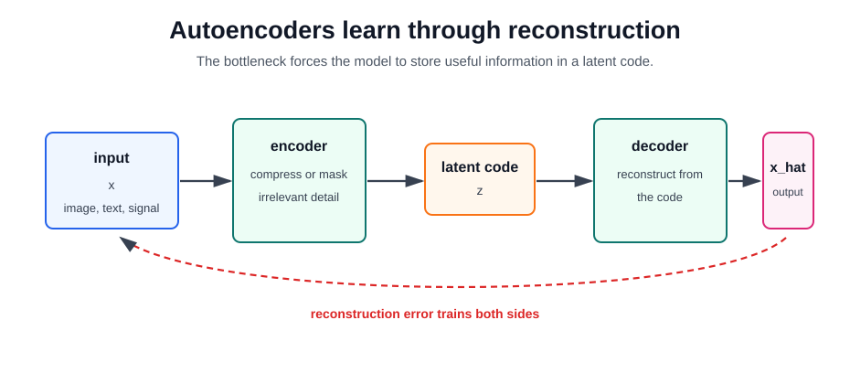

# Autoencoders

An autoencoder learns to copy an input through a constrained intermediate representation. The model has an encoder that maps an input to a latent code and a decoder that reconstructs the input from that code. The useful part is not the copying itself; it is the representation forced through the bottleneck, corruption process, sparsity penalty, or probabilistic latent space.

Autoencoders are a form of [representation learning](representation-learning.md) and often a form of [self-supervised learning](self-supervised-learning.md), because the input provides its own target. They differ from [contrastive learning](contrastive-learning.md): contrastive objectives learn by comparing examples, while autoencoders learn by reconstructing missing, noisy, or compressed information.

## Defining Mechanism

For input $x$, encoder $f_\theta$, decoder $g_\phi$, and latent code $z$:

$$
z=f_\theta(x),\qquad \hat x=g_\phi(z).
$$

A basic reconstruction objective is

$$
L_{\mathrm{rec}}(x,\hat x)=\lVert x-\hat x\rVert_2^2.
$$

If the latent dimension is smaller than the input or otherwise regularized, the model cannot simply memorize every coordinate independently. It must learn a compressed representation that preserves information useful for reconstruction.

## Bottleneck Intuition

Suppose an input has 1,000 pixel values and the latent code has 64 numbers. The decoder cannot reconstruct the image by passing all pixels through unchanged. The encoder must store factors such as edges, colors, object layout, or texture statistics in the code. A better reconstruction loss means the code preserved more information that the decoder could use.

That does not automatically mean the code is semantic. A plain autoencoder can spend capacity on background texture or camera noise if those details reduce pixel loss. This is why autoencoders are often paired with corruption, masking, perceptual losses, sparsity, or downstream evaluation.

## Important Variants

| Variant                   | Training signal                               | What it encourages                                  |
| ------------------------- | --------------------------------------------- | --------------------------------------------------- |
| Undercomplete autoencoder | reconstruct from a smaller latent code        | compression and dimensionality reduction            |
| Denoising autoencoder     | reconstruct clean input from corrupted input  | robustness to noise and missing features            |
| Sparse autoencoder        | reconstruct while penalizing active units     | interpretable or factorized latent features         |
| Variational autoencoder   | reconstruct while matching a latent prior     | smooth latent sampling and probabilistic generation |
| Masked autoencoder        | reconstruct hidden patches or tokens          | scalable self-supervised representation learning    |
| Latent autoencoder        | compress data before another generative model | efficient generation in a learned latent space      |

## Variational Autoencoders

A variational autoencoder turns the latent code into a distribution. The encoder predicts parameters of $q_\theta(z\mid x)$, the decoder models $p_\phi(x\mid z)$, and training maximizes the evidence lower bound:

$$
\mathcal L_{\mathrm{VAE}}
=
\mathbb E_{q_\theta(z\mid x)}[\log p_\phi(x\mid z)]
-D_{\mathrm{KL}}\left(q_\theta(z\mid x)\,\Vert\,p(z)\right).
$$

The reconstruction term asks the decoder to explain the data. The KL term keeps the encoded latent distribution close to a simple prior, often a standard normal. This makes sampling possible: draw $z$ from the prior and decode it. VAEs usually give smoother latent spaces than plain autoencoders, but samples can look blurrier when the likelihood and decoder are too simple.

## Applications

Autoencoders are useful when the objective is compression, reconstruction, anomaly detection, imputation, or representation pretraining:

| Application                 | How the autoencoder is used                                                                                             |
| --------------------------- | ----------------------------------------------------------------------------------------------------------------------- |
| Dimensionality reduction    | replace high-dimensional inputs with compact latent codes                                                               |
| Denoising                   | reconstruct clean images, audio, or sensor readings from corrupted inputs                                               |
| Anomaly detection           | flag examples with unusually high reconstruction error                                                                  |
| Missing-data imputation     | infer masked features from visible context                                                                              |
| Self-supervised pretraining | train encoders with reconstruction before fine-tuning                                                                   |
| Generative modeling         | sample from a VAE latent prior or decode latents from another model                                                     |
| Latent diffusion            | compress images into a latent space before denoising, as in [Stable Diffusion](../11-generative-ai/stable-diffusion.md) |

## Relevance After Transformers

Transformers did not make autoencoders irrelevant. They changed the preferred architecture for many autoencoding objectives. Masked autoencoders use transformer encoders and decoders to reconstruct missing image patches, and masked-language models are autoencoding in spirit even when their reconstruction target is tokens rather than pixels.

For frontier text-to-image generation, plain VAEs are no longer the dominant generator. Diffusion, flow, and transformer-based generators usually produce better perceptual samples. But many of those systems still depend on autoencoder components: latent diffusion uses an autoencoder to define the image latent space, and representation learning still uses reconstruction when labels are scarce or when missing content is the natural supervision signal.

## Caveats

Reconstruction quality can reward the wrong information. A model can reconstruct scanner artifacts, watermarks, sensor noise, or background texture while learning features that transfer poorly. Anomaly detection by reconstruction error can also fail if the autoencoder reconstructs anomalies too well or if normal examples are diverse. Always evaluate the learned representation or error score against the actual downstream task.

## Connections

- [Representation Learning](representation-learning.md) gives the broader framing for learned latent spaces.
- [Self-Supervised Learning](self-supervised-learning.md) covers masked, denoising, and predictive objectives.
- [Contrastive Learning](contrastive-learning.md) is a different self-supervised family based on similarity comparisons rather than reconstruction.
- [Stable Diffusion](../11-generative-ai/stable-diffusion.md) uses an autoencoder latent space before diffusion denoising.

## References

- [Hinton and Salakhutdinov, 2006, Reducing the Dimensionality of Data with Neural Networks](https://www.science.org/doi/10.1126/science.1127647)
- [Vincent et al., 2008, Extracting and Composing Robust Features with Denoising Autoencoders](https://www.cs.toronto.edu/~larocheh/publications/icml-2008-denoising-autoencoders.pdf)
- [Kingma and Welling, 2013, Auto-Encoding Variational Bayes](https://arxiv.org/abs/1312.6114)
- [He et al., 2021, Masked Autoencoders Are Scalable Vision Learners](https://arxiv.org/abs/2111.06377)
- [Rombach et al., 2021, High-Resolution Image Synthesis with Latent Diffusion Models](https://arxiv.org/abs/2112.10752)

> [!nav]
> **Section** — [Deep Learning](index.md)
>
> [← Representation Learning](representation-learning.md) [Self-Supervised Learning →](self-supervised-learning.md)
