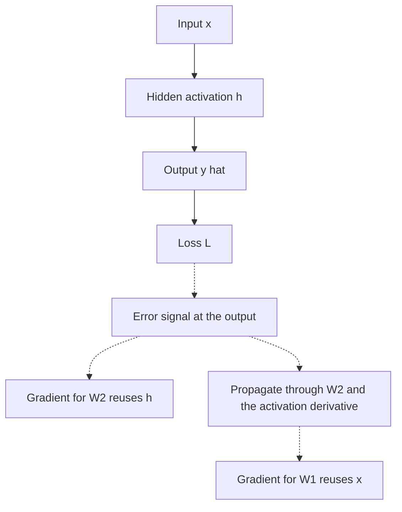

# Backpropagation

Backpropagation is reverse-mode automatic differentiation applied to a network's computational graph. A forward pass records intermediate values; the backward pass reuses them to push an error signal from the [loss function](loss-functions.md) through parameters, nonlinear [activation functions](activation-functions.md), and earlier layers. It supplies gradients; [optimizers](optimizers.md) decide how parameters move.

## Defining math

For a two-layer scalar-output network,

$$
h=\phi(xW_1), \qquad \hat y=hW_2, \qquad L=(\hat y-y)^2.
$$

The final-layer gradient is local:

$$
\frac{\partial L}{\partial W_2}=h^\top\frac{\partial L}{\partial \hat y}, \qquad \frac{\partial L}{\partial \hat y}=2(\hat y-y).
$$

The earlier layer gets the same error signal multiplied through downstream weights and the derivative of the nonlinearity:

$$
\frac{\partial L}{\partial W_1}
=x^\top\left[\left(\frac{\partial L}{\partial \hat y}W_2^\top\right)\odot \phi'(xW_1)\right].
$$

This is the chain rule from [gradients](../01-mathematical-foundations/gradients.md), organized so each intermediate Jacobian-vector product is computed once instead of recomputing every path independently.

The forward pass (solid) computes and caches activations; the backward pass (dotted) reuses them to send the error signal back into each parameter:



## Worked example

This snippet lets PyTorch differentiate a two-layer network and compares selected gradients with a manual backpropagation calculation.

```python
import torch

torch.manual_seed(0)
x = torch.tensor([[0.2, -0.4]])
y = torch.tensor([[1.0]])
W1 = torch.randn(2, 3, requires_grad=True)
W2 = torch.randn(3, 1, requires_grad=True)
h = torch.tanh(x @ W1)
pred = h @ W2
loss = ((pred - y) ** 2).mean()
loss.backward()
d_pred = 2 * (pred.detach() - y)
dW2_manual = h.detach().T @ d_pred
dh = d_pred @ W2.detach().T
dW1_manual = x.T @ (dh * (1 - h.detach() ** 2))
print("loss", round(loss.item(), 6))
print("W2_grad", torch.round(W2.grad.flatten(), decimals=6).tolist())
print("manual_W2_grad", torch.round(dW2_manual.flatten(), decimals=6).tolist())
print("max_abs_W1_diff", (W1.grad - dW1_manual).abs().max().item())
```

Observed output:

```text
loss 0.570892
W2_grad [-0.12187600135803223, -0.5416929721832275, -0.18595199286937714]
manual_W2_grad [-0.12187600135803223, -0.5416929721832275, -0.18595199286937714]
max_abs_W1_diff 0.0
```

Autograd and the manual chain-rule calculation agree exactly for this tiny graph. The important detail is that the hidden activation `h` is reused in both the final-layer gradient and the earlier-layer gradient.

## Caveats

Backpropagation through many repeated transformations can make gradients vanish or explode, which is why [initialization](initialization.md), [normalization](normalization.md), gating, and residual connections matter. In-place tensor edits can overwrite values needed for the backward pass. The backward pass also stores activations, so memory often scales with depth and batch size rather than parameter count alone.

## References

- [PyTorch documentation: Autograd mechanics](https://docs.pytorch.org/docs/2.7/notes/autograd.html)
- [Goodfellow, Bengio, and Courville, Deep Learning, Chapter 8: Optimization for Training Deep Models](https://www.deeplearningbook.org/contents/optimization.html)

> [!nav]
> **Section** — [Deep Learning](index.md)
>
> [← Neural Network Fundamentals](neural-network-fundamentals.md) [Activation Functions →](activation-functions.md)
>
> **Learning path** — [Deep learning](../00-home-and-navigation/learning-paths.md#deep-learning)
>
> [← Neural Network Fundamentals](neural-network-fundamentals.md) [Optimizers →](optimizers.md)
