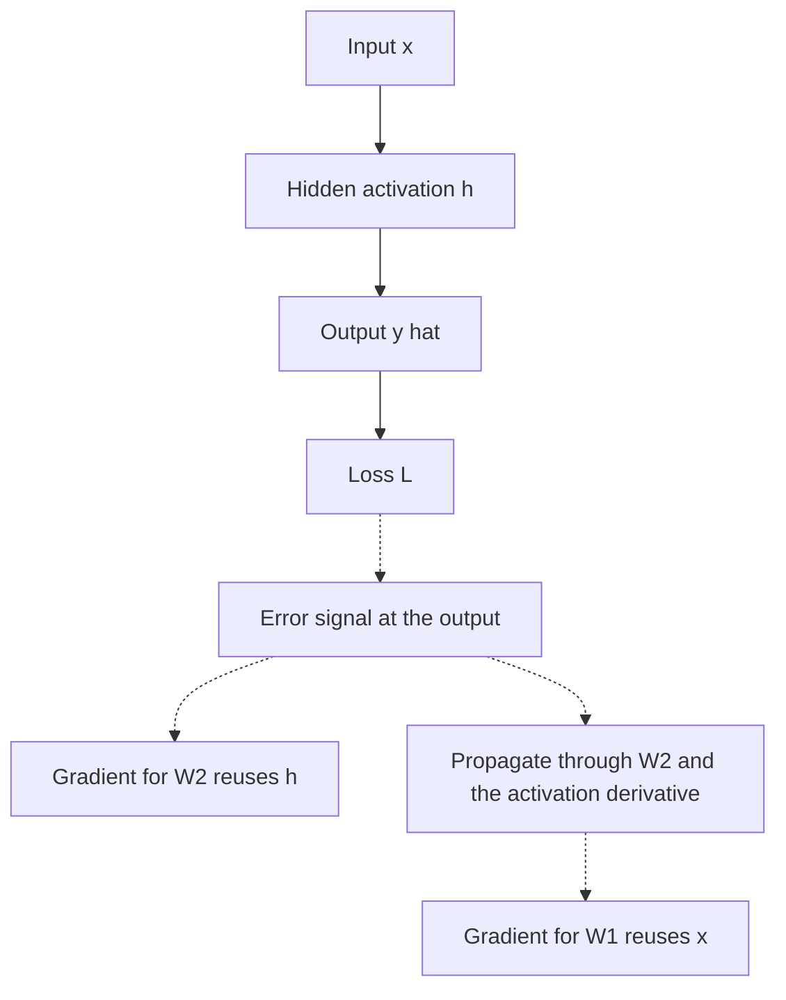

# Backpropagation

Backpropagation is reverse-mode automatic differentiation applied to a network's computational graph. A forward pass records intermediate values; the backward pass reuses them to push an error signal from the [loss function](loss-functions.md) through parameters, nonlinear [activation functions](activation-functions.md), and earlier layers. It is the gradient-computing stage of the training loop introduced in [neural network fundamentals](neural-network-fundamentals.md): backpropagation supplies the gradients, and [optimizers](optimizers.md) decide how parameters move.

## How it works

Backpropagation computes every parameter's gradient in two passes over the network's computation graph:

1. **Forward pass.** Run the input through the layers to produce the prediction and the loss, caching each layer's intermediate activations along the way.
2. **Backward pass.** Starting from the loss, send an error signal backward through the graph. At each layer, combine the incoming error with the cached activations to produce both the gradient for that layer's parameters and the error signal to pass further back.

The efficiency comes from reuse: each activation is computed once in the forward pass and reused in the backward pass, so a network with millions of parameters still needs only one forward and one backward sweep — not one pass per parameter. The forward pass (solid) caches activations; the backward pass (dotted) reuses them to send the error signal back into each parameter:



## The chain rule, organized

Take the smallest network that still shows every step: a small [multilayer perceptron](multilayer-perceptrons.md) with one hidden layer of width $d_{\text{hidden}}$. Fix the remaining sizes so every object below has a definite shape — an input row $x\in\mathbb{R}^{1\times2}$, weights $W_1\in\mathbb{R}^{2\times d_{\text{hidden}}}$ and $W_2\in\mathbb{R}^{d_{\text{hidden}}\times1}$, nonlinearity $\phi$, a scalar output $\hat y$, and target $y$. The forward pass is

$$
h=\phi(xW_1), \qquad \hat y=hW_2, \qquad L=(\hat y-y)^2,
$$

where $h$ is the hidden activation and $\hat y$ the prediction. Backpropagation now works from the loss backward, one layer at a time.

One rule keeps the shapes straight: because the loss $L$ is a single scalar, **the gradient of $L$ with respect to any quantity has exactly the same shape as that quantity.** A gradient is never a new kind of object — $\partial L/\partial W_1$ is a $2\times d_{\text{hidden}}$ matrix like $W_1$, $\partial L/\partial h$ is a $1\times d_{\text{hidden}}$ row vector like $h$, and $\partial L/\partial\hat y$ is a scalar like $\hat y$. The forward objects and their shapes are:

| Symbol           | Meaning               | Shape                       | Object        |
| ---------------- | --------------------- | --------------------------- | ------------- |
| $x$              | input                 | $1\times2$                  | row vector    |
| $W_1$            | first-layer weights   | $2\times d_{\text{hidden}}$ | matrix        |
| $a_1=xW_1$       | hidden pre-activation | $1\times d_{\text{hidden}}$ | row vector    |
| $h=\phi(a_1)$    | hidden activation     | $1\times d_{\text{hidden}}$ | row vector    |
| $W_2$            | second-layer weights  | $d_{\text{hidden}}\times1$  | column vector |
| $\hat y=hW_2$    | prediction            | $1\times1$                  | scalar        |
| $L=(\hat y-y)^2$ | loss                  | $1\times1$                  | scalar        |

**Final layer.** The loss reaches $W_2$ only through $\hat y=hW_2$, so differentiate the loss with respect to the prediction, then push that error through the linear layer:

$$
\frac{\partial L}{\partial \hat y}=2(\hat y-y)\in\mathbb{R}^{1\times1}
$$

$$
\frac{\partial L}{\partial W_2}=h^\top\frac{\partial L}{\partial \hat y}\in\mathbb{R}^{d_{\text{hidden}}\times1}
$$

The weight gradient lands in $\mathbb{R}^{d_{\text{hidden}}\times1}$, matching $W_2$: the layer input $h^\top$ is exactly what scales the incoming scalar error.

**Hidden layer.** Reaching $W_1$ takes one more step back — through $W_2$, then through the nonlinearity:

$$
\frac{\partial L}{\partial h}=\frac{\partial L}{\partial \hat y}\,W_2^\top\in\mathbb{R}^{1\times d_{\text{hidden}}}
$$

$$
\frac{\partial L}{\partial a_1}=\frac{\partial L}{\partial h}\odot\phi'(a_1)\in\mathbb{R}^{1\times d_{\text{hidden}}}
$$

Multiplying by $W_2^\top$ carries the output error back across the linear layer; the elementwise product with $\phi'(a_1)$ applies the activation ($\odot$ is elementwise, so it preserves the $1\times d_{\text{hidden}}$ shape). The weight gradient again takes the "input transposed, times arriving error" form:

$$
\frac{\partial L}{\partial W_1}=x^\top\frac{\partial L}{\partial a_1}\in\mathbb{R}^{2\times d_{\text{hidden}}}
$$

which matches $W_1$. Substituting the two intermediate gradients collapses the chain into one closed-form expression:

$$
\frac{\partial L}{\partial W_1}=x^\top\left[\left(\frac{\partial L}{\partial \hat y}W_2^\top\right)\odot \phi'(xW_1)\right]
$$

This is the chain rule from [gradients](../01-mathematical-foundations/gradients.md), organized so each intermediate gradient — $\partial L/\partial \hat y$, then $\partial L/\partial h$, then $\partial L/\partial a_1$ — is computed once and reused, instead of re-expanding every path from $L$ back to $W_1$.

## Beyond one hidden layer: deep networks and CNNs

The same two moves — pull the error back through the next layer's weights, then through the local activation derivative — repeat at every depth. Write layer $\ell$ with pre-activation $a_\ell=z_{\ell-1}W_\ell$ and activation $z_\ell=\phi(a_\ell)$, starting from $z_0=x$. Backpropagation carries the pre-activation gradient $\partial L/\partial a_\ell$ backward through the stack, starting from $\partial L/\partial a_L$ at the output layer:

$$
\frac{\partial L}{\partial a_\ell}=\left(\frac{\partial L}{\partial a_{\ell+1}}W_{\ell+1}^\top\right)\odot\phi'(a_\ell)
$$

$$
\frac{\partial L}{\partial W_\ell}=z_{\ell-1}^\top\frac{\partial L}{\partial a_\ell}
$$

The first equation is the hidden-layer step from above, applied recursively; the second is the same "layer input transposed, times arriving error" rule. The shapes carry over too: $\partial L/\partial a_\ell$ has the shape of the pre-activation $a_\ell$, and $\partial L/\partial W_\ell$ has the shape of $W_\ell$. Because each $\partial L/\partial a_\ell$ is built from $\partial L/\partial a_{\ell+1}$, one backward sweep computes every gradient no matter how deep the network is.

[Convolutional networks](convolutional-neural-networks.md) obey the identical recursion, with two changes that follow from replacing the dense weight matrix with a shared, sliding kernel:

- **Convolution replaces the matrix product.** Pulling the error back across a convolutional layer (the multiply-by-$W_{\ell+1}^\top$ step) becomes a convolution of the incoming error with the spatially flipped kernel — a transposed convolution.
- **Weight sharing sums the gradient.** Because one kernel is reused at every spatial location, its gradient is the sum of the contributions from all those locations, not a single term. Pooling layers carry no weights: max-pooling routes the error only to the position that was the maximum, and average-pooling spreads it evenly over the window.

## Worked example: MLP gradients in PyTorch

This snippet lets PyTorch differentiate the same one-hidden-layer network (here $d_{\text{hidden}}=3$) and compares selected gradients with a manual backpropagation calculation.

```python
import torch

torch.manual_seed(0)
x = torch.tensor([[0.2, -0.4]])
y = torch.tensor([[1.0]])
W1 = torch.randn(2, 3, requires_grad=True)
W2 = torch.randn(3, 1, requires_grad=True)
h = torch.tanh(x @ W1)
pred = h @ W2
loss = ((pred - y) ** 2).mean()
loss.backward()
d_pred = 2 * (pred.detach() - y)
dW2_manual = h.detach().T @ d_pred
dh = d_pred @ W2.detach().T
dW1_manual = x.T @ (dh * (1 - h.detach() ** 2))
print("loss", round(loss.item(), 6))
print("W2_grad", torch.round(W2.grad.flatten(), decimals=6).tolist())
print("manual_W2_grad", torch.round(dW2_manual.flatten(), decimals=6).tolist())
print("max_abs_W1_diff", (W1.grad - dW1_manual).abs().max().item())
```

Observed output:

```text
loss 0.570892
W2_grad [-0.12187600135803223, -0.5416929721832275, -0.18595199286937714]
manual_W2_grad [-0.12187600135803223, -0.5416929721832275, -0.18595199286937714]
max_abs_W1_diff 0.0
```

Autograd and the manual chain-rule calculation agree exactly for this tiny graph. The important detail is that the hidden activation `h` is reused in both the final-layer gradient and the earlier-layer gradient.

## Worked example: a convolution by hand

The two CNN rules are easiest to trust on numbers. Take a $3\times3$ input $X$ and a single $2\times2$ kernel $K$, with a valid (stride-1, no-padding) convolution — the cross-correlation used by deep-learning frameworks — which produces a $2\times2$ output $Y$:

$$
X=\begin{bmatrix}1&2&0\\0&3&1\\2&1&0\end{bmatrix},\qquad
K=\begin{bmatrix}1&0\\0&-1\end{bmatrix}
$$

Each output pixel is $Y_{ij}=\sum_{u,v}K_{uv}\,X_{i+u,\,j+v}$, giving

$$
Y=\begin{bmatrix}-2&1\\-1&3\end{bmatrix}
$$

Suppose a squared-error loss against targets $T=\begin{bmatrix}-2&0\\0&1\end{bmatrix}$ produces the upstream gradient $\delta=\partial L/\partial Y=Y-T$, a $2\times2$ matrix (the shape of $Y$):

$$
\delta=\begin{bmatrix}0&1\\-1&2\end{bmatrix}
$$

**Kernel gradient — weight sharing sums over positions.** The same four kernel weights are applied at all four output positions, so each weight's gradient adds up a contribution from every position:

$$
\frac{\partial L}{\partial K_{uv}}=\sum_{i,j}\delta_{ij}\,X_{i+u,\,j+v}
$$

For the top-left weight, summing over the four output positions,

$$
\frac{\partial L}{\partial K_{00}}=0(1)+1(2)+(-1)(0)+2(3)=8,
$$

and repeating for the other three weights gives a $2\times2$ matrix, the shape of $K$:

$$
\frac{\partial L}{\partial K}=\begin{bmatrix}8&-1\\3&0\end{bmatrix}
$$

This is itself a cross-correlation of the input $X$ with the upstream gradient $\delta$.

**Input gradient — a transposed convolution.** Each input pixel fed every output position it touched, so its error is gathered back through the flipped kernel:

$$
\frac{\partial L}{\partial X_{pq}}=\sum_{u,v}K_{uv}\,\delta_{p-u,\,q-v},
$$

treating $\delta$ as zero outside its $2\times2$ range. For the center pixel, only two terms survive,

$$
\frac{\partial L}{\partial X_{11}}=K_{00}\,\delta_{11}+K_{11}\,\delta_{00}=1(2)+(-1)(0)=2,
$$

and over the whole grid the input gradient is a $3\times3$ matrix, the shape of $X$:

$$
\frac{\partial L}{\partial X}=\begin{bmatrix}0&1&0\\-1&2&-1\\0&1&-2\end{bmatrix}
$$

A framework's autograd computes exactly these two arrays. The lesson is that convolution obeys the same backward rule as the dense layers: pull the error back through the layer (a transposed convolution in place of $W^\top$) and form the weight gradient from the layer input (here summed over every position the shared kernel visited). Pooling layers, which have no weights, only route $\delta$: max-pooling sends it to the position that was the maximum, average-pooling spreads it evenly.

## Caveats

Backpropagation through many repeated transformations can make [gradients vanish or explode](vanishing-and-exploding-gradients.md), which is why [initialization](initialization.md), [normalization](normalization.md), gating, and [residual connections](residual-connections.md) matter. In-place tensor edits can overwrite values needed for the backward pass. The backward pass also stores activations, so memory often scales with depth and batch size rather than parameter count alone.

## References

- [Rumelhart, Hinton, and Williams, 1986, Learning representations by back-propagating errors](https://doi.org/10.1038/323533a0)
- [PyTorch documentation: Autograd mechanics](https://docs.pytorch.org/docs/2.7/notes/autograd.html)
- [Goodfellow, Bengio, and Courville, Deep Learning, Chapter 6: Deep Feedforward Networks](https://www.deeplearningbook.org/contents/mlp.html)

> [!nav]
> **Section** — [Deep Learning](index.md)
>
> [← Multilayer Perceptrons](multilayer-perceptrons.md) [Vanishing and Exploding Gradients →](vanishing-and-exploding-gradients.md)
>
> **Learning path** — [Deep learning](../00-home-and-navigation/learning-paths.md#deep-learning)
>
> [← Neural Network Fundamentals](neural-network-fundamentals.md) [Optimizers →](optimizers.md)
