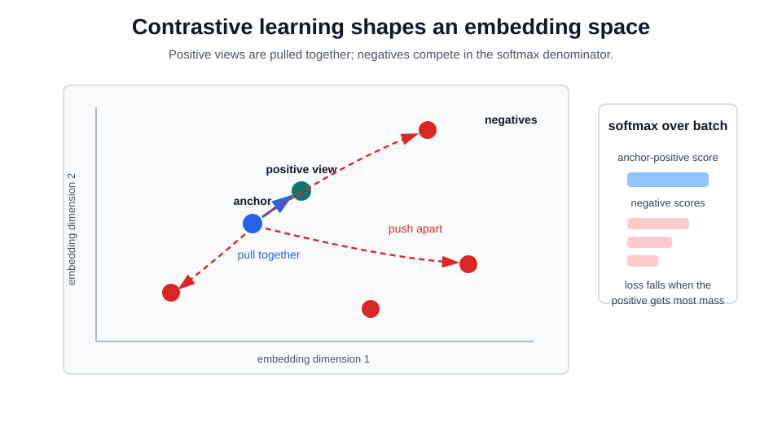

# Contrastive Learning

Contrastive learning trains an embedding space by comparing examples. A positive pair should land close together; negative examples should land farther away. In [self-supervised learning](self-supervised-learning.md), positives are often two augmentations of the same item. In [multimodal learning](multimodal-learning.md), positives can be paired image-text examples. The learned vectors are useful for [dense retrieval](../12-information-retrieval-and-search/dense-retrieval.md), clustering, transfer learning, and downstream classifiers.

The important design choice is not only the loss. The positive-pair construction defines the invariances the model learns. If two crops of the same image are treated as positive, the representation is encouraged to ignore crop location. If an image and its caption are treated as positive, the representation is encouraged to align visual and textual semantics.

## Defining Math

Let $z_i$ and $z_j$ be normalized embeddings of two positive views. Similarity is often cosine similarity,

$$
\operatorname{sim}(z_i,z_j)=z_i^\top z_j.
$$

For an anchor $i$ with positive $j$, the NT-Xent loss is

$$
\ell_{i,j}=
-\log
\frac{\exp(\operatorname{sim}(z_i,z_j)/\tau)}
{\sum_{k\ne i}\exp(\operatorname{sim}(z_i,z_k)/\tau)}.
$$

This is a [cross-entropy](../01-mathematical-foundations/cross-entropy.md) classification problem over the batch: given anchor $i$, classify which other embedding is its positive. The numerator rewards high anchor-positive similarity. The denominator makes every other item in the batch compete for probability mass.

The temperature $\tau$ controls sharpness. Smaller $\tau$ makes the softmax focus strongly on the most similar negatives; larger $\tau$ spreads gradient across more negatives.

## Worked Calculation

Suppose an anchor has cosine similarities $0.80$ to its positive and $0.20$, $0.05$, and $-0.10$ to three negatives. With $\tau=0.5$, the positive probability is

$$
p_{\text{pos}}
=
\frac{e^{0.80/0.5}}
{e^{0.80/0.5}+e^{0.20/0.5}+e^{0.05/0.5}+e^{-0.10/0.5}}
\approx 0.59.
$$

The loss is

$$
-\log(0.59)\approx 0.52.
$$

Even though the positive is the most similar item, the loss is not zero because the negatives still take about $41\%$ of the probability mass. Training increases the positive similarity, decreases hard-negative similarity, or both.

## Positive and Negative Construction

| Setting                        | Positive pair                       | Negative candidates                   | What the model is pushed to learn                         |
| ------------------------------ | ----------------------------------- | ------------------------------------- | --------------------------------------------------------- |
| SimCLR-style vision            | two augmentations of the same image | other images in the batch             | invariance to crop, color, blur, and augmentation choices |
| CLIP-style multimodal training | matched image and text              | other images or texts in the batch    | cross-modal semantic alignment                            |
| Retrieval fine-tuning          | query and relevant document         | irrelevant or less relevant documents | task-specific ranking geometry                            |
| Instance discrimination        | two views of the same instance      | other instances                       | instance-level separation                                 |

False negatives are the central risk. Two different images of the same class, or two documents that answer the same query, may be treated as negatives if the batch labels do not know they are semantically related. The loss will then push useful neighbors apart.

## Why Batch Composition Matters

Contrastive objectives use the batch as the classification universe. Larger batches or memory queues provide more negatives, which can make the task harder and the representation sharper. But more negatives are not automatically better: easy negatives contribute little gradient, while false negatives actively harm the embedding geometry.

Hard-negative mining has to be handled carefully. A hard negative should be genuinely different from the anchor while still being close enough to teach a boundary. If the negative is mislabeled or ambiguous, the model learns the wrong separation.

## Caveats

Contrastive learning does not discover "semantic similarity" in the abstract. It learns the similarity implied by the view construction, augmentations, batch sampling, and temperature. If augmentations remove information needed by the downstream task, the representation can become invariant to the wrong features. If the deployment task needs calibrated probabilities rather than neighbor structure, contrastive pretraining usually needs supervised adaptation.

## Connections

- [Self-Supervised Learning](self-supervised-learning.md) covers the broader family of label-free pretext objectives.
- [Autoencoders](autoencoders.md) learn by reconstructing inputs or masked content instead of comparing positives and negatives.
- [Representation Learning](representation-learning.md) explains why embedding quality matters for transfer.
- [Multimodal Learning](multimodal-learning.md) uses contrastive losses to align representations from different modalities.
- [Dense Retrieval](../12-information-retrieval-and-search/dense-retrieval.md) turns embedding similarity into a search system.

## References

- [Oord et al., 2018, Representation Learning with Contrastive Predictive Coding](https://arxiv.org/abs/1807.03748)
- [Chen et al., 2020, A Simple Framework for Contrastive Learning of Visual Representations](https://arxiv.org/abs/2002.05709)
- [He et al., 2020, Momentum Contrast for Unsupervised Visual Representation Learning](https://arxiv.org/abs/1911.05722)
- [Radford et al., 2021, Learning Transferable Visual Models From Natural Language Supervision](https://arxiv.org/abs/2103.00020)

> **Section — [Deep Learning](index.md):** ← [Self-Supervised Learning](self-supervised-learning.md) · [Transfer Learning](transfer-learning.md) →
