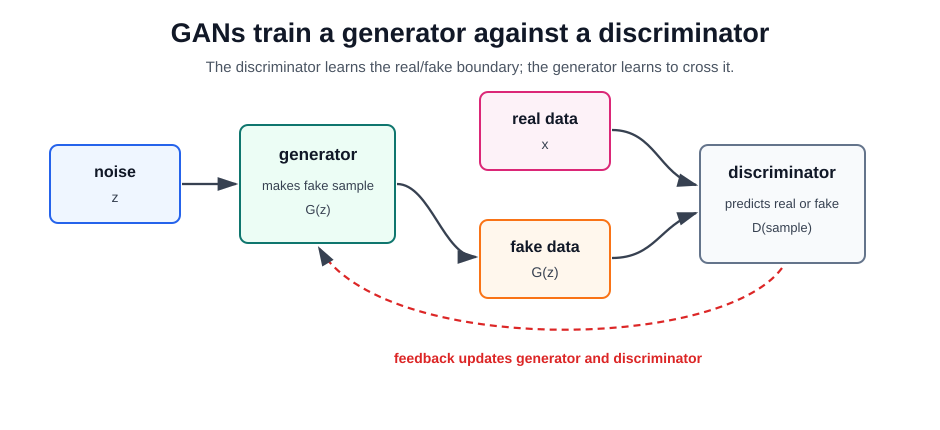

# Generative Adversarial Networks

A generative adversarial network trains two models against each other. The generator maps random noise or conditioning variables to a synthetic sample. The discriminator tries to tell real training samples from generated samples. Training improves the generator by making the discriminator's job harder.

GANs are implicit generative models: they can sample quickly after training, but they do not usually provide an explicit likelihood for a data point. This makes them different from [autoencoders](autoencoders.md), VAEs, autoregressive models, and diffusion models.

## The adversarial game

Let $z\sim p(z)$ be a noise vector, $G_\theta(z)$ a generated sample, and $D_\psi(x)$ the discriminator's estimate that $x$ is real. The original minimax objective is

$$
\min_G\max_D
\mathbb E_{x\sim p_{\mathrm{data}}}\left[\log D(x)\right]
+
\mathbb E_{z\sim p(z)}\left[\log(1-D(G(z)))\right].
$$

The discriminator is trained to output high scores for real data and low scores for generated data. The generator is trained so generated samples receive high discriminator scores. In practice, many GANs use modified losses, normalization, gradient penalties, spectral normalization, or non-saturating generator objectives to make training more stable.

## Why the Game Is Hard

GAN training is not ordinary supervised minimization. The target changes while the model learns:

| Component     | Learns to                | Failure if it wins too easily                        |
| ------------- | ------------------------ | ---------------------------------------------------- |
| Discriminator | detect generated samples | generator gradients become weak or unhelpful         |
| Generator     | fool the discriminator   | discriminator becomes unable to give useful feedback |

The useful training region is a balance. If the discriminator is too weak, it accepts poor samples. If it is too strong, the generator may receive little signal. This moving-target game explains why GANs are more fragile than reconstruction or maximum-likelihood objectives.

## Common Failure Modes

| Failure mode              | What it looks like                              | Why it happens                                            |
| ------------------------- | ----------------------------------------------- | --------------------------------------------------------- |
| Mode collapse             | generator produces limited varieties of samples | a few outputs fool the discriminator well enough          |
| Training oscillation      | quality improves and then regresses             | generator and discriminator chase each other              |
| Discriminator overfitting | generated samples degrade on small datasets     | discriminator memorizes real examples                     |
| Artifact learning         | samples contain texture or aliasing artifacts   | generator exploits architecture and upsampling shortcuts  |
| Evaluation mismatch       | samples look sharp but are not useful           | perceptual realism differs from task quality or diversity |

Techniques such as adaptive discriminator augmentation, StyleGAN-style architectures, spectral normalization, careful data augmentation, and better evaluation reduce these problems but do not remove the adversarial nature of the objective.

## Applications

GANs are especially useful when perceptual realism matters and a discriminator can learn a better loss than hand-written pixel error:

| Application                          | Why GANs fit                                                                               |
| ------------------------------------ | ------------------------------------------------------------------------------------------ |
| Domain-specific image synthesis      | fast sampling and high visual fidelity within a narrow distribution                        |
| Image-to-image translation           | conditional GANs learn mappings such as edges-to-photo or label-map-to-scene               |
| Unpaired translation                 | cycle-consistency plus adversarial loss maps one domain to another without paired examples |
| Super-resolution and restoration     | adversarial loss encourages perceptually sharp outputs                                     |
| Data augmentation and simulation     | synthetic samples can expand rare visual conditions when validated carefully               |
| Representation and domain adaptation | adversarial losses can align feature distributions                                         |

GAN-generated media also creates safety and provenance issues. Photorealistic faces, voices, or scenes can be used for harmless simulation or harmful deception, so deployment needs provenance, consent, and abuse controls.

## Relevance After Transformers and Diffusion

GANs are no longer the default choice for frontier open-ended text-to-image generation. Diffusion, rectified-flow, and transformer-backed image generators tend to be easier to scale, condition, and train for broad prompts. Latent diffusion also benefits from [autoencoder](autoencoders.md) compression and text-image representation learning.

That does not make GANs obsolete. They remain relevant when one-pass sampling speed, domain-specific fidelity, controllable latent spaces, or adversarial perceptual losses matter. StyleGAN-style models are still important for high-quality face and object-domain generation, and GAN losses remain common in restoration and super-resolution systems. The transformer breakthrough changed many backbones and training regimes; it did not eliminate the adversarial objective as a useful tool.

## GANs Versus Autoencoders and Diffusion

| Model family      | Training signal                    | Sampling                    | Main strength                             | Main weakness                               |
| ----------------- | ---------------------------------- | --------------------------- | ----------------------------------------- | ------------------------------------------- |
| Autoencoder       | reconstruct input                  | encode then decode          | representation, compression, denoising    | reconstruction can preserve nuisance detail |
| VAE               | reconstruct plus latent prior      | sample latent then decode   | smooth probabilistic latent space         | samples can be blurry                       |
| GAN               | fool discriminator                 | one generator pass          | sharp samples and learned perceptual loss | unstable training and mode collapse         |
| Diffusion or flow | denoise or transport noise to data | iterative, unless distilled | scalable, controllable generation         | slower sampling and high training cost      |

## Caveats

GAN evaluation needs both quality and diversity. A generator can improve a visual score while dropping rare modes. FID, precision-recall for generative models, nearest-neighbor inspection, slice evaluation, and downstream task tests answer different questions. For real systems, also check licensing, consent, watermarking, demographic coverage, and whether synthetic data improves the target task instead of merely looking plausible.

## Connections

- [Autoencoders](autoencoders.md) reconstruct inputs directly, while GANs learn from discriminator feedback.
- [Representation Learning](representation-learning.md) explains how latent spaces can be useful beyond generation.
- [Stable Diffusion](../11-generative-ai/stable-diffusion.md) covers the diffusion family that displaced GANs for many broad text-to-image workflows.
- [Image Representation](../09-computer-vision/image-representation.md) gives the pixel/tensor background needed for image generators.

## References

- [Goodfellow et al., 2014, Generative Adversarial Networks](https://arxiv.org/abs/1406.2661)
- [Isola et al., 2016, Image-to-Image Translation with Conditional Adversarial Networks](https://arxiv.org/abs/1611.07004)
- [Zhu et al., 2017, Unpaired Image-to-Image Translation using Cycle-Consistent Adversarial Networks](https://arxiv.org/abs/1703.10593)
- [Karras et al., 2020, Training Generative Adversarial Networks with Limited Data](https://arxiv.org/abs/2006.06676)
- [Karras et al., 2021, Alias-Free Generative Adversarial Networks](https://arxiv.org/abs/2106.12423)
- [Wang et al., 2021, Real-ESRGAN](https://arxiv.org/abs/2107.10833)
- [Rombach et al., 2021, High-Resolution Image Synthesis with Latent Diffusion Models](https://arxiv.org/abs/2112.10752)

> [!nav]
> **Section** — [Deep Learning](index.md)
>
> [← Multimodal Learning](multimodal-learning.md) [PyTorch →](pytorch.md)
