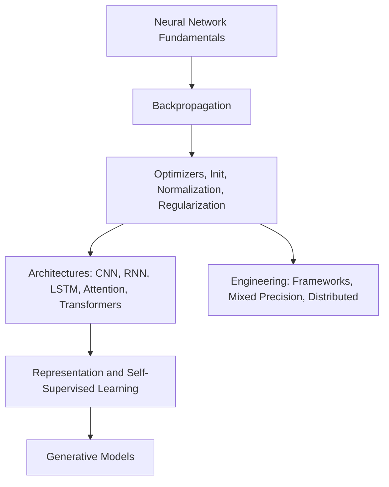

# Deep Learning

Deep learning studies neural networks as trainable function approximators: layers define the computation, losses define the target, gradients move parameters, and architecture choices determine what structure is easy to learn. Read this section as a mechanism-first path rather than a catalogue.

## Knowledge map

Fundamentals and training mechanics come first because every architecture reuses them; architectures then enable representation learning, generative models, and the engineering needed to train at scale.

## Reading path

Read fundamentals and training mechanics, then architectures, representation learning, generative models, and engineering.

1. [Neural Network Fundamentals](neural-network-fundamentals.md): how affine layers, nonlinearities, losses, and optimizers combine into a trainable model.
2. [Multilayer Perceptrons](multilayer-perceptrons.md): dense feed-forward networks that transform features without recurrent state.
3. [Backpropagation](backpropagation.md): reverse-mode chain-rule differentiation through a computational graph.
4. [Vanishing and Exploding Gradients](vanishing-and-exploding-gradients.md): why deep chain-rule products can shrink or blow up.
5. [Activation Functions](activation-functions.md): nonlinearities that control expressiveness and gradient flow.
6. [Loss Functions](loss-functions.md): differentiable objectives for regression and classification.
7. [Optimizers](optimizers.md): SGD, momentum, and Adam-style rules that turn gradients into updates.
8. [Initialization](initialization.md): starting weight scales that keep activations and gradients usable.
9. [Normalization](normalization.md): batch and layer standardization with trainable affine recovery.
10. [Regularization](regularization.md): dropout, weight penalties, and other ways to reduce memorization.
11. [Residual Connections](residual-connections.md): skip paths that let deep blocks learn corrections.
12. [Convolutional Neural Networks](convolutional-neural-networks.md): shared local filters for grids and images.
13. [Recurrent Neural Networks](recurrent-neural-networks.md): stateful sequence models with shared temporal transitions.
14. [LSTM and GRU](lstm-and-gru.md): gated recurrent cells for longer-range credit assignment.
15. [Attention](attention.md): content-based weighted routing between positions or modalities.
16. [Transformers](transformers.md): attention, residual, normalization, and feed-forward blocks for parallel sequence modeling.
17. [Representation Learning](representation-learning.md): learned feature spaces for prediction, retrieval, and transfer.
18. [Autoencoders](autoencoders.md): encoder-decoder models that learn latent codes by reconstruction.
19. [Self-Supervised Learning](self-supervised-learning.md): pretext objectives generated from unlabeled data.
20. [Contrastive Learning](contrastive-learning.md): embedding objectives that separate positives from negatives.
21. [Transfer Learning](transfer-learning.md): reusing pretrained features on a new task.
22. [Fine-Tuning](fine-tuning.md): selectively updating pretrained parameters or adapters.
23. [Multimodal Learning](multimodal-learning.md): aligning and fusing text, image, audio, and video.
24. [Generative Adversarial Networks](generative-adversarial-networks.md): generator-discriminator games for sharp implicit generation.
25. [PyTorch](pytorch.md): dynamic-tape tensor programming and explicit training loops.
26. [TensorFlow and Keras](tensorflow-and-keras.md): high-level model APIs and production workflows.
27. [Mixed Precision](mixed-precision.md): lower-precision arithmetic with scaling and FP32 safeguards.
28. [Distributed Training](distributed-training.md): synchronized or partitioned training across devices and machines.

## Connections

- [Mathematical Foundations](../01-mathematical-foundations/index.md) supplies the gradients and linear algebra behind training.
- [Natural Language Processing](../08-natural-language-processing/index.md), [Computer Vision](../09-computer-vision/index.md), and [Generative AI](../11-generative-ai/index.md) specialize these architectures to their modalities.

> [!nav]
> **Learning path** — [Deep learning](../00-home-and-navigation/learning-paths.md#deep-learning)
>
> [Neural Network Fundamentals →](neural-network-fundamentals.md)
