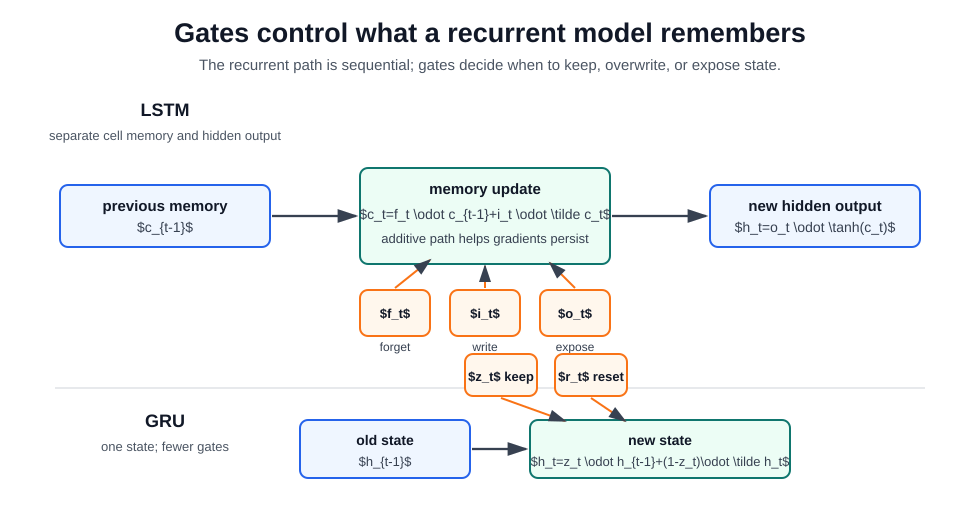

# LSTM and GRU

LSTMs and GRUs are gated variants of [recurrent neural networks](recurrent-neural-networks.md). A vanilla RNN keeps one hidden state and repeatedly overwrites it. LSTMs and GRUs add learned gates so the model can preserve, erase, or expose information over time instead of forcing every new input through the same update.

This matters for temporal learning. A sequence model may need to remember a negation word, a market regime, a sensor event, or a speaker state for many later steps. Gates give the model a differentiable way to decide which information should persist and which information should be replaced.

## The Problem They Solve

Training a recurrent model uses backpropagation through time. If a loss at the end of a sequence depends on a hidden state many steps earlier, the gradient contains a product of recurrent Jacobians:

$$
\frac{\partial L_T}{\partial h_t}
=\frac{\partial L_T}{\partial h_T}
\prod_{k=t+1}^{T}\frac{\partial h_k}{\partial h_{k-1}}.
$$

If the factors in that product usually have norm below $1$, [gradients vanish](vanishing-and-exploding-gradients.md). If they usually have norm above $1$, gradients explode. Exploding gradients can be limited with gradient clipping, but vanishing gradients are harder because the learning signal for early events becomes too small to change the parameters.

LSTMs address this by adding a cell state with an additive update:

$$
c_t=f_t\odot c_{t-1}+i_t\odot \tilde c_t.
$$

The forget gate $f_t$ creates a controlled path from $c_{t-1}$ to $c_t$. When $f_t$ is near $1$, information and gradients can pass forward with little change. When $f_t$ is near $0$, the model deliberately forgets that part of memory.

## LSTM Cell

An LSTM has a hidden state $h_t$ and a separate cell state $c_t$. The cell state is the memory path; the hidden state is the exposed representation passed to the next layer or prediction head.

For input $x_t$ and previous hidden state $h_{t-1}$:

$$
i_t=\sigma(W_ix_t+U_ih_{t-1}+b_i)
$$

$$
f_t=\sigma(W_fx_t+U_fh_{t-1}+b_f)
$$

$$
o_t=\sigma(W_ox_t+U_oh_{t-1}+b_o)
$$

$$
\tilde c_t=\tanh(W_cx_t+U_ch_{t-1}+b_c)
$$

$$
c_t=f_t\odot c_{t-1}+i_t\odot\tilde c_t,\qquad
h_t=o_t\odot\tanh(c_t).
$$

The gates have separate roles:

| LSTM part              | Range       | Role                                                |
| ---------------------- | ----------- | --------------------------------------------------- |
| Forget gate $f_t$      | $0$ to $1$  | keeps or erases old cell memory                     |
| Input gate $i_t$       | $0$ to $1$  | controls how much candidate memory is written       |
| Candidate $\tilde c_t$ | $-1$ to $1$ | proposes new content for the cell                   |
| Output gate $o_t$      | $0$ to $1$  | controls how much memory is exposed as hidden state |

If $f_t=0.95$ and $i_t=0.05$ for one memory dimension, the LSTM mostly preserves old information. If $f_t=0.1$ and $i_t=0.9$, it mostly overwrites that dimension with new evidence. These values are learned from data; they are not hand-coded rules.

## GRU Cell

A GRU simplifies the design by merging memory and hidden state into one vector. It uses an update gate and a reset gate:

$$
z_t=\sigma(W_zx_t+U_zh_{t-1}+b_z)
$$

$$
r_t=\sigma(W_rx_t+U_rh_{t-1}+b_r)
$$

$$
\tilde h_t=\tanh(W_hx_t+U_h(r_t\odot h_{t-1})+b_h)
$$

$$
h_t=z_t\odot h_{t-1}+(1-z_t)\odot\tilde h_t.
$$

The update gate $z_t$ decides how much of the old state to keep. The reset gate $r_t$ decides how much previous state is used when proposing the new candidate. GRUs are often cheaper than LSTMs because they have fewer gates and no separate cell state, while still preserving an additive path for temporal information.

## Loss Over Time

For sequence labeling, the model may emit a prediction at every step:

$$
L=\sum_{t=1}^{T}\ell(y_t,\hat y_t).
$$

For sequence classification, it may emit only at the end:

$$
L=\ell(y,\hat y_T).
$$

Both cases unfold the recurrent cell over time. Longer sequences increase memory use during training because intermediate states are needed for backpropagation. Truncated backpropagation through time reduces compute by backpropagating over shorter windows, but then credit assignment is also limited to those windows.

Gating does not make long-range learning free. It gives gradients a better path through memory, while practical training still uses clipping, normalization, careful initialization, masking, packed sequences, and hidden-state resets.

## LSTM, GRU, and Transformer Learning

Gated RNNs and [transformers](transformers.md) learn temporal structure in different ways:

| Question                              | LSTM / GRU                                            | Transformer                                                   |
| ------------------------------------- | ----------------------------------------------------- | ------------------------------------------------------------- |
| How does information move?            | sequential hidden-state update                        | direct attention between token positions                      |
| Can training parallelize across time? | limited, because $h_t$ depends on $h_{t-1}$           | yes within a layer, because token states are updated together |
| Main bottleneck                       | fixed-size recurrent state and long credit assignment | attention cost and context-window limits                      |
| Natural deployment mode               | streaming, low-latency, one step at a time            | batch processing over a context window                        |
| Long-range access                     | carried through memory gates                          | retrieved by attention weights over visible positions         |

An LSTM reading tokens left to right must carry old evidence forward through its state. A transformer can let token $t$ attend directly to token $3$ if the mask allows it. That direct path is a major reason transformers displaced RNNs for large-scale language modeling. Gated RNNs still fit streaming sensor, speech, time-series, and edge deployments where incremental state updates are cheaper than recomputing attention over a long context.

## Caveats

Gates are learned and can fail. If the task, data, or optimization encourages the model to overwrite memory too often, long dependencies still disappear. If hidden states are not reset between independent examples, information leaks across batch items. If padding masks are wrong, the model learns from fake timesteps. These bugs are common because recurrent models make time part of the computational graph.

## Connections

- [Recurrent Neural Networks](recurrent-neural-networks.md) explains the vanilla recurrence and the product-of-Jacobians problem.
- [Backpropagation](backpropagation.md) explains the gradient mechanics used when the recurrent cell is unfolded through time.
- [Attention](attention.md) and [Transformers](transformers.md) explain the non-recurrent alternative that gives positions direct access to one another.

## References

- [Hochreiter and Schmidhuber, 1997, Long Short-Term Memory](https://doi.org/10.1162/neco.1997.9.8.1735)
- [Cho et al., 2014, Learning Phrase Representations using RNN Encoder-Decoder for Statistical Machine Translation](https://arxiv.org/abs/1406.1078)
- [Chung et al., 2014, Empirical Evaluation of Gated Recurrent Neural Networks on Sequence Modeling](https://arxiv.org/abs/1412.3555)

> [!nav]
> **Section** — [Deep Learning](index.md)
>
> [← Recurrent Neural Networks](recurrent-neural-networks.md) [Attention →](attention.md)
