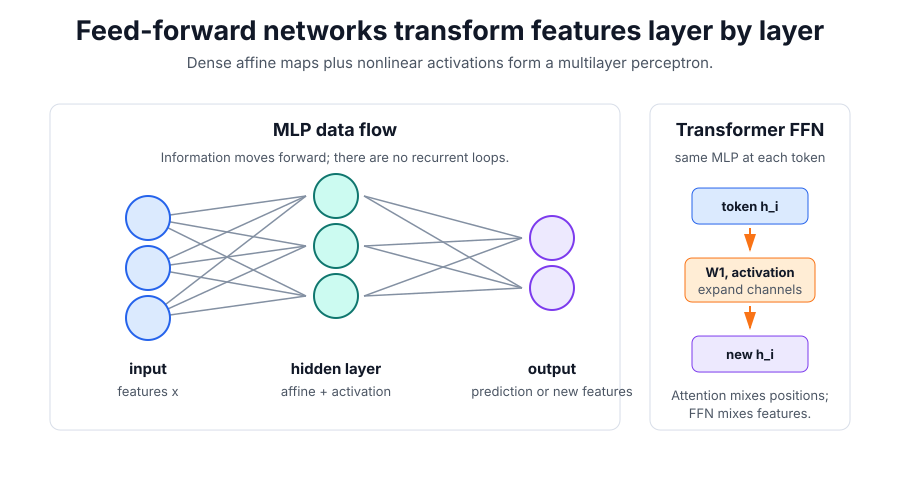

# Multilayer Perceptrons

A multilayer perceptron, or MLP, is the standard dense feed-forward neural network: affine maps followed by [activation functions](activation-functions.md). Information flows forward from inputs through hidden layers to outputs; there is no recurrent hidden state and no loop over sequence time.

"Feed-forward network" is the broader graph description: the computation has directed layers and no cycles. An MLP is the dense version most people mean in deep-learning architectures. In transformer papers, `FFN` usually means a position-wise MLP sublayer, not a separate sequence model.

## Defining math

For a two-layer MLP,

$$
h=\phi(xW_1+b_1),
\qquad
y=hW_2+b_2.
$$

Here $x$ is the input vector or batch, $W_1,W_2$ and $b_1,b_2$ are learned parameters, $\phi$ is a nonlinearity such as ReLU or GELU, $h$ is the hidden representation, and $y$ is the output. The nonlinearity is essential: without it, two affine layers collapse into one affine map.

## Transformer use

In a [transformer](transformers.md), the feed-forward network is usually a position-wise MLP:

$$
\operatorname{FFN}(h_i)=W_2\phi(W_1h_i+b_1)+b_2.
$$

The same parameters are applied independently to every token position $i$. Self-attention mixes information across positions; the FFN mixes and reshapes features inside each token vector. Many transformer FFNs first expand the hidden width, apply a nonlinearity such as GELU or SwiGLU, and then project back to the model width.

## Worked example

For one token vector $h_i\in\mathbb R^{d_{\text{model}}}$, a transformer FFN might map

$$
\mathbb R^{768}\rightarrow\mathbb R^{3072}\rightarrow\mathbb R^{768}.
$$

The middle layer gives the model more feature capacity at that position. It can create nonlinear combinations such as "this token is a verb in a question" or "this patch has a vertical edge and high contrast" after attention has supplied context.

## Caveats

"Feed-forward" describes the information-flow graph, not the training algorithm. MLPs are still trained with [backpropagation](backpropagation.md). Dense MLPs also ignore spatial, temporal, or relational structure unless the input representation or surrounding architecture supplies it. That is why CNNs, recurrent networks, attention, and transformers add stronger structure around MLP blocks.

## References

- [Goodfellow, Bengio, and Courville, Deep Learning, Chapter 6: Deep Feedforward Networks](https://www.deeplearningbook.org/contents/mlp.html)

> [!nav]
> **Section** — [Deep Learning](index.md)
>
> [← Neural Network Fundamentals](neural-network-fundamentals.md) [Backpropagation →](backpropagation.md)
